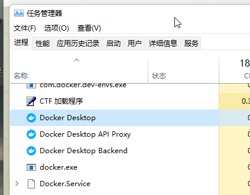
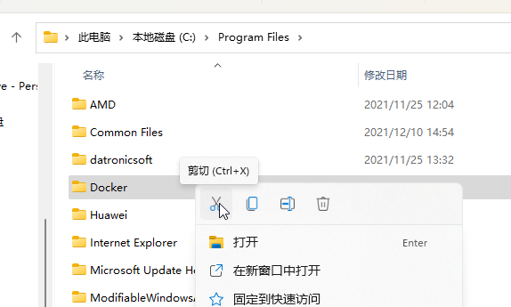
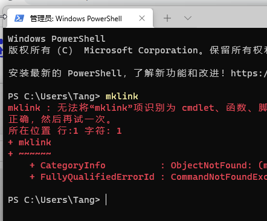
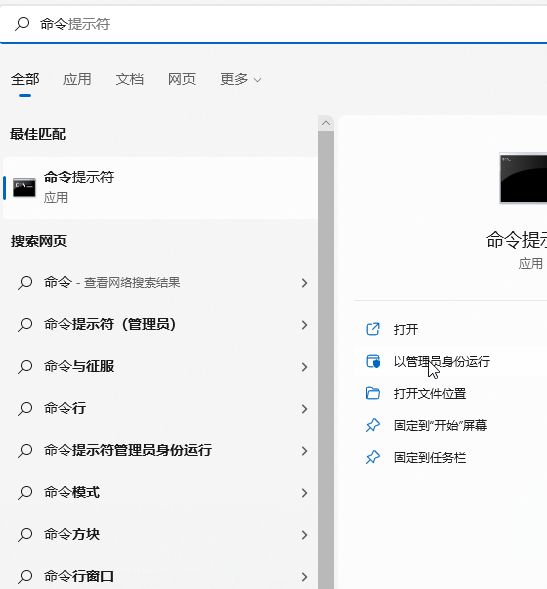
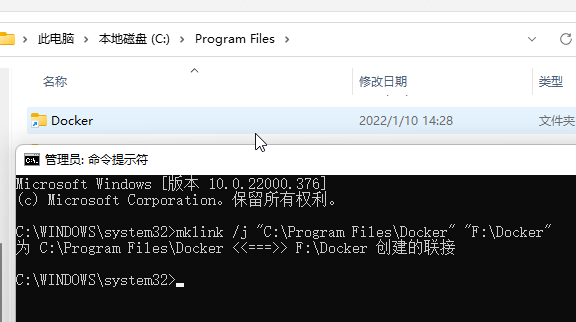
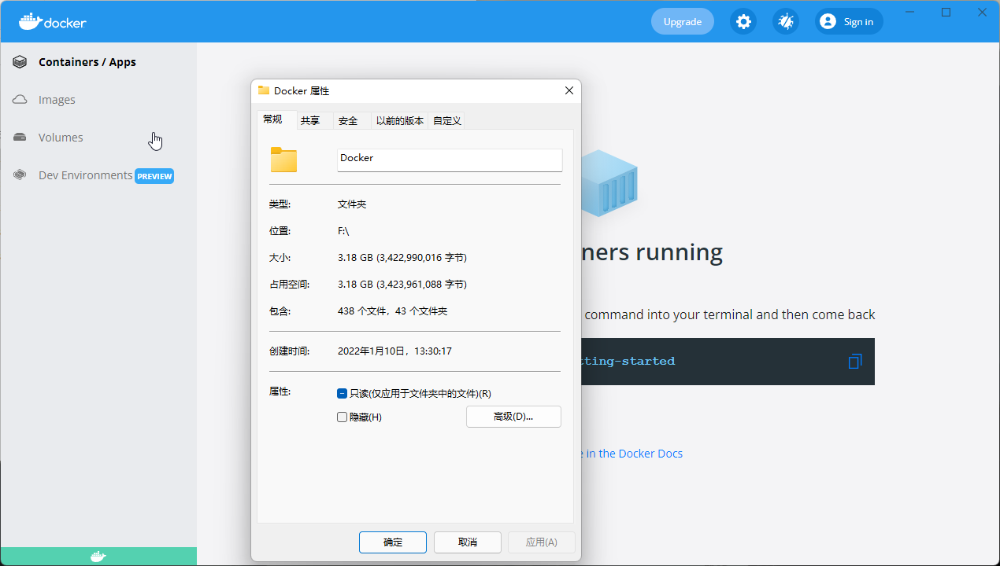
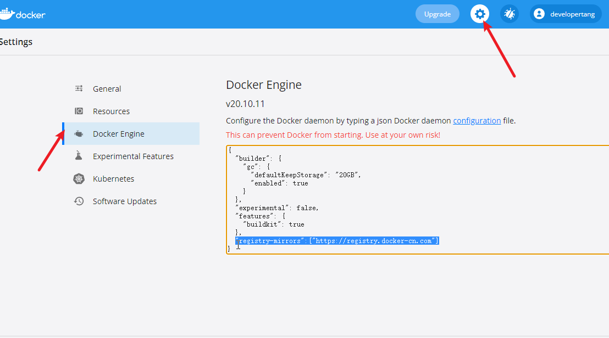

## 软件链接

> **桌面版：** [https://www.docker.com/products/docker-desktop](https://www.docker.com/products/docker-desktop)
>
> **Linux：** 

> Docker for Desktop (Windows) 下载后直接双击安装就行，自动安装没有配置的步骤

## 桌面版默认安装C盘问题

> Docker for Desktop (Windows)默认将软件安装到C盘，且镜像也存储在C盘
>

### 停止Docker服务

> 从任务管理器中将与Docker有关的进程

 

### 移动文件夹

> 剪切文件夹到自己想存放的地方

 

### 创建软链接

```shell
mklink /j "链接所在的位置" "链接指向的位置" #要填写到Docker文件夹的全路径 ""不能少
```

> 要以管理员身份运行命令行，其他方式命令行是不能使用该命令的

 

 

 

### WSL路径变更

```shell
PS C:\Users\Tang\Desktop> wsl --shutdown # 关闭所有发行版
PS C:\Users\Tang\Desktop> wsl --export docker-desktop-data ./docker-desktop-data.tar # 我这是直接放在了桌面
PS C:\Users\Tang\Desktop> wsl --unregister docker-desktop-data # 注销docker-desktop-data
PS C:\Users\Tang\Desktop> wsl --import docker-desktop-data F:\Docker\docker-desktop-data\ .\docker-desktop-data.tar --version 2 # 导入，路径都根据自己的来
```

### 启动Docker

> 正常启动，其他还有些文件在C盘也不会占据太多的空间

 

### 配置镜像加速

> 如图找到配置，追加配置。注意满足json格式，比如追加前面要补个逗号

```json
"registry-mirrors":["https://registry.docker-cn.com"]
```


