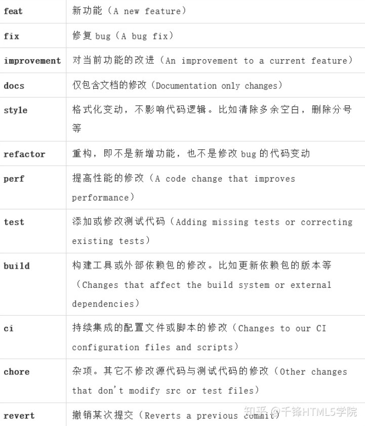
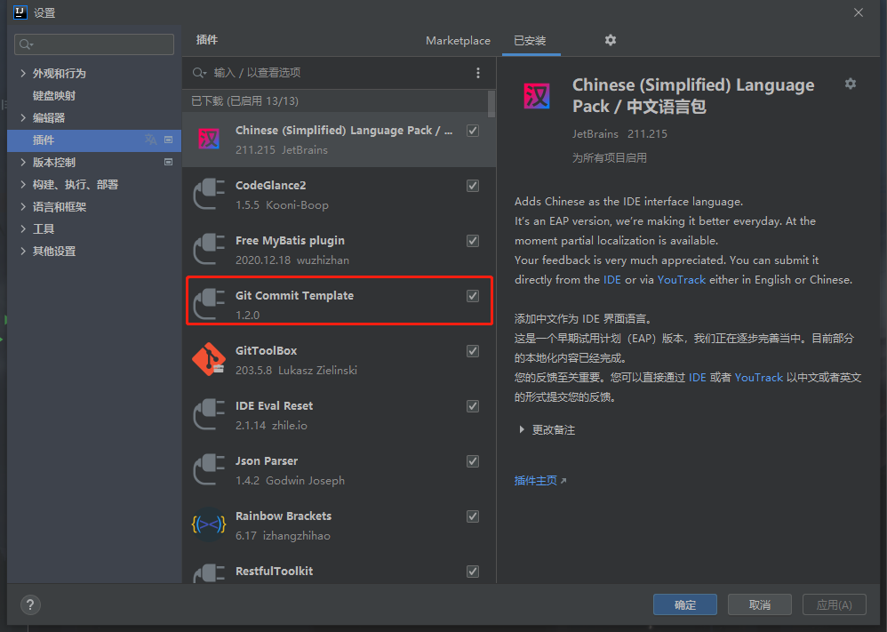
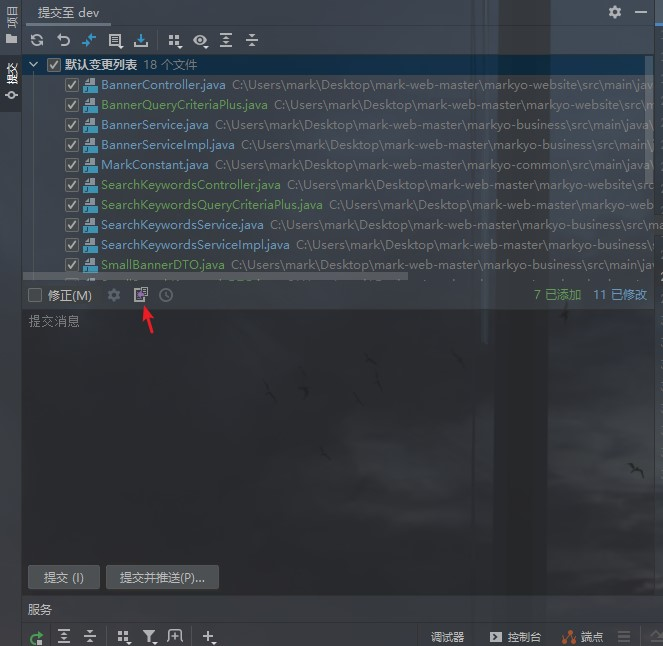
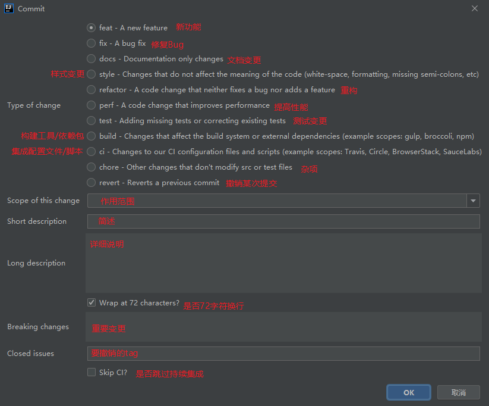
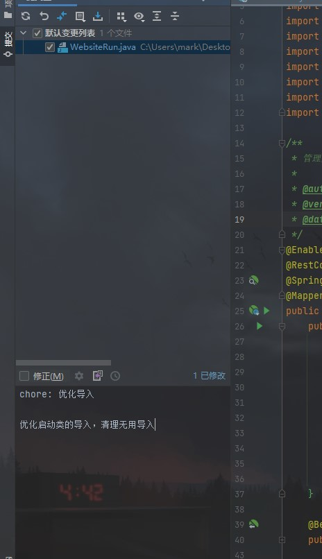
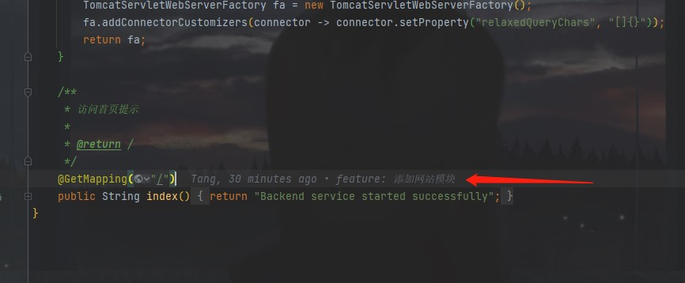
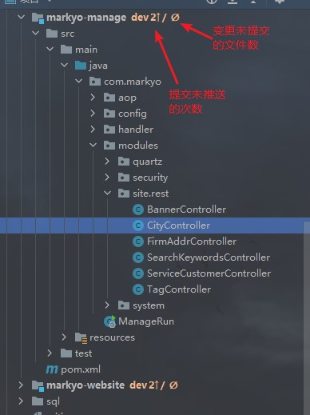

## Commit Message 的标准格式

**Commit Message 标准格式包括三个部分：Header**，**Body**，**Footer**

```
<type>(<scope>): <subject>
// 空一行
<body>
// 空一行
<footer>
```

其中，**Header** 是必需的，**Body** 和 **Footer** 可以省略

## 一、Header

**Header** 部分只有一行，包括三个字段：**type**（必需）、**scope**（可选）、**subject**（必需）

### 1. type

用于说明类型。可分以下几种类型



### 2. scope

用于说明影响的范围，比如数据层、控制层、视图层等等。

### 3. subject

主题，简短描述。一行

## 二、Body

对 subject 的补充。可以多行。

## 三、Footer

主要是一些关联 issue 的操作。

## IDEA插件

**推荐：** **`Git Commit Template`(全面)** or **`Git Commit Template Helper`(简洁)**









**其他：** **`GitToolBox`** 能够在编辑窗口的代码行中显示上次变动的提交信息



提示提交/未提交提示

