[toc]

## Git简介

> 此文章来源与网上黑马的教程材料+个人改动一部分

### Git是什么?

> Git是目前世界上最先进的分布式文件版本控制系统工具，对于我们而言，管理的就是代码文件的版本。

### Git和Github

> 确切的说 GitHub 是一家公司，位于旧金山，由 Chris Wanstrath、 PJ Hyett 与 Tom Preston-Werner 三位开发者在2008年4月创办。这是它的 Logo：


> 2008年4月10日，GitHub正式成立，主要提供基于git的版本托管服务。一经上线，它的发展速度惊为天人，截止目前，GitHub 已经发展成全球最大的开源社区。 所以 Git 只是 GitHub上用来管理项目的一个工具而已，但是GitHub 的功能可远不止于此！

### 集中式和分布式

#### 集中式版本控制

> 早期的SVN是集中式版本控制系统，版本库是集中放在中央服务器的，而干活的时候，用的都是自己的电脑，所以首先要从中央服务器那里得到最新的版本，然后干活，干完后，需要把自己做完的活推送到中央服务器。集中式版本控制系统是必须联网才能工作，如果在局域网还可以，带宽够大，速度够快，如果在互联网下，如果网速慢的话，就郁闷了。如果中心服务器出现问题，所有人都不能正常干活，恢复也很麻烦，因为SVN记录的是每次改动的差异，不是完整文件

> 下图就是标准的集中式版本控制工具管理方式：

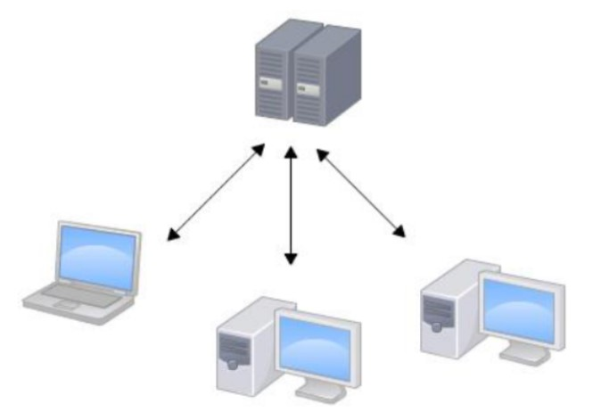

> 集中管理方式在一定程度上看到其他开发人员在干什么，而管理员也可以很轻松掌握每个人的开发权限。

> 但是相较于其优点而言，集中式版本控制工具缺点很明显：
>
> - 服务器单点故障
> - 容错性差

#### 分布式版本控制

> Git是分布式版本控制系统，那么它可以没有中央服务器的，每个人的电脑就是一个完整的版本库，这样，工作的时候就不需要联网了，因为版本都是在自己的电脑上。既然每个人的电脑都有一个完整的版本库，那多个人如何协作呢？比如说自己在电脑上改了文件A，其他人也在电脑上改了文件A，这时，你们两之间只需把各自的修改推送给对方，就可以互相看到对方的修改了。

> 下图就是分布式版本控制工具管理方式：

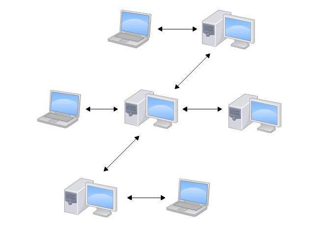

## Git安装

> **参考他人文档改编而来，实际操作中可能存在区别，但实际原理一致**

### 下载

下载地址：https://git-scm.com/download

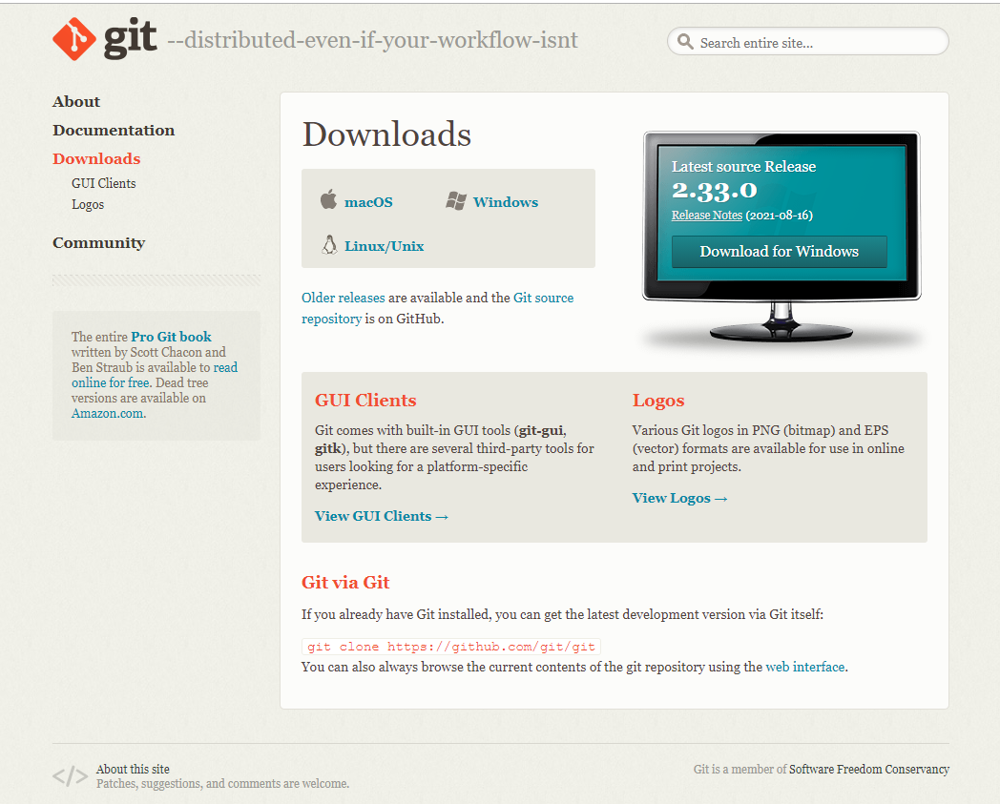

### 安装

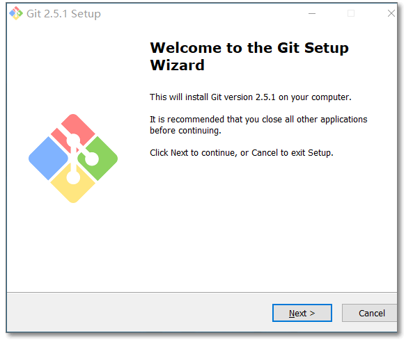

> 一路“Next”使用默认选项即可。

> 安装完成后，可以在任意文件夹点右键，看到如下菜单：

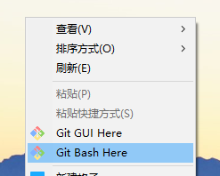

> 点击后，出现Git的控制台，在控制台输入`git`，可以看到相关的帮助信息：

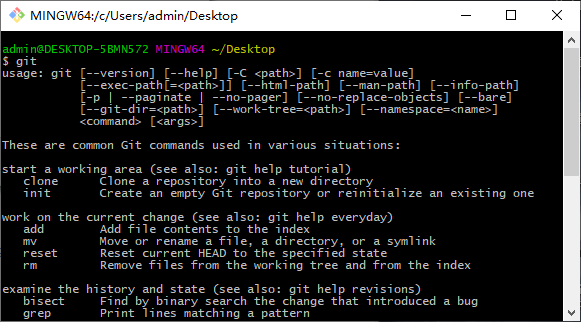

## Git的基本使用

### 创建版本库

> 关于版本库,你可以简单理解成一个目录，这个目录里面的所有文件都可以被Git管理起来，每个文件的修改、删除，Git都能跟踪，以便任何时刻都可以追踪历史，或者在将来某个时刻可以“还原”。由于git是分布式版本管理工具，所以git在不需要联网的情况下也具有完整的版本管理能力。

> 选择一个合适的地方创建一个空目录,右击打开Git Bash, 输入 **`git init`**  就可以将当前目录变成Git可以管理的仓库了

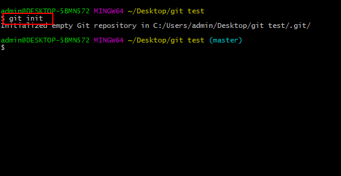

> 在目录中生成了一个.git的隐藏目录,这个目录就是Git用来跟踪管理版本库的,没事千万别手动修改该目录里的文件.

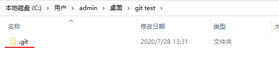

### 添加文件并提交

> 版本控制系统,其目的就是跟踪文本文件的变动,我们开发编写的代码,配置文件本质都是文本文件,

> 文件中的每一个字符的变化(添加,修改,删除)都会被跟踪并且进行版本控制.

> 1. 首先在 **工作区** 创建一个新的文本文件:readme.txt,并添加一些内容:hello git

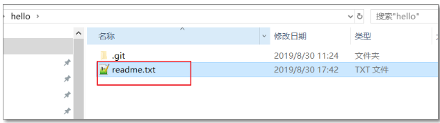

> 2. 将文件添加到 **暂存区**，**`git add 文件名`**

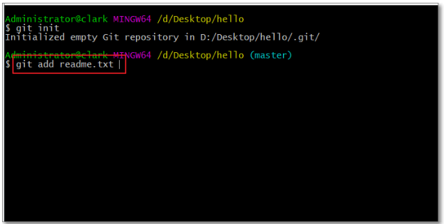

> 3. 通过 **`git commit`** 命令,将暂存区的文件提交到 **版本库** 的分支


> 如果是第一次安装Git,提交的时候需要认证用户,添加邮箱密码即可(随意)


```shell
git config --global user.email "邮箱地址" # 指定邮箱
git config --global user.name "用户名" # 指定用户名
```

> **命令解释:**

```shell
git add # 将文件从【工作区】添加到【暂存区】
git commit -m "本次提交的说明" # 将暂存区的文件提交到【版本库】命令参数,-m是本次提交的说明信息,用来注释本次提交内容的说明
```

> 我们发现,一个文件从创建到最终被Git进行版本控制,需要分两步
>
> 1. 使用 `git add`  将文件添加至 **暂存区**
> 2. 使用 `git commit` 将文件提交到 **版本库**

> 为什么不是创建后直接提交,而是要经历add和commit两个步骤呢?
>
> 这就关系到Git的仓库的相关概念了

### 工作区/暂存区/版本库

#### 工作区

> 就是创建的目录,对应当前案例的就是hello文件夹

#### 版本库及暂存区

> 工作区有一个隐藏目录 **.git** ，这个不算工作区，而是Git的版本库。

> Git的版本库里存了很多东西，其中最重要的就是称为 **stage**（或者叫 **index** ）的暂存区，还有Git为我们自动创建的第一个分支 **master** ，以及指向 **master** 的一个指针叫 **HEAD** 。

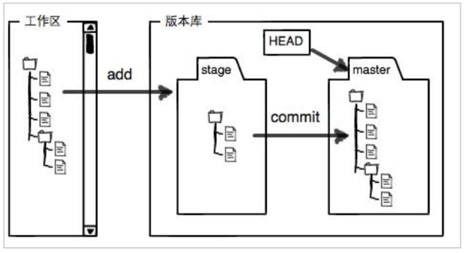

> 前面讲了我们把文件往Git版本库里添加的时候，是分两步执行的：
>
> - 第一步是用**git add**把文件添加进去，实际上就是把文件修改添加到暂存区；
> - 第二步是用**git commit**提交更改，实际上就是把暂存区的所有内容提交到当前分支。

> 因为我们创建Git版本库时，Git自动为我们创建了唯一一个 **master** 分支，所以，现在，**git commit** 就是往 **master** 分支上提交更改。

> 你可以简单理解为，需要提交的文件修改通通放到暂存区，然后，一次性提交暂存区的所有修改。

### 管理文件修改

> 我们在开发的时候,肯定会不可避免的对代码进行修改,修改完的文件也需要再次提交到版本库中,

> 那如何知道工作区的文件相对版本库的文件都有哪些差异呢?

#### 差异对比

> 我们对readme.txt文件进行修改:

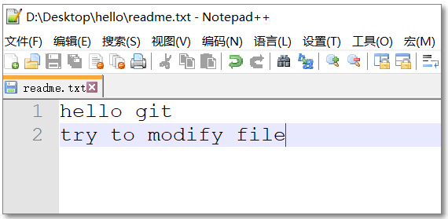

> 通过 **`git diff -- readme.txt`**  命令可以查看工作区和版本库里面最新版本的区别:

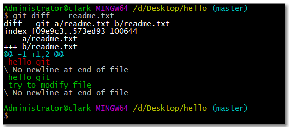

#### 查看状态

> 如果不确定自己哪些文件被修改了,可以通过 **`git status`** 命令,查看当前工作区的状态:

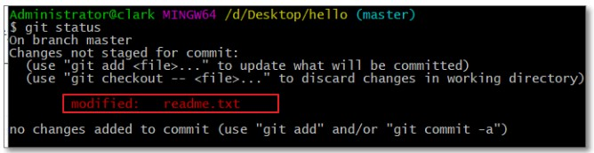

> 可以清楚的看到,修改没有被暂存,需要通过 `git add` 添加到暂存区

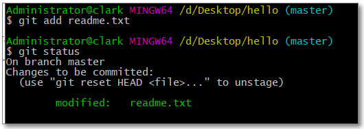

> 添加到暂存区后通过 **`git commit`** 进行提交,再次查看状态:

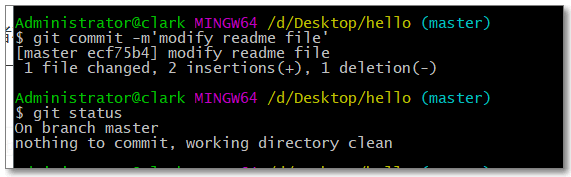

> 提示说:工作区很干净,没有任何内容需要提交

> 以上就是对工作区文件进行修改后, 再次提交到版本库的过程.

#### 版本回退

> 编辑readme.txt文件:


> 提交到版本库:

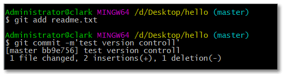

##### 查看日志

> 通过 `git log`  命令,可以查看历史每次提交的信息:

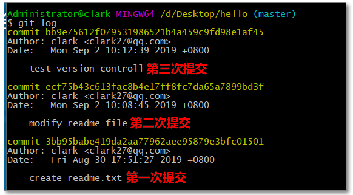

> 可以发现，目前为止，我们已经在本地仓库中提交了3次，也就是说有3个不同版本。其中，最近的这个版本有一个标示：**HEAD** ，这就是标记当前分支的当前版本所在位置。

> 本例当中，当前版本即 test version control这次提交,如果没有HEAD->master,需要查看日志命令后加上 --decorate查看，即git log --decorate。

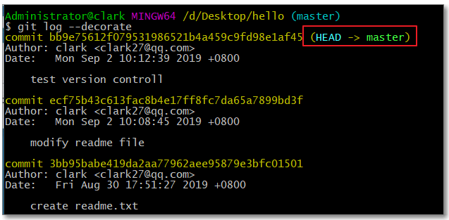

> 在log中，每一个版本的前面，都有一长串随即数字：bb9e7561……af45 ，这是每次提交的 **commit id**
> ，这是通过SHA1算法得到的值，Git通过这个唯一的id来区分每次提交。

##### 版本回退

> 现在，假设我们要回到上一级版本，该如何操作呢？

> 首先，Git通过**HEAD**来判断当前所在的版本位置。那么上一个版本，就用 **HEAD^** 标示，上上一个版本就是 **HEAD^^** ，当然往上100个版本写100个^比较容易数不过来，所以写成 **HEAD~100** 。

> 如果要从 “test version control” 回退到 “modify readme file” ，我们可以使用  **`git reset --hard HEAD^`** 命令

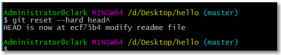

> 提示说:HEAD 现在已经被设置到ecf75b4 这个版本了,再次查看readme.txt文件:

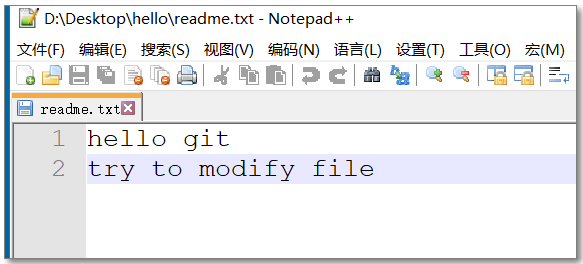

> 发现,版本已经回退了,最新添加的 text version control 已经没有了.

> 再次通过 **`git log`**  查看日志,发现只剩下两次提交信息,第三次已经没了:

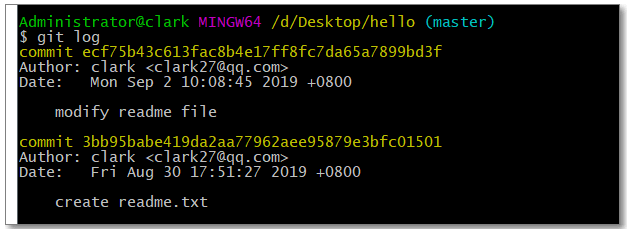

> 但如果此时后悔了, 还想回到第三次提交的版本该怎么办呢?

##### 查看所有关联日志

> 通过 **`git reflog`**  命令,看到以前的每次执行动作:

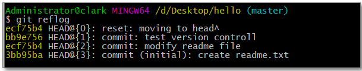

> 关联日志记录了版本操作的id,其中bb9e756 就是第三次提交版本的id,我们可以通过指定id的方式,来指定HEAD的位置:

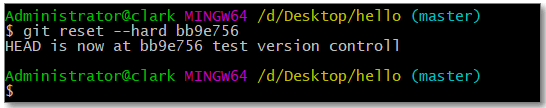

> 再次查看日志,发现第三次提交又回来了

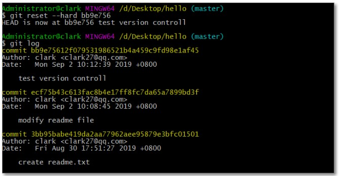

> 文件的数据也恢复了:

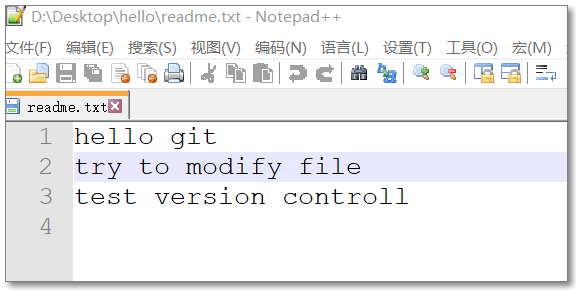

##### 总结

> 如果要进行版本回退或前进，一般分两步：
>
> 1. 通过 **git log** 或 **git reflog** 查看操作日志，查找版本的 **commit** **id**
> 2. 通过 **git reset --hard**  设置 **HEAD** 到指定版本

> 其实版本的回退，仅仅是修改HEAD指针的位置而已

#### 撤销修改

##### 撤销工作区修改

> 现在我们在readme.txt中添加一行数据：

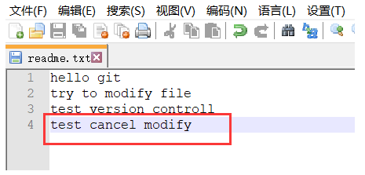

> 在你提交前，你突然发现这个修改是有问题的，你打算恢复到原来的样子。怎么办？

> 如果修改的并不多，我们完全可以手动恢复到原始状态。但是如果改动比较大，手动处理就很容易有遗漏，而且很麻烦。怎么办？

> 查看状态：

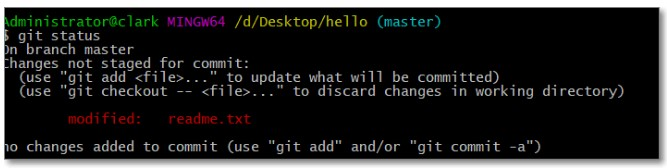

> Git提示我们，现在文件已经修改，等待被staged（暂存）。我们有两个选择：
>
> 1. 可以使用 **git add**  来添加到暂存区，接着去提交文件,然后回退到上一个版本.
> 2. 可以使 **git** **checkout --**  来撤销修改

> 所以，这里我们选择第二种方案后,再次查看状态：

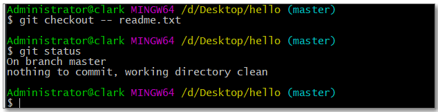

> 工作区是干净的！修改已经被撤销了！

> 查看文件：

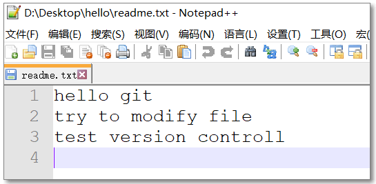

##### 撤销staged修改

> 刚才的案例中，我们修改了数据，并没有add到暂存区，处理起来还算简单。如果我们已经把数据add 到了暂存区，又该如何处理呢？

> 我们首先添加一行数据到readme.txt

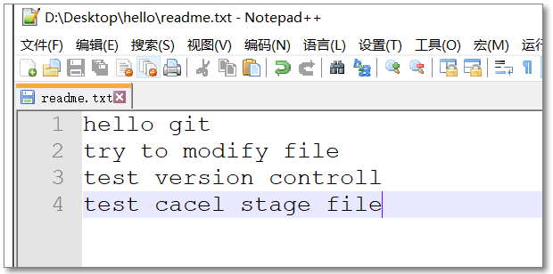

> 并且添加到staged（暂存区），然后查看状态

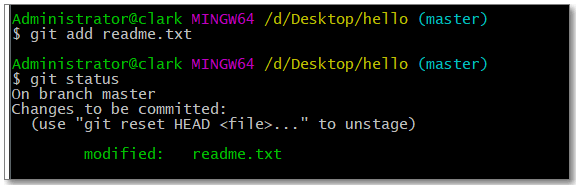

> 有一个修改等待被提交，并且有一行提示：可以使用 **git reset HEAD** 来撤销缓存修改。

> 我们前面说过，**git reset** 命令可以进行版本回退，此处reset 指定的是 **HEAD** ，而不是其他版本，因此就有撤销缓存修改的作用：

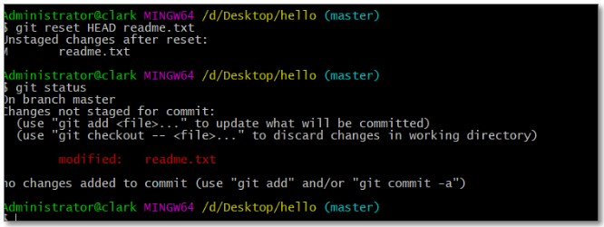

> 发现文件的修改被撤回到了工作区，尚未添加到staged（暂存区），我们再次执行**git checkout** **--**  即可撤销工作区修改

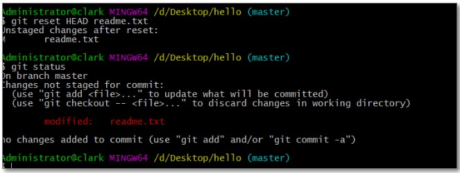

> 工作区干净了！

> 查看文件：

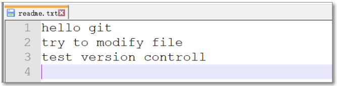

##### 总结

> 撤销修改分两种情况：
>
> 1. 撤销工作区修改，使用 **git checkout** **--**
>
> 2. 撤销暂存区修改，分两步：
     >
     >    2.1. 使用 **git reset HEAD** 来撤销暂存区修改。
     >
     >    2.2. 使用 **git checkout** **--** 来撤销工作区修改

## 远程仓库

> 到目前为止，我们已经学会了如何在本机利用git进行文件版本管理，但是如果要想进行多人协作，我们就必须使用远程仓库。将本地仓库的数据同步到远程仓库，实现多人协作开发。

> 目前比较热门的代码托管社区：GitHub，网址：https://gtihub.com  ,提供了免费的远程git仓库功能。不过网速不是特别流畅。
> 在国内，有很多的公司使用oschina提供的git服务：码云, https://gitee.com ，当然，我们也可以自己来搭建远程仓库。

> 这里使用的个人搭建的私服GitLab，其实Github、Gitee也只是在创建账号与用户设置上有些许差异，大家摸索下也就都会用了

> **访问http://119.45.45.13:8099, 账号由管理员统一申请，发送激活邮件至个人邮箱，账号为个人邮箱，密码为激活时设置的密码**（Github、Gitee用户忽略此步骤，自行去相应网站注册账号）

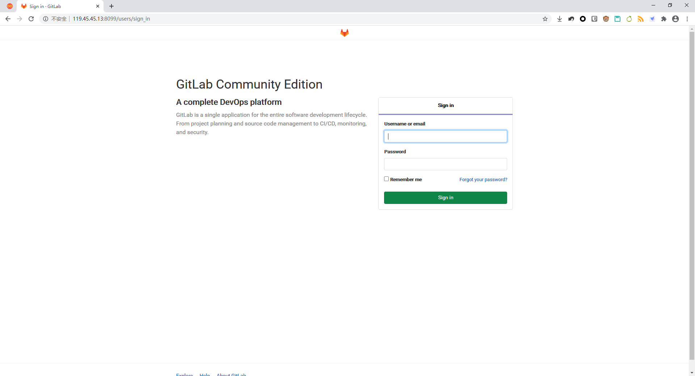

> **根据个人习惯设置语言**（Github、Gitee用户可忽略此步骤）

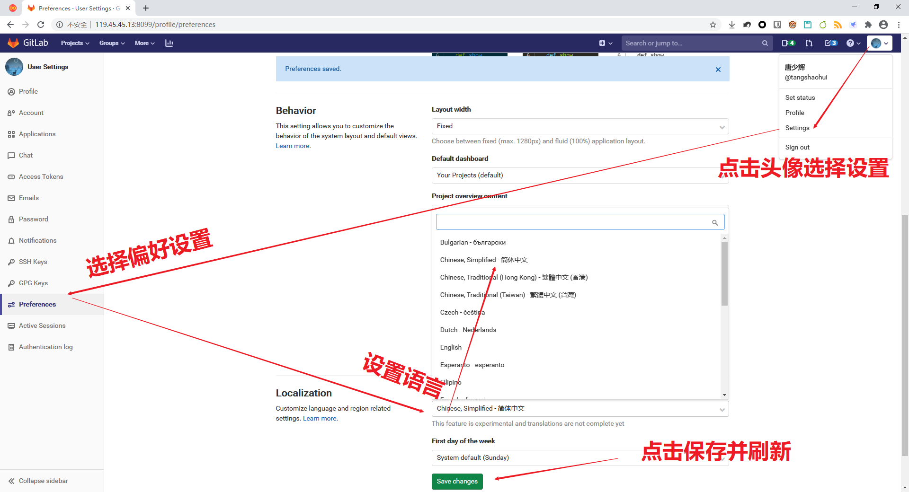

> **创建SSH密钥**
> 本机打开CMD命令行

```shell
ssh-keygen -t rsa -b 2048 -C "email@example.com"
```

**需要输入加密短语，两次一致，记住密钥短语后期提交代码会使用到**
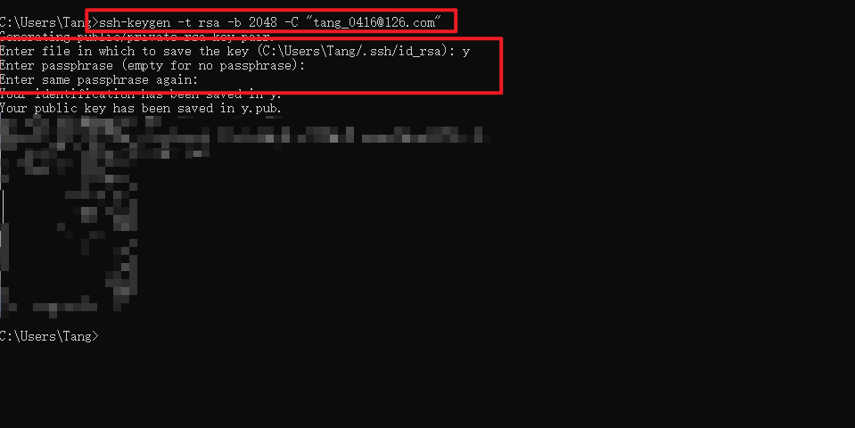

> 根据提示找到密钥文件

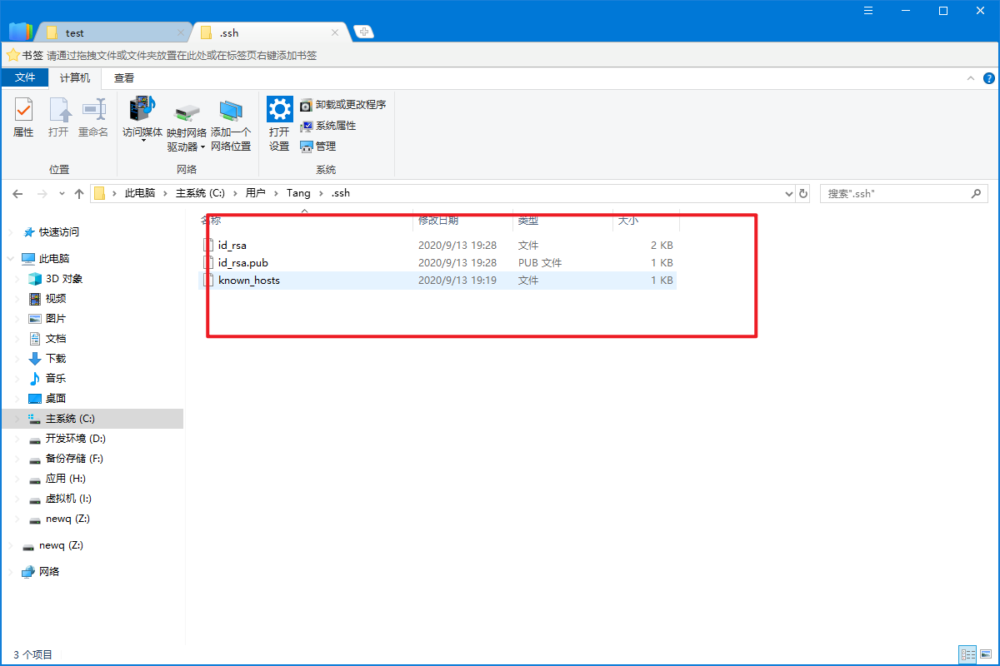

> **将.pub的密钥内容复制到个人账号的SSH密钥中**

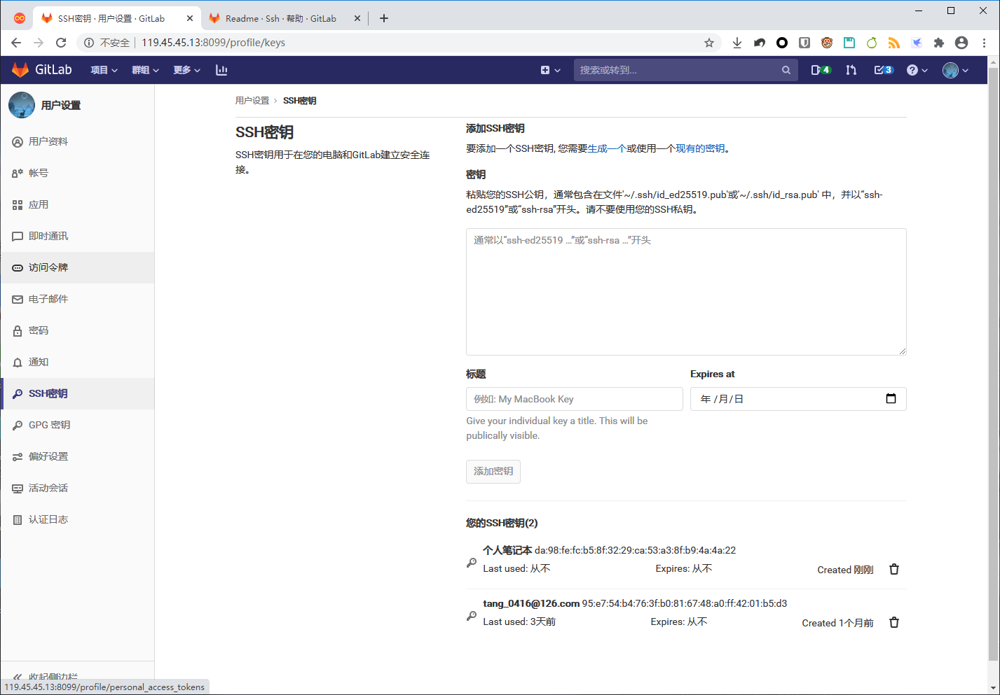

### 创建或加入新的项目

> （Github、Gitee用户忽略此步骤，Github、Gitee用户一般在右上角➕处可找到创建仓库的地方）

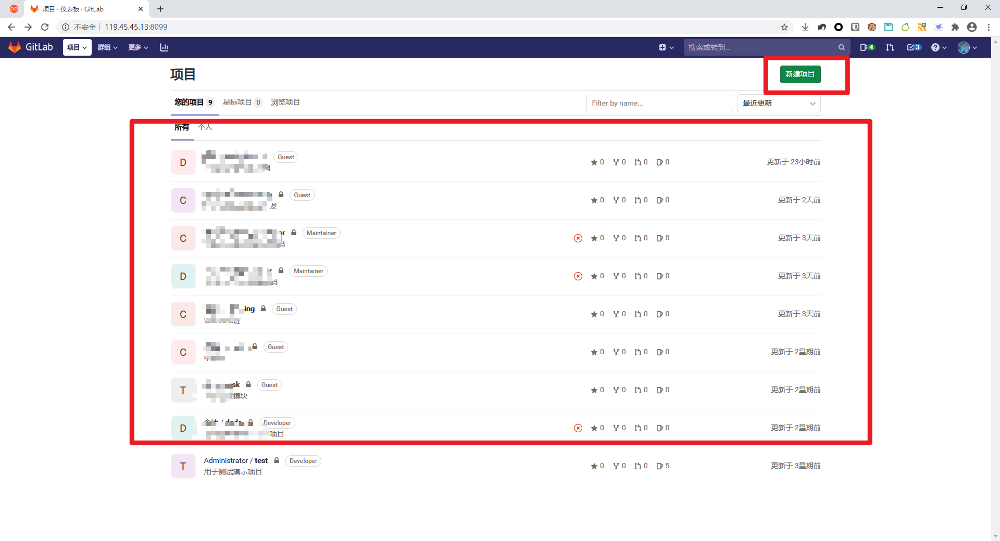

> **新建项目**（Github、Gitee用户为新建仓库）

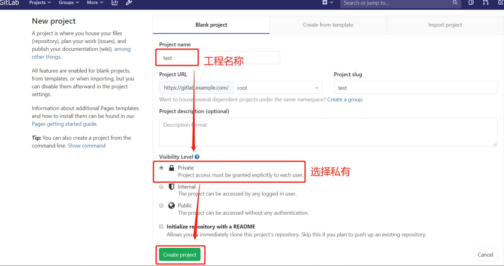

### 推送远程仓库

> 创建完仓库后,会弹出使用教程页面:

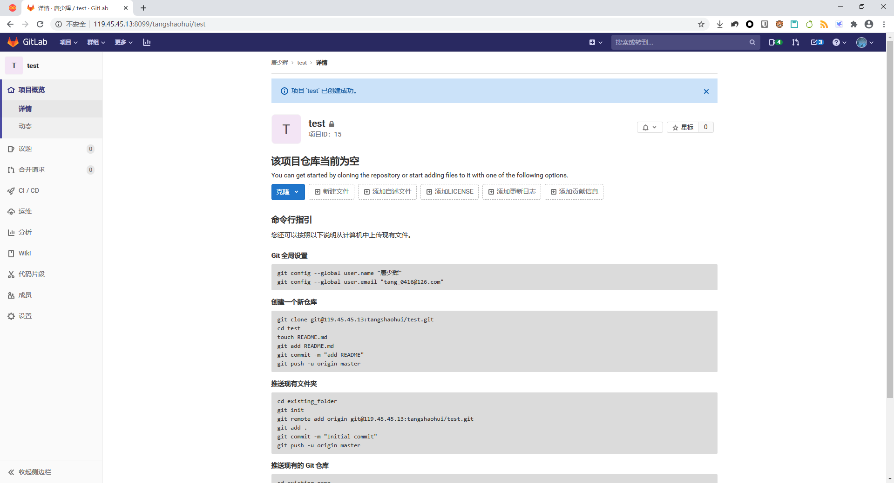

> 这里配置了SSH证书所以使用SSH克隆地址，点击克隆按钮可以看到SSH地址

> **本地项目仓库关联远程仓库**

```shell
git remote add origin git@119.45.45.13:8099/tangshaohui/test.git # 关联仓库
git push -u origin master # 推送本地记录至远程
```

> 推送成功！此时登录远程仓库，刷新页面，可以看到数据已经推送，并且与本地仓库完全一致：

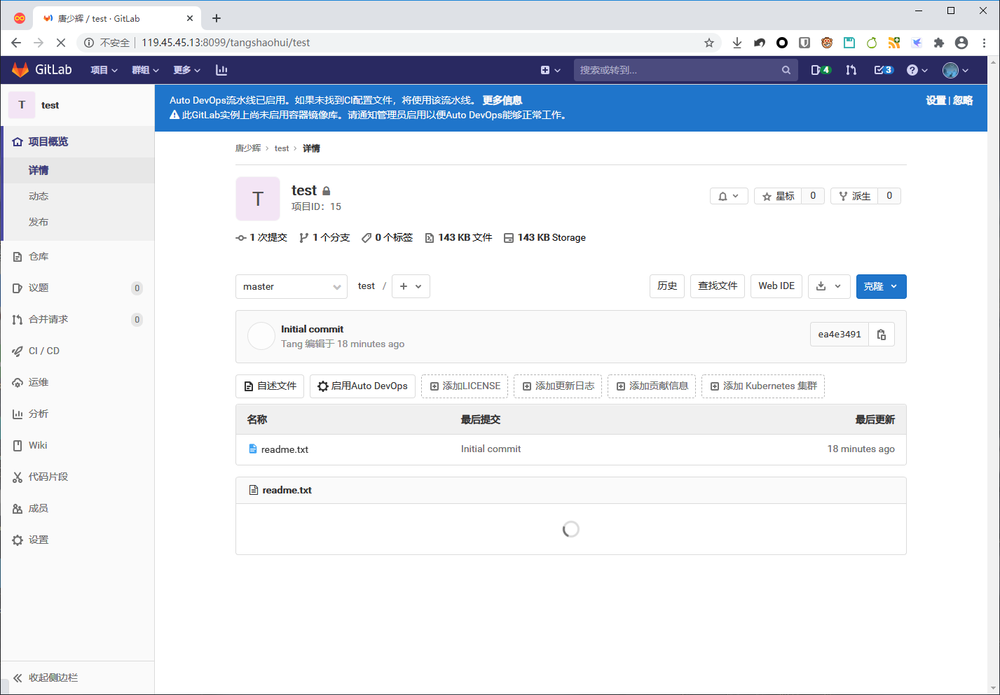

> 从现在起，只要本地作了提交，就可以通过命令：**`git push origin master`**

> 把本地 **master** 分支的最新修改推送至Gitee，现在，你就拥有了真正的分布式版本库！

> 如果不想每次push的时候都要重新输入用户名和密码: 可以通过以下命令实现:

```shell
git config --global credential.helper wincred
```

> 然后再次执行push命令,输入完用户名和密码,之后的操作中 就不再需要重新输入了

### 克隆远程仓库

> 现在，假设一个新的成员要加入我们的开发队伍，那他首先要做的第一件事情，一定是从远程仓库获取所有代码。此时就可以使用克隆动作。

> 克隆远程仓库：就是从远程把仓库复制一份到本地，克隆后会创建一个新的本地仓库。

> 首先我们从gitee获取要被克隆的远程仓库地址: git@119.45.45.13:8099/tangshaohui/test.git

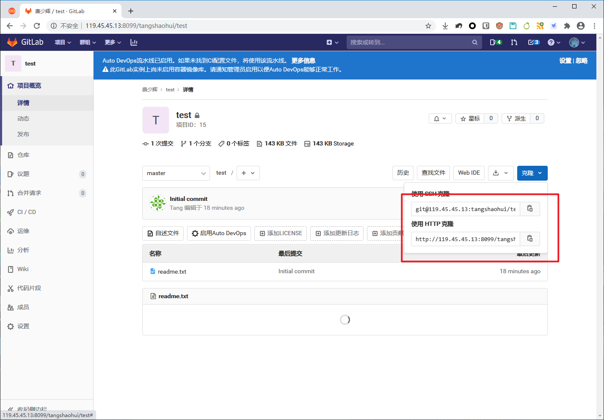

> 在本地空目录打开Git bash,输入命令 **`git clone 远程仓库地址`**

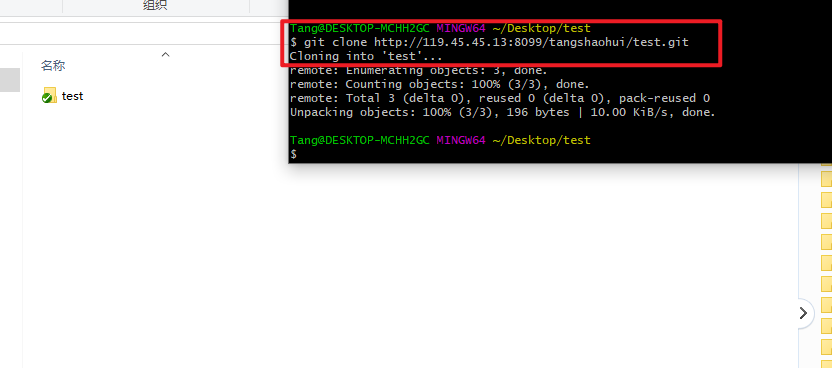

> 远程仓库被克隆到了gitrepo目录,我们打开该目录就可以看到和远程仓库同步了:

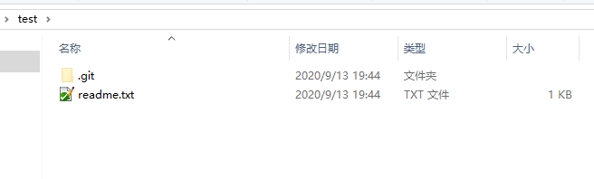

### 从远程仓库拉取数据

> 现在如果有人也向远程仓库推送了代码，那么我们就需要拉取 远程仓库的最新代码到本地：

> 我们可以先手动修改远程仓库数据，模拟他人的提交：

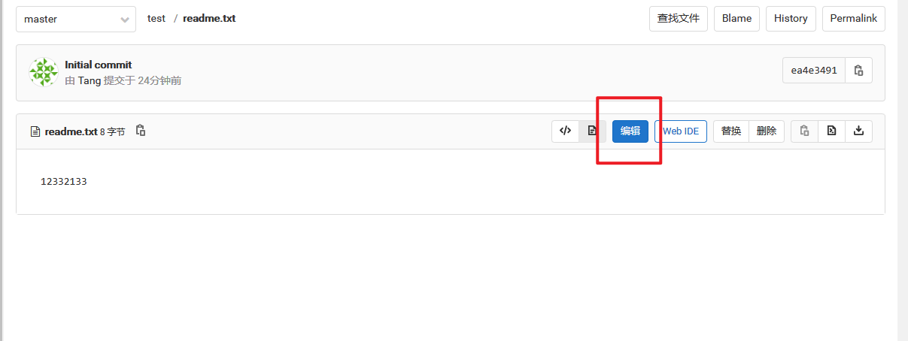

----

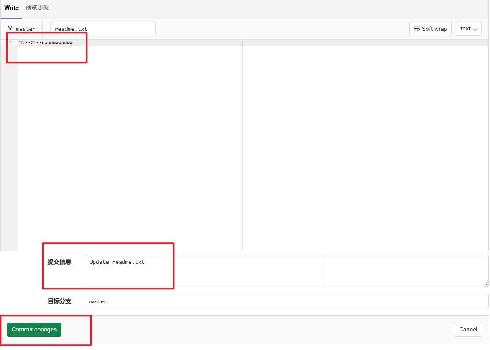

----

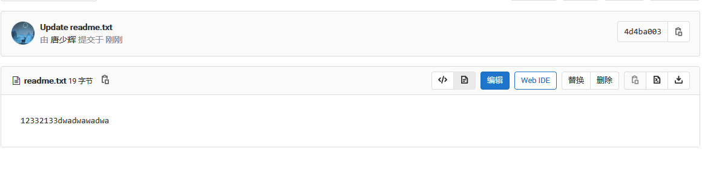

> 在本地使用 `git pull` 命令拉取最新代码:

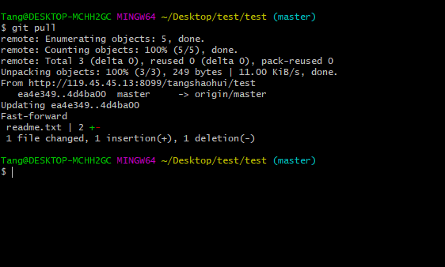

> 查看文件:

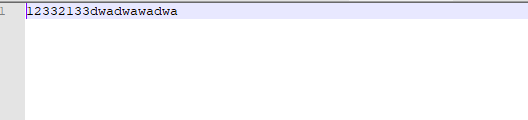

> 内容已经与远端保持一致。

### 总结

> 注意：
>
> 1. 如果没有本地仓库,先创建本地仓库,添加内容后再推送到远程仓库
>
> 2. 如果已经有本地仓库，并且想要与远程仓库关联，一般需要两步：
     >
     >    2.1. 通过 **git remote add origin** + 远程仓库地址 进行关联
     >
     >    2.2. 通过 **git push -u origin master** 推送本地仓库修改到远程仓库
>
> 3. 获取远程仓库内容可以通过 **git clone** + 远程仓库地址 进行克隆并创建本地仓库
> 4. 通过 **git pull** 拉取远程仓库的最新内容到本地仓库

## 分支管理

### 分支有什么用

> 假设你准备开发一个新功能，但是需要两周才能完成，第一周你写了50%的代码，如果立刻提交，由于代码还没写完，不完整的代码库会导致别人不能干活了。如果等代码全部写完再一次提交，又存在丢失每天进度的巨大风险.

> 现在有了分支，就不用怕了。你创建了一个属于你自己的分支，别人看不到，还继续在原来的分支上正常工作，而你在自己的分支上干活，想提交就提交，直到开发完毕后，再一次性合并到原来的分支上，这样，既安全，又不影响别人工作.

### Git的分支管理原理

> 我们的每次提交，都对应一个具体的时间点，git会把这许多的时间点串起来，就形成了一条时间线，这条时间线就是一个分支。Git中默认的分支就是主分支，叫master。

> 我们查看当前的提交日志：

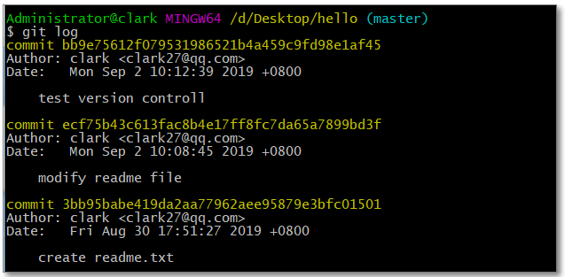

> 发现总共有3次提交，这3次提交可以串起来成一条时间线，就是master分支：

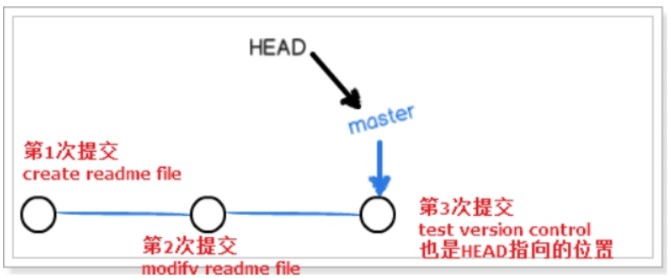

> 每次提交，**master** 分支都会新增一个时间点，分支线也不断变长。

> 当我们创建新的分支，例如 **dev** 分支。Git会创建一个新的指针，叫做 **dev** ，指向跟 **master** 相同的时间点（提交点），这样分支就创建好了，你的工作区无需任何改变，创建分支的速度非常的快。

> 而要切换分支，只需要把 **HEAD** 指向 **dev** 即可.

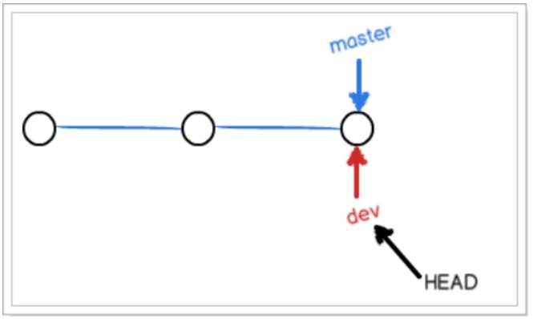

> 不过，从现在开始，对工作区的修改和提交就是针对dev分支了，比如新提交一次后，dev指针往前移动一步，而master指针不变：

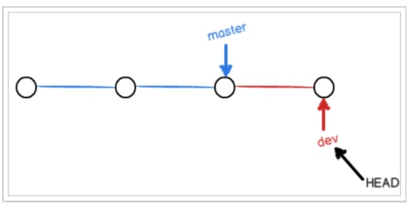

> 假如我们在dev上的工作完成了，就可以把dev合并到master上。Git怎么合并呢？最简单的方法，就是直接把master指向dev的当前提交，就完成了合并：


> 合并完分支后，甚至可以删除dev分支。删除dev分支就是把dev指针给删掉，删掉后，我们就剩下了一条master分支：

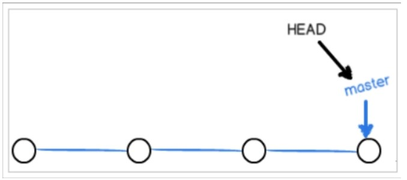

> 你会发现Git的分支管理，基本就是创建新的指针，改变HEAD指向，删除指针等操作，几乎没有文件的增删。所以速度非常快！

### 分支的创建和合并

#### 创建分支

> 我们可以使用 **`git checkout -b 分支名`** 来创建并切换到新的分支：

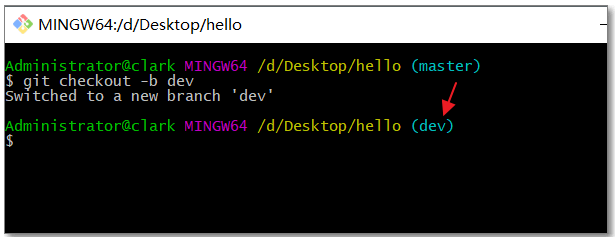

> 你会注意到我们已经切换到了dev分支。 **`git checkout -b 参数`** ，就等同于创建分支，并切换分支。相当于以下两条命令：

```shell
git branch dev # 创建分支
git checkout dev # 切换到具体分支
```

> 使用 **`git branch`** 查看所有分支，当前分支前面会有一个*表示：

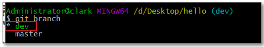

> 然后我们可以在 **dev** 分支上进行修改和提交。例如我们在readme.txt上添加一行文字：

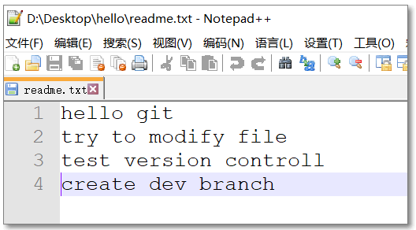

> 提交文件

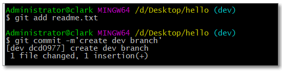

> 此时，**dev** 分支已经比 **master** 领先了一次提交，并且 **HEAD** 指向的是 **dev**

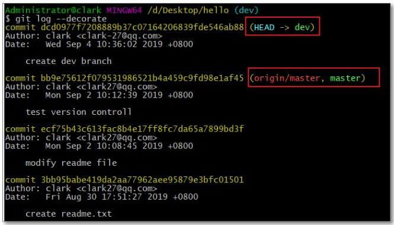

#### 合并分支

> 我们使用 **`git checkout master`** 切换回**master**分支，查看文件内容：

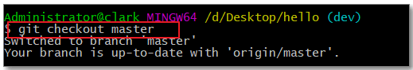

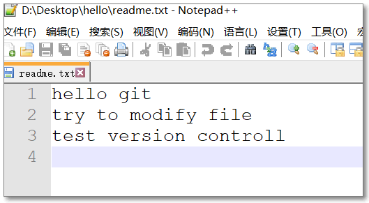

> 发现readme并没有改变，因为刚才修改的是 **dev** 分支。此时的 **HEAD** 已经指向了 **master** 了：

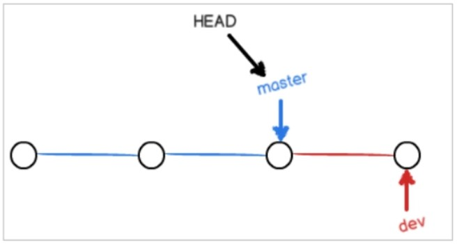

> 我们使用 **`git merge dev`** 命令将 **dev** 分支的修改合并到 **master** 分支：

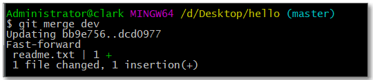

> **`git merge`** 命令用于合并指定分支到当前分支。合并后，再查看readme.txt的内容，就可以看到，和 dev分支的最新提交是完全一样的。

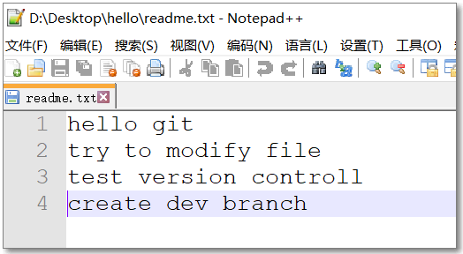

#### 删除分支

> 合并完成后，就可以放心地删除 **dev** 分支了，可以使用 **git branch -d dev** 命令删除 **dev** 分支，dev就是具体的分支名

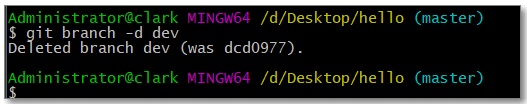

> 再次查看分支列表：

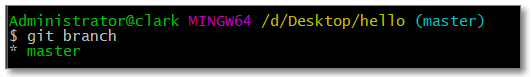

#### 总结

> 1. 使用 **git branch** **分支名** 创建分支
> 2. 使用 **git checkout** **分支名** 来切换分支
> 3. 也可以使用 **git checkout -b** **分支名** 来完成 创建并切换分支的操作
> 4. 使用 **git merge** **分支名** 来合并分支到当前分支
> 5. 使用 **git branch -d** **分支名** 来删除指定分支，注意：要删除一个未合并的分支。需要使用 **-D** 参数进行强制删除

### 解决冲突

#### 制造冲突

> 现在我们新建一个分支:dev

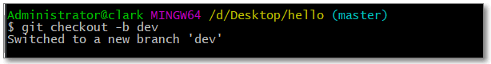

> 然后修改文件内容并提交

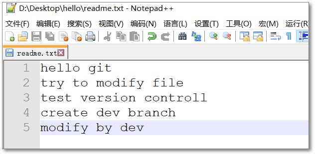

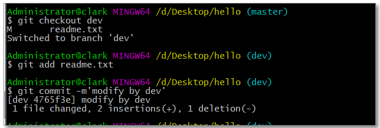

> 再切换回master分支:

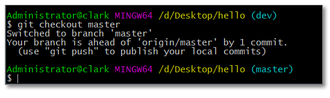

> 同样修改文件内容并 提交:

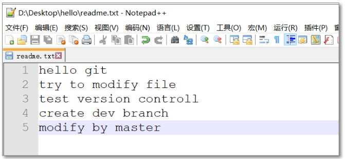

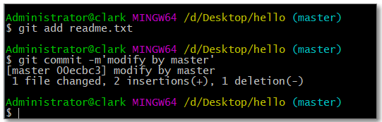

> 现在，master和dev都有了各自新的提交，变成了这样：

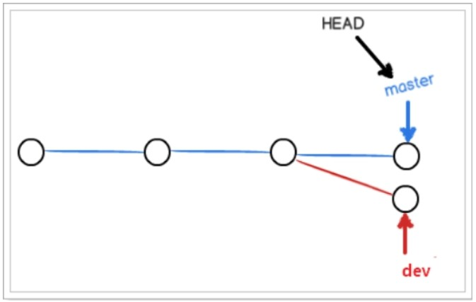

> 这种情况下，是无法进行快速合并的。我们试一下：

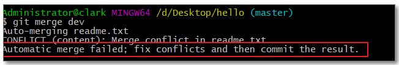

> 提示:自动合并失败，必须先解决文件冲突，才能提交。

> 此时查看readme.txt文件：

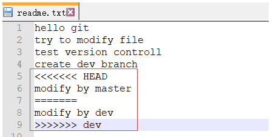

> 我们可以根据实际情况进行冲突解决，比如两者都保留：

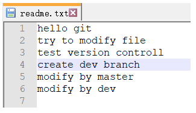

> 然后再次提交：

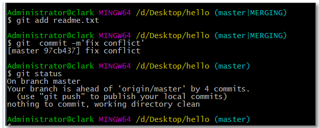

> 工作区就干净了。此时master和dev分支线就变成了这样：

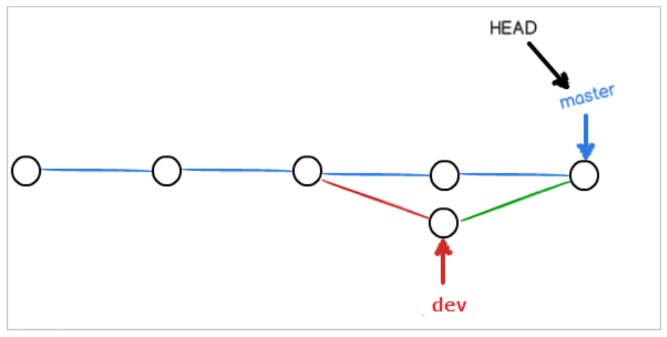

> 可以用 **`git log --graph --decorate --pretty=oneline --abbrev-commit`** 命令来查看：

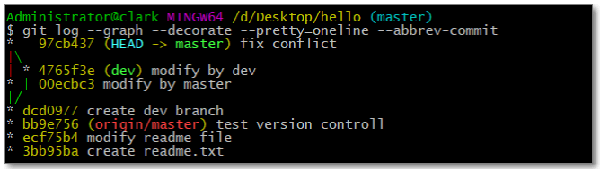

> 删除dev分支:


## Git工具

> 自己去网上找吧，这里就不做详细介绍了

## IDEA客户端

### 在IDEA中配置Git

> 在IDEA开始界面选择 Configure->Settings:

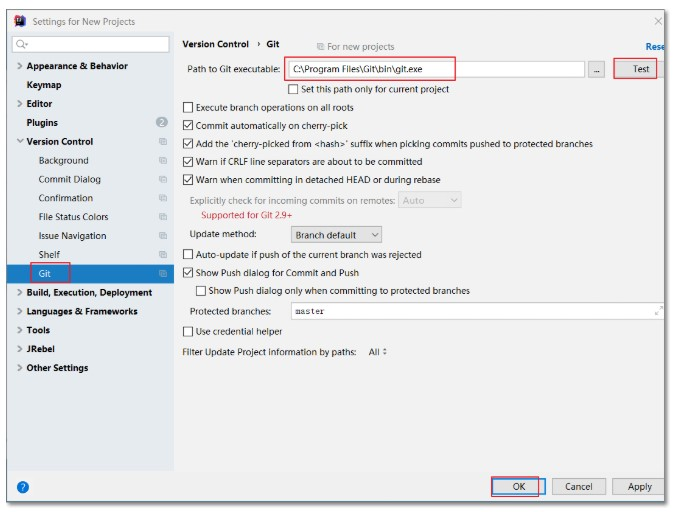

### 创建工程和本地版本库

> 新建一个maven工程:

> 打开VCS菜单

> **VCS -->  Import into Version Control --> Create Git Repository**

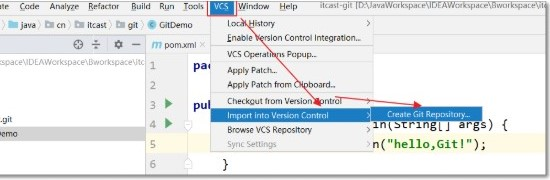

> 在弹框中选中项目所在的位置，**点击OK**。

> 此时项目文件全部变成**棕色**。


> 项目Git版本已经创建成功:

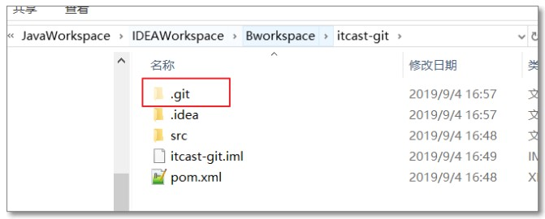

### 忽略文件

> 安装ignore插件，插件商城搜索.ignore，点击Install，安装完成后就可以愉快的使用了，记得重启IDEA。

> 可以手动创建.gitignore文件,也可以通过插件过滤:

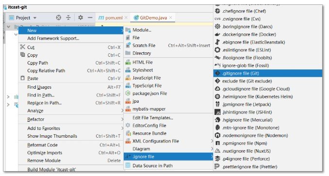

> 创建.gitgnore文件,选择Example user template 模版(根据需求自行添加过滤规则)

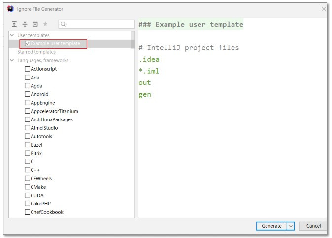

> 将当前项目中需要忽略的文件或目录添加到.gitgnore文件中:

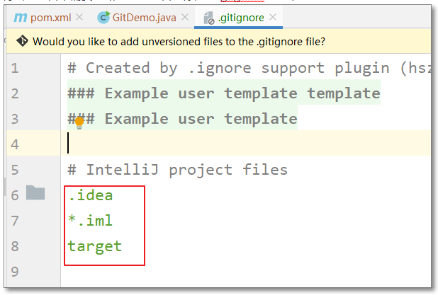

### 提交代码(重点)

#### 添加代码到暂存区

> 项目右键选择Git --> add(Ctrl+alt+A)

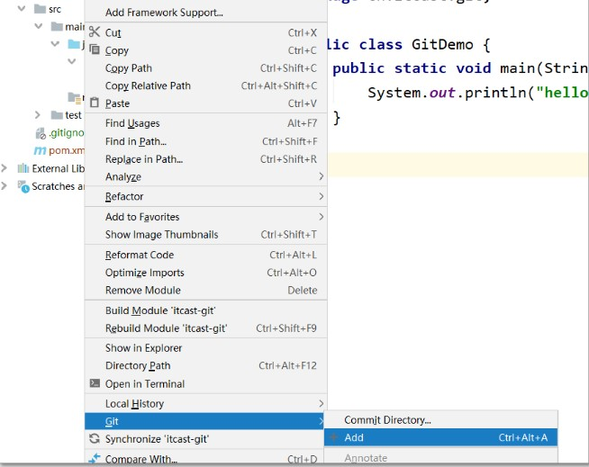

> 此时项目文件全部变成绿色，此时文件只是处于暂存区，并没有真正进入到版本库中。

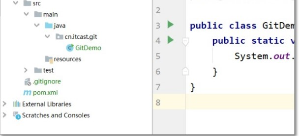

#### 提交到本地版本库

> 项目右键Git--> Commit Directory

> 在弹窗中输入Commit Message，点击commit，此时项目文件从暂存区真正进入版本库中

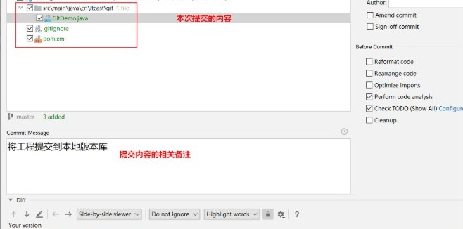

> 此时项目文件全部变成 **黑色** ： bedroom

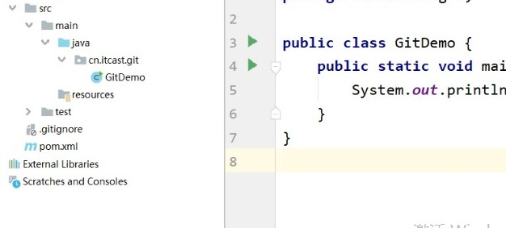

### 推送到远程仓库(重点)

#### 新建远程仓库

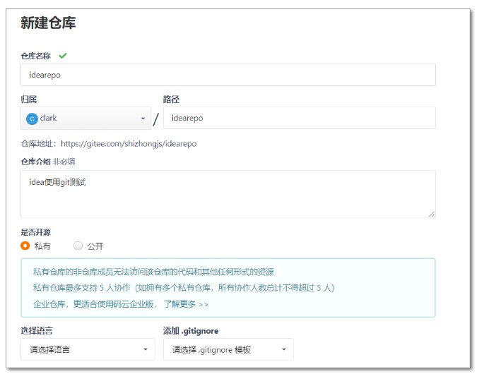

> 记录仓库地址:http://****/idearepo.git

#### 推送到远程仓库

> 右键选择项目—> **Git ->Repository -> Push** ，然后填写远程仓库地址。

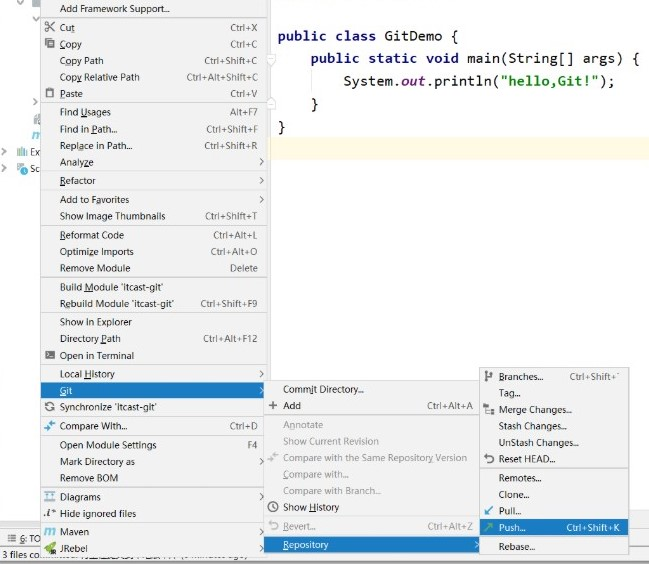

> 复制远程仓库的地址，并填写：

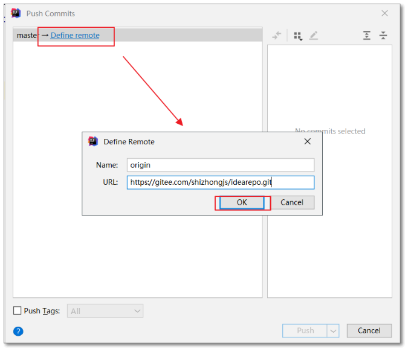

> 点击Push

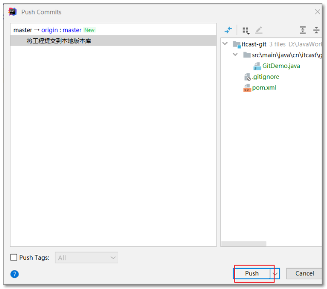

> 推送成功, 在IDEA右下角弹出提示框：

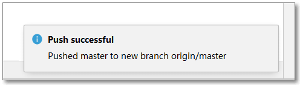

> 查看远程仓库:

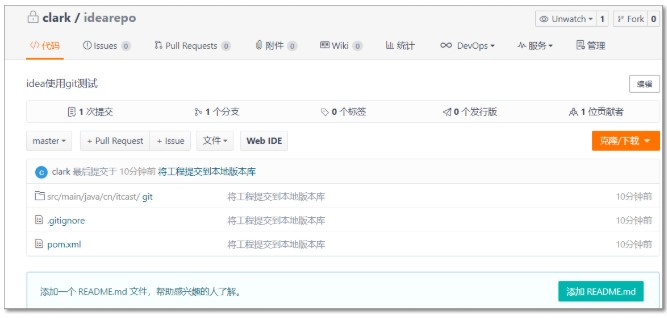

#### 拉取数据

> 在远程仓库随意修改代码:

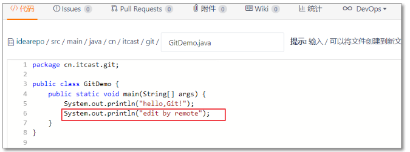

> 在本地项目中，拉取代码：


> 点击Pull:

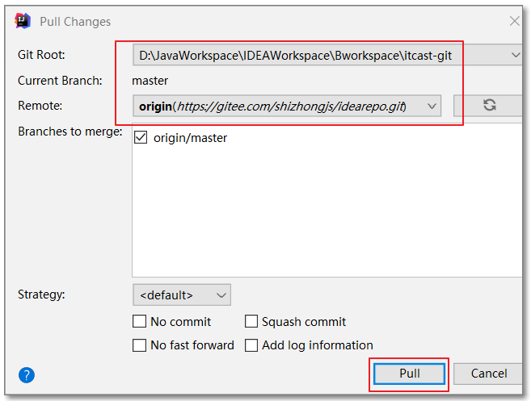

> 代码同步成功:

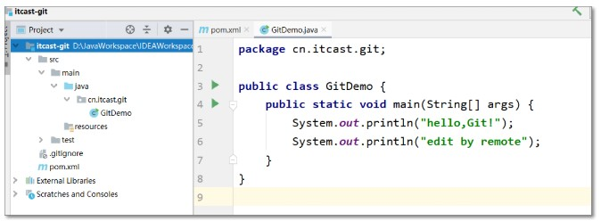

### 克隆项目(重点)

#### 删除本地项目

#### 克隆远程仓库并导入IDEA

> 打开IDEA,点击 **Check out form Version Control**，选中Git

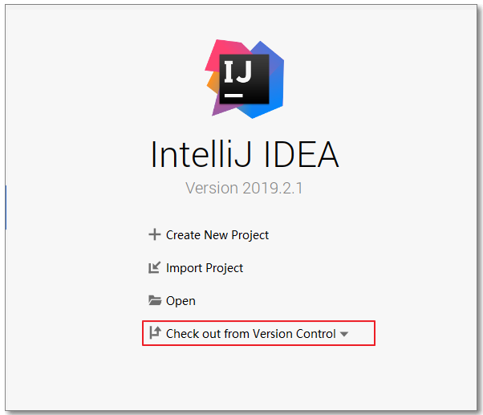

> 填入远程仓库地址,输入你的远程仓库地址，点击Test，测试一下地址是否正确。

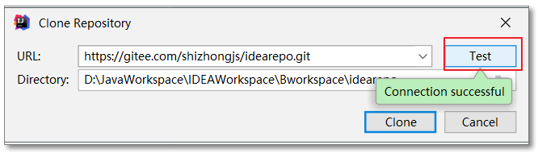

> 点击YES:

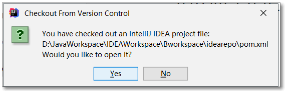

> 导入成功：

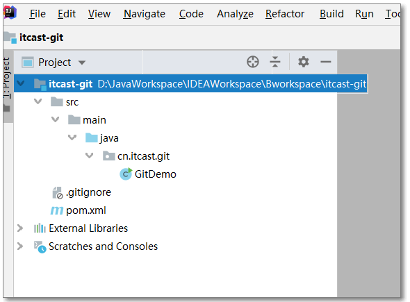

### 解决冲突

#### 制造冲突

> 在IDEA工具右下角:点击Git:master

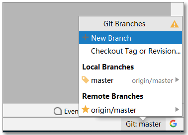

> 创建新的分支:

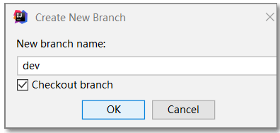

> 修改dev分支中的代码并提交

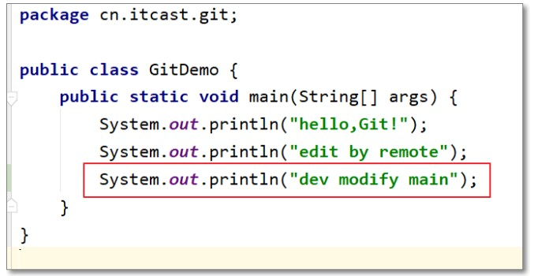

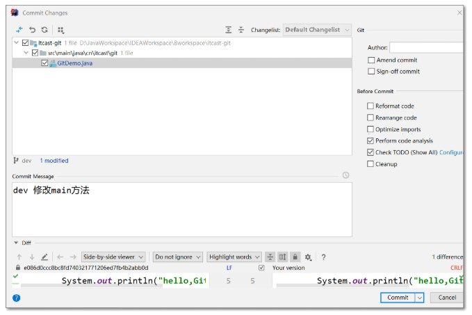

> 接着切换到master分支,修改main方法并提交

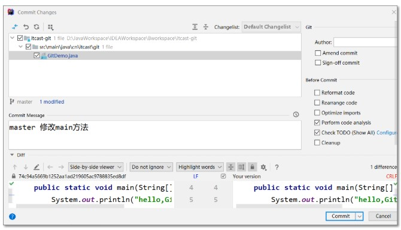

> 接下来尝试合并dev分支：

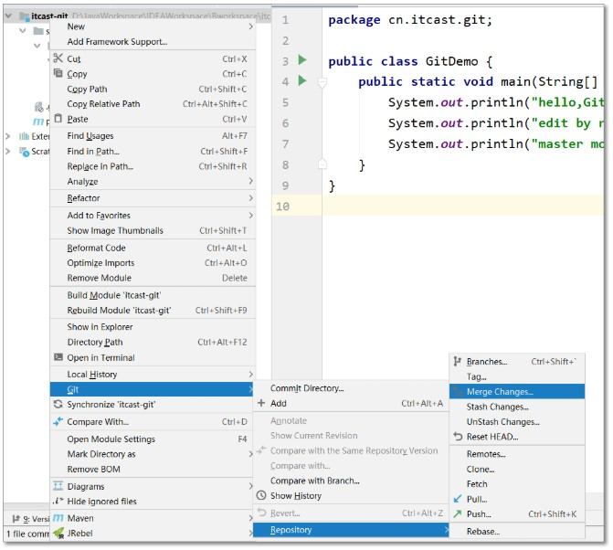

> 选择要合并的分支：

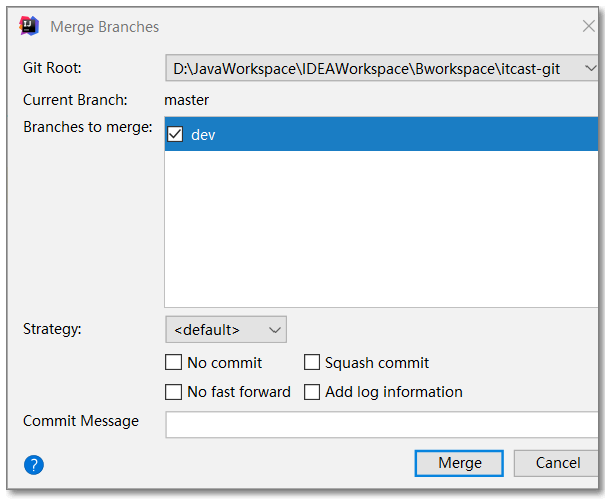

> **发现合并失败** ,此时文件有 **红色标记**

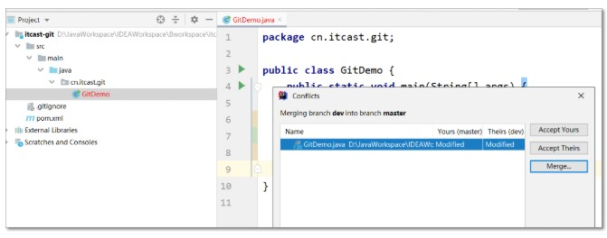

#### 解决冲突

```
Accept Yours：保留你自己的代码, 
Accept Theirs：保留别人的,
merge：人工合并
```

> 点击Merge...

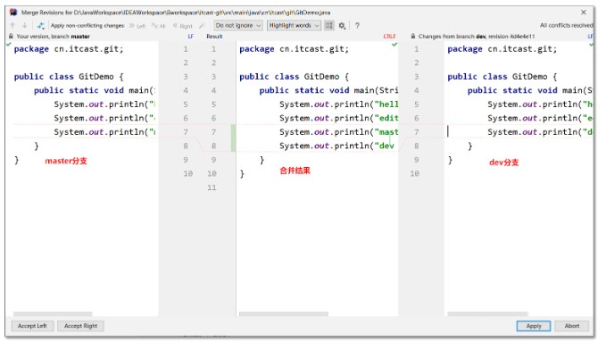

> 此时文件的红色标记没了：

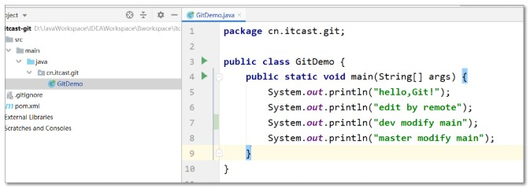

> 但是有未提交的**蓝色标记**。然后提交，文件变为**黑色**。冲突被解决！

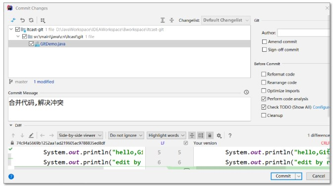
