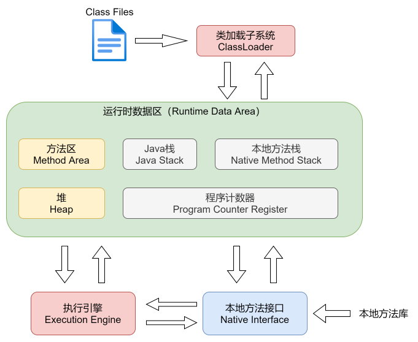

> 备用工具链接
>
> JClassLib：https://github.com/ingokegel/jclasslib/tags
>
> MemoryAnalyzer：https://www.eclipse.org/mat/downloads.php
>
> PXBinaryViewer：https://binary-viewer.en.softonic.com/download

## JVM整体架构

