## JVM内存模型简图

## JVM运行时数据区介绍

- **堆（Heap）：**

  > 被线程共享的一块数据区域，用于存储创建的对象与数组等。是垃圾回收器进行垃圾收集的主要区域，根据VM的分代收集算法，Java堆还可以被细分为： **新生代** （Eden、FormSurvivor和ToSurvivor）和 **老年代**
- **方法区（MethodArea）：**
  > 被线程共享的内存区域，常用永久代描述方法区。用于存储JVM加载的类信息、常量、静态变量、即时编译器编译后的代码等。HotspotVM采取Java堆的永久代来实现方法区，这样垃圾回收器可以像管理Java堆一样管理方法区，而不需要重新实现（永久代的回收收益也很小，一般只有常量池回收与类型卸载）。

    - 常量池

      > 用于村方法编译期生成的各种字面常量和符号引用，这部分的内容将在类加载后存放到方法区中的运行时常量池
- **虚拟机栈（VMStack）：**
  > 描述Java方法执行的内存模型，每个线程独立拥有。 每调用一个方法都会创建一个栈帧，栈帧随着方法的调用而创建，随着方法的结束而销毁。

    - 栈帧

      > 用于存储一个方法的局部变量、操作数栈、动态链接、方法出口等信息

- **本地方法栈（NativeMethodStack）：**

  > 线程私有的栈空间，用于存储线程执行的Native方法
- **程序计数器（ProgramCounterRegister）：**

  > 一块很小的内存空间，每个线程独立拥有。主要用于存储当前线程执行的Java方法的字节码指令地址， 如果调用的时Native方法则为空

## 类加载子系统

## Java堆的分代结构

### 新生代

> 用于存放新创建的对象吗，一般占据堆内存的 1/3 空间。由于对象创建频繁，所以该区域会频繁触发 `新生代回收` 进行垃圾回收。新生代又细分为如下

- Eden：

  > Java新生对象的存储位置（如果对象占用空间过大会直接放入老年代中）。当Eden空间不足时就会触发 `新生代回收` 通过 [复制算法](/Java/JVM/GC收集算法及收集器.md?id=复制算法) 进行垃圾回收

- From Survivor：

  > 上次GC的幸存者

- To Survivor：

  > 用于临时保存GC过程中的幸存者

> 新生代回收流程如下

### 老年代

> 用于存放程序中生命周期比较长的内存对象，由于老年代中的对象比较稳定，所以 `老年代回收` 不会频繁触发。在进行 `老年代回收` 前一般会先进行一次 `年轻代回收` ，使新生代的对象晋升到老年代，导致空间不足时才会触发。当剩余空间不足以为为新创建比较大的对象分配连续空间时，也会提前触发 `老年代回收` 通过 [标记整理算法](/Java/JVM/GC收集算法及收集器.md?id=标记整理算法) 进行垃圾回收腾出空间

### 永久代

> 用于永久保存的内存区域，主要用于存放Class和Meta（元数据），Class被加载的时候会放入永久区域。与存放实例的区域不同，GC不会在主程序运行期对永久区域进行去清理。在JDK8后废弃永久代的概念，采用元空间来带代替，元空间通过本地内存实现，由系统控制可用空间
