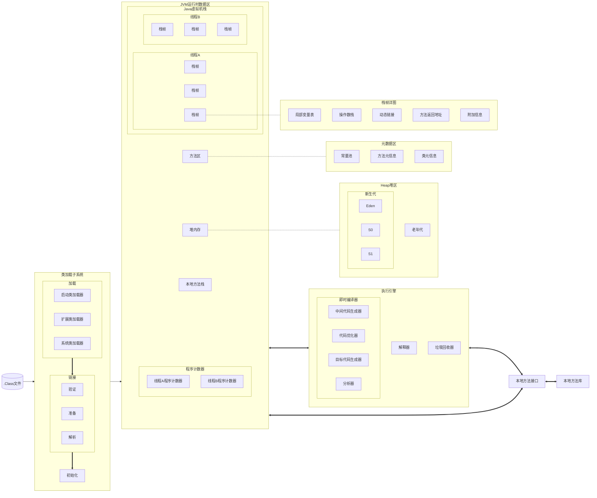

## JVM整体架构

> 草图

```mermaid
flowchart LR
	A[(.Class文件)]
    subgraph ClassLoader [类加载子系统]
        subgraph Loader [加载]
            A1[启动类加载器]
            A2[扩展类加载器]
            A3[系统类加载器]
        end
        subgraph Link [链接]
        	B1[验证]
        	B2[准备]
        	B3[解析]
        end
        Init[初始化]
        Loader ==> Link
        Link ==>Init
    end
	A --> ClassLoader
    subgraph RuntimeDataArea [JVM运行时数据区]
    	Fun[方法区]
    	Stack[堆内存]
        subgraph JVMStack [Java虚拟机栈]
        	subgraph Thread1 [线程A]
                Frame1[栈帧]
                Frame2[栈帧]
                Frame3[栈帧]
            end
        	subgraph Thread2 [线程B]
                Frame4[栈帧]
                Frame5[栈帧]
                Frame6[栈帧]
            end
        end
        subgraph AppCount [程序计数器]
        	AppCount1[线程A程序计数器]
        	AppCount2[线程B程序计数器]
        end
        LoaclFunFrame[本地方法栈]
    end
    subgraph MetaData [元数据区]
    	MetaData1[常量池]
    	MetaData2[方法元信息]
    	MetaData3[类元信息]
    end
    Fun -.-MetaData
    subgraph Heap [Heap堆区]
        subgraph New [新生代]
            New1[Eden]
            New2[S0]
            New3[S1]
        end
    	Old[老年代]
    end
    Stack -.-Heap
    subgraph FrameInfo [栈帧详图]
    	FrameInfo1[局部变量表]
    	FrameInfo2[操作数栈]
    	FrameInfo3[动态链接]
    	FrameInfo4[方法返回地址]
    	FrameInfo5[附加信息]
    end
    Frame3 -.- FrameInfo
	ClassLoader --> RuntimeDataArea
    subgraph Execute [执行引擎]
    	Execute1[解释器]
        subgraph Comp [即时编译器]
            Comp1[中间代码生成器]
            Comp2[代码优化器]
            Comp3[目标代码生成器]
            Comp4[分析器]
        end
    	Execute2[垃圾回收器]
    end
    RuntimeDataArea <==> Execute
	Execute <==> LocalFunAPI[本地方法接口]
	RuntimeDataArea <==> LocalFunAPI
	LocalFunAPI <==> LocalLib[本地方法库]
	
```

