## 基本数据类型

| 类型        | 字节数 | 默认值         | 包装类型  |
| ----------- | ------ | -------------- | --------- |
| **byte**    | 1      | 0              | Byte      |
| **char**    | 2      | '/uoooo'(null) | Character |
| **short**   | 2      | 0              | Short     |
| **int**     | 4      | 0              | Interger  |
| **long**    | 8      | 0L             | Long      |
| **float**   | 4      | 0.0F           | Float     |
| **double**  | 8      | 0.0D           | Double    |
| **boolean** | 1      | false          | Boolean   |

### 数值类型的取值范围

> 整数的取值范围计算，N：字节数 

$$
-2^{8*N-1}\mbox{ ～ }2^{8*N-1}-1
$$

### 数值类型转换

> 强制转换精度会丢失，请酌情使用强制转换，Java中boolean类型不能参与数值类型的转换

## 实参传递的值与引用

> 方法调用时实参分为值传递和引用传递

> **值传递：**值传递多发生于数值类型参数的传递，以及String类型，修改值传递的变量对其原有的变量不会做成变动
>
> **引用传递：**数组、非基本数据类型为引用传递，修改引用中的数据会对原变量的数据进行改动

## 权限修饰符

| 修饰符        | 本类中 | 同一包中的其他类（包括子类） | 其他包中的子类 | 其他包中的替他类 |
| ------------- | ------ | ---------------------------- | -------------- | ---------------- |
| **public**    | √      | √                            | √              | √                |
| **default**   | √      | √                            |                |                  |
| **protected** | √      | √                            | √              |                  |
| **private**   | √      |                              |                |                  |

## final关键字的作用

> final修饰的类：不可被继承

> final修饰的方法：不可被重写

> final修饰的变量：只能进行一次赋值，赋值后不可以修改指向（内存地址），即基本数据类型不可修改值，引用类型不能改变引用地址，但可以修改引用地址内的值

