## 基本数据类型

| 类型        | 字节数 | 默认值         | 包装类型  |
| ----------- | ------ | -------------- | --------- |
| **byte**    | 1      | 0              | Byte      |
| **char**    | 2      | '/uoooo'(null) | Character |
| **short**   | 2      | 0              | Short     |
| **int**     | 4      | 0              | Interger  |
| **long**    | 8      | 0L             | Long      |
| **float**   | 4      | 0.0F           | Float     |
| **double**  | 8      | 0.0D           | Double    |
| **boolean** | 1      | false          | Boolean   |

#### 数值类型的取值范围

> 整数的取值范围计算，N：字节数
>
> 


#### 数值类型转换



> 强制转换精度会丢失，如float转int：由于float的变量的存储空间大于int，float在被强转为int时因为int类型存储空间不足，float变量的数据会被截断从而导致数据精度发生变化，请酌情使用强制转换，Java中boolean类型不能参与数值类型的转换


## 实参传递的值与引用

> 方法调用时实参分为值传递和引用传递

> **值传递：**值传递多发生于数值类型参数的传递，以及String类型，修改值传递的变量对其原有的变量不会做成变动
>
> **引用传递：**数组、非基本数据类型为引用传递，修改引用中的数据会对原变量的数据进行改动


## 权限修饰符

| 修饰符        | 本类中 | 同一包中的其他类（包括子类） | 其他包中的子类 | 其他包中的其他类 |
| ------------- | ------ | ---------------------------- | -------------- | ---------------- |
| **public**    | √      | √                            | √              | √                |
| **default**   | √      | √                            |                |                  |
| **protected** | √      | √                            | √              |                  |
| **private**   | √      |                              |                |                  |


## final关键字的作用

> final修饰的类：不可被继承

> final修饰的方法：不可被重写

> final修饰的变量：只能进行一次赋值，赋值后不可以修改指向（内存地址），即基本数据类型不可修改值，引用类型不能改变引用地址，但可以修改引用地址内的值


## 重载与重写

- **重载：**一个类中存在多个方法名称相同，而参数列表不同的方法，这种行为叫重载

  ```java
  void add(int i,int n){}
  //void add(int m,int n){} 不构成重载，参数不同体现在类型、顺序、个数上的不同而不是参数名
  void add(float f,float x){}
  void add(int i,float f){}
  ```

- **重写：**一个类对父类的定义的方法进行重新实现，这种行为重写/覆盖

  ```java
  class Person{
      void eat(){
          System.out.println("人需要吃饭");
      }
  }
  class Man extends Person{
      void eat(){ //重新实现了父类的方法
          System.out.println("我能吃的更多些");
      }
  }
  ```


## this与supr的指向

- **this：**this指对象本身，this.xx指向对象的成员变量，this.xx()指向对象的成员方法，this()指向本类的空参/含参构造器

- **supr：**supr指向父类空间，supr.xx指向父类变量，supr.xx()指向父类方法，supr()指向父类的空参/含参构造器

> 子类的构造器不手动调用supr()的话，会隐式自动在构造器开始处执行supr()


## 类初始化顺序

```
父类静态变量-->父类静态代码块-->子类静态变量-->子类静态代码块-->父类普通变量
-->父类普通代码块-->父类构造函数-->子类普通变量-->子类普通代码块-->子类构造函数
```


## Error与Exception

- **Error：**Error 类是指 java 运行时系统的内部错误和资源耗尽错误。应用程序不会抛出该类对象。如果出现了这样的错误，除了告知用户，剩下的就是尽力使程序安全的终止。

- **Exception：**又有两个分支，一个是运行时异常RuntimeException ，一个是检查异常CheckedException
  - **RuntimeException：**RuntimeException是那些可能在 Java 虚拟机正常运行期间抛出的异常的超类
  - **CheckedException：**一般是外部错误，这种异常都发生在编译阶段，Java 编译器会强制程序去捕获此类异常，即会出现要求你把这段可能出现异常的程序进行 try catch


## throw与throws的区别

- **throw：**在函数体内使用，可以抛出指定类型的异常，执行带throw会终止其功能将问题抛给调用者
- **throws：**在函数声明上，可以指定多个可能会发生的异常，并不一定发生该异常

