## 基本数据类型

| 类型        | 字节数 | 默认值         | 包装类型  |
| ----------- | ------ | -------------- | --------- |
| **byte**    | 1      | 0              | Byte      |
| **char**    | 2      | '/uoooo'(null) | Character |
| **short**   | 2      | 0              | Short     |
| **int**     | 4      | 0              | Integer   |
| **long**    | 8      | 0L             | Long      |
| **float**   | 4      | 0.0F           | Float     |
| **double**  | 8      | 0.0D           | Double    |
| **boolean** | 1      | false          | Boolean   |

### 数值类型的取值范围

> 整数的取值范围计算，N：字节数
>
> 

### 数值类型转换


> 强制转换精度会丢失，如float转int：由于float的变量的存储空间大于int，float在被强转为int时因为int类型存储空间不足，float变量的数据会被截断去掉高位保存低位从而导致数值发生变化，请酌情使用强制转换，Java中boolean类型不能参与数值类型的转换

## 实参传递的值与引用

> 方法调用时实参分为值传递和引用传递

> **值传递：**值传递多发生于数值类型参数的传递，以及String类型，修改值传递的变量对其原有的变量不会做成变动
>
> **引用传递：**数组、非基本数据类型为引用传递，修改引用中的数据会对原变量的数据进行改动

## 权限修饰符

| 修饰符        | 本类中 | 同一包中的其他类（包括子类） | 其他包中的子类 | 其他包中的其他类 |
| ------------- | :------: | :----------------------------: | :--------------: | :----------------: |
| **public**    | √      | √                            | √              | √                |
| **default**   | √      | √                            |                |                  |
| **protected** | √      | √                            | √              |                  |
| **private**   | √      |                              |                |                  |

## final关键字的作用

> final修饰的类：不可被继承

> final修饰的方法：不可被重写

> final修饰的变量：只能进行一次赋值，赋值后不可以修改指向（内存地址），即基本数据类型不可修改值，引用类型不能改变引用地址，但可以修改引用地址内的值

## String类

> final修饰的类，不可被继承

### String与StringBuffer、StringBuilder的区别

> String的值是不可变的，每次对String的操作都会生成新的String对象

> StringBuffer是可变类，和线程安全的字符串操作类，任何对它指向的字符串的操作都不会产生新的对象。每个StringBuffer对象都有一定的缓冲区容量，当字符串大小没有超过容量时，不会分配新的容量，当字符串大小超过容量时，会自动增加容量

> StringBuilder相较于StringBuffer有速度优势，所以多数情况下建议使用StringBuilder类。然而在应用程序要求线程安全的情况下，则必须使用StringBuffer类

## 重载与重写

- **重载：**一个类中存在多个方法名称相同，而参数列表不同的方法，这种行为叫重载

  ```java
  void add(int i,int n){}
  //void add(int m,int n){} 不构成重载，参数不同体现在类型、顺序、个数上的不同而不是参数名
  void add(float f,float x){}
  void add(int i,float f){}
  ```

- **重写：**一个类对父类的定义的方法进行重新实现，这种行为重写/覆盖

  ```java
  class Person{
      void eat(){
          System.out.println("该吃饭了");
      }
  }
  class Man extends Person{ 
      @Override
      void eat(){ //重新实现了父类的方法
          System.out.println("我爱吃肉");
      }
  }
  ```

## this与supr的指向

- **this：**this指对象本身，this.xx指向对象的成员变量，this.xx()指向对象的成员方法，this()指向本类的空参/含参构造器

- **supr：**supr指向父类空间，supr.xx指向父类变量，supr.xx()指向父类方法，supr()指向父类的空参/含参构造器

> 子类构造器中会默认调用supr()

## 类初始化顺序

```
父类静态变量-->父类静态代码块-->子类静态变量-->子类静态代码块-->父类普通变量
-->父类普通代码块-->父类构造函数-->子类普通变量-->子类普通代码块-->子类构造函数
```

## Error与Exception

- **Error：**Error 类是指 java 运行时系统的内部错误和资源耗尽错误。应用程序不会抛出该类对象。如果出现了这样的错误，除了告知用户，剩下的就是尽力使程序安全的终止。

- **Exception：**又有两个分支，一个是运行时异常RuntimeException ，一个是检查异常CheckedException
  - **RuntimeException：**RuntimeException是那些可能在 Java 虚拟机正常运行期间抛出的异常的超类
  - **CheckedException：**一般是外部错误，这种异常都发生在编译阶段，Java 编译器会强制程序去捕获此类异常，即会出现要求你把这段可能出现异常的程序进行 try catch

## throw与throws的区别

- **throw：**在函数体内使用，可以抛出指定类型的异常，执行带throw会终止其功能将问题抛给调用者
- **throws：**在函数声明上，可以指定多个可能会发生的异常，并不一定发生该异常

## List集合

### ArrayList

> **原理：**内部由数组实现，允许对元素进行快速的随机访问，但存储空间必须连续。

> **动态扩容：**当数组大小不满足使用需求时需要重新分配空间，将已有的数组的数据复制到新的存储空间中。

> **初始大小：**10

> **扩容倍数：**1.5

> **数据变动：**当从ArrayList的中间位置插入或者删除元素时，需要对数组进行复制、移动、代价比较高。

> **总结：**适合随机查找和遍历，不适合插入和删除

### Vector

> **原理：**与ArrayList原理相似，但Vector在方法上使用了synchronized实现同步方法，所以Vecotr是线程安全的

> **初始大小：**10

> **扩容倍数：**2

> **总结：**线程安全，但访问慢

### LinkList

> **原理：**用链表结构存储数据的，很适合数据的动态插入和删除

> **数据变动：**插入或删除时只需要对当前元素的前后一个元素的头信息进行修改即可，其他元素不会发生任何变化

> **总结：**适合数据的动态插入和删除,需要顺序读取不适合随机查找

## Set集合

### HashSet

> 哈希表边存放的是哈希值。HashSet存储元素的顺序并不是按照存入时的顺序（和List显然不同）而是按照哈希值来存的所以取数据也是按照哈希值取得。元素的哈希值是通过元素的hashcode方法来获取的, HashSet首先判断两个元素的哈希值，如果哈希值一样，接着会比较equals方法如果equls结果为true，HashSet就视为同一个元素。如果equals为false就不是同一个元素。

### TreeSet

> TreeSet()是使用二叉树的原理对新add()的对象按照指定的顺序排序（升序、降序），每增加一个对象都会进行排序，将对象插入的二叉树指定的位置。

> Integer和String对象都可以进行默认的TreeSet排序，而自定义类的对象是不可以的，自己定义的类必须实现Comparable接口，并且覆写相应的compareTo()函数，才可以正常使用。

> 在覆写compare()函数时，要返回相应的值才能使TreeSet按照一定的规则来排序

> 比较此对象与指定对象的顺序。如果该对象小于、等于或大于指定对象，则分别返回负整数、零或正整数。

### LinkHashSet

> 对于LinkedHashSet而言，它继承与HashSet、又基于LinkedHashMap来实现的。LinkedHashSet底层使用LinkedHashMap来保存所有元素，它继承与HashSet，其所有的方法操作上又与HashSet相同，因此LinkedHashSet的实现上非常简单，只提供了四个构造方法，并通过传递一个标识参数，调用父类的构造器，底层构造一个LinkedHashMap来实现，在相关操作上与父类HashSet的操作相同，直接调用父类HashSet的方法即可。

## Map集合

### HashMap

> HashMap根据键的hashCode值存储数据，大多数情况下可以直接定位到它的值，因而具有很快的访问速度，但遍历顺序却是不确定的。HashMap最多只允许一条记录的键为null，允许多条记录的值为null。HashMap非线程安全，即任一时刻可以有多个线程同时写HashMap，可能会导致数据的不一致。如果需要满足线程安全，可以用Collections的synchronizedMap方法使HashMap具有线程安全的能力，或者使用ConcurrentHashMap。

#### Java7 HashMap


> 大方向上，HashMap 里面是一个数组，然后数组中每个元素是一个单向链表。上图中，每个绿色的实体是嵌套类Entry 的实例，Entry 包含四个属性：key, value, hash 值和用于单向链表的next。
>
> - capacity：当前数组容量，始终保持2^n，可以扩容，扩容后数组大小为当前的2 倍。
> - loadFactor：负载因子，默认为0.75。
> - threshold：扩容的阈值，等于capacity * loadFactor
> - 默认容量：1<<<4即16

> 插入时会先判断是否需要扩容，再插入

#### Java8 HashMap

> Java8 对HashMap 进行了一些修改，最大的不同就是利用了红黑树，所以其由数组+链表+[红黑树](/数据结构/红黑树图解.md)组成。

> 根据Java7 HashMap 的介绍，我们知道，查找的时候，根据hash 值我们能够快速定位到数组的具体下标，但是之后的话，需要顺着链表一个个比较下去才能找到我们需要的，时间复杂度取决于链表的长度，为 O(n)。为了降低这部分的开销，在 Java8 中，当链表中的元素超过了 8 个以后，会将链表转换为红黑树，在这些位置进行查找的时候可以降低时间复杂度为 O(logN)。


> 插入时先进行插入，插入完成再判断是否需要扩容

#### Java7中HashMap头插法的危害

> map扩容时，头插法会使链表发生反转，多线程环境下会产生环；
>
> 个人理解可能存在错误观点


### ConcurrentHashMap

#### Java7中的ConcurrentHashMap

> Java7中ConcurrentHashMap采用与HashMap相同的**存储格式：数据+链表**，但引入了Segment分段锁的概念，转变成了两层结构，第一次Hash确定所在Segment，第二次Hash确定具体的节点位置


> Java7中ConcurrentHashMap应对多线程时的处理如下


#### Java8中的ConcurrentHashMap

> Java8中ConcurrentHashMap抛弃了Segment分段锁，采用了粒度更细的加锁方式，使用Synchronized锁数组中的根节点使之支持更高的并发量


> Java8中ConcurrentHashMap应对多线程时的处理如下


### HashTable

> HashTable中hash数组默认大小是11，扩容的方式是 old*2+1，继承自Dictionary类，HashTable采用了锁全表的方式来保证线程安全，在性能上比不上ConcurrentHashMap，所以不推荐使用

### TreeMap

> TreeMap实现SortedMap接口，能够把它保存的记录根据键排序，默认是按键值的升序排序，也可以指定排序的比较器，当用Iterator遍历TreeMap时，得到的记录是排过序的。

> 在使用TreeMap时，key必须实现Comparable接口或者在构造TreeMap传入自定义的Comparator，否则会在运行时抛出 java.lang.ClassCastException 类型的异常。

> 方式一：key实现Comparable 接口，例：按优先级升序排序

```java
public class Test02 implements Comparable<Test02> {
    private final Integer level;

    public Test02(Integer level) {
        this.level = level;
    }

    @Override
    public String toString() {
        return "Test02{" +
                "level=" + level +
                '}';
    }

    public static void main(String[] args) {
        TreeMap<Test02, Object> resultMap = new TreeMap<>();

        resultMap.put(new Test02(3), 3);
        resultMap.put(new Test02(1), 1);
        resultMap.put(new Test02(4), 4);
        resultMap.put(new Test02(5), 5);
        resultMap.put(new Test02(2), 2);

        resultMap.forEach((k, v) -> {
            System.out.printf("Key：'%S'，Value：'%s'\n", k, v);
        });
    }

    @Override
    public int compareTo(Test02 o) {
        return Integer.compare(this.level, o.level);
    }
}
// 输出
// Key：'TEST02{LEVEL=1}'，Value：'1'
// Key：'TEST02{LEVEL=2}'，Value：'2'
// Key：'TEST02{LEVEL=3}'，Value：'3'
// Key：'TEST02{LEVEL=4}'，Value：'4'
// Key：'TEST02{LEVEL=5}'，Value：'5'
```

> 方式二：传入自定义Comparator实现类，例：按字符串长度升序排序

```java
public class Test02 {
    public static void main(String[] args) {
        TreeMap<String, Object> resultMap = new TreeMap<>(new Comparator<String>() {
            @Override
            public int compare(String o1, String o2) {
                return Integer.compare(o1.length(), o2.length());
            }
        });

        resultMap.put("123456", 123456);
        resultMap.put("123", 123);
        resultMap.put("12345678", 12345678);
        resultMap.put("1234", 1234);
        resultMap.put("123456789", 123456789);

        resultMap.forEach((k, v) -> {
            System.out.printf("Key：'%S'，Value：'%s'\n", k, v);
        });
    }
}
// 输出：
// Key：'123'，Value：'123'
// Key：'1234'，Value：'1234'
// Key：'123456'，Value：'123456'
// Key：'12345678'，Value：'12345678'
// Key：'123456789'，Value：'123456789'

```

### LinkHashMap

> LinkedHashMap是HashMap的一个子类，通过HashMap+双向链表的方式，保存了记录的插入顺序，在用Iterator遍历LinkedHashMap时，先得到的记录肯定是先插入的，也可以在构造时带参数，按照访问次序排序。

## HashTable

HashTable是线程安全的类，但由于在增改删时会对全表加锁，所以其性能很低，在项目中遇到需要用到线程安全的Key-Value结构存储，一般都会采用ConcureentHashMap

## 类加载器

- **Bootstrap classLoader：**主要负责加载核心的类库(java.lang.*等)，构造ExtClassLoader和APPClassLoader
- **ExtClassLoader：**主要负责加载jre/lib/ext目录下的一些扩展的jar。
- **AppClassLoader：**主要负责加载应用程序的主函数类

### 双亲委派机制

> 防止重复加载同一个.class。通过委托去向上面问一问，加载过了，就不用再加载一遍。保证数据安全。

> 保证核心class对象不能被篡改。保证了Class执行安全。

 

