## 线程创建方式

### 继承Thread类

> Thread类本质上是实现了Runnable接口的一个实例，代表一个线程的实例。启动线程的唯一方法就是通过Thread类的start()实例方法。start()方法是一个native方法，它将启动一个新线程，并执行run()方法。

```java
public class MyThread extends Thread {
    @Override
    public void run() { 
        System.out.println("MyThread.run()"); 
    }
    public static void main(String[] args){
        MyThread myThread1 = new MyThread(); 
        myThread1.start();
    }
} 
```

### 实现Runnable接口

```java
public class MyRunnable extends OtherClass implements Runnable { 
    @Override
    public void run() { 
        System.out.println("MyRunnable.run()"); 
    }
    public static void main(String[] args){
        Runnable myRunnable = new MyRunnable();
        Thread thread = new Thread(myRunnable); 
        thread.start();
    }
}
```

### Callable与Future、FutureTask

- **Callable:**
    - 可以获取线程的执行结果,也称为返回值
    - 通过与Future的结合,可以实现利用Future来跟踪异步计算的结果
- **Runnable和Callable的区别:**
    - Callable规定的方法是call(),Runnable规定的接口是run()
    - Callable的任务执行后可返回值,而Runnable的任务是不能有返回值的
    - call方法可以抛出异常,run方法不可以
    - 运行Callable任务可以拿到一个Future对象,表示异步计算的结果,它提供了检查是否计算完成的方法,以等待计算的完成,并检索计算的结果,通过Future对象可以了解任务执行情况,可以取消任务的执行,还可以获取执行结果
- **Future接口:**
    - Future是一个接口,代表了一个异步计算的结果,接口中的方法用来检查计算是否完成,等待完成和得到计算结果
    - 当计算完成后,只能通过get()方法得到结果,get()方法会阻塞,一直到线程的计算结果完成并返回
    - 如果想取消,那么调用cancel()方法,其他方法用于确定任务是正常完成还是取消了
    - 一旦计算完成了,那么这个计算就不能被取消
- **FutureTask类:**
    - FutureTask类实现了RunnableFuture接口,而RunnableFuture接口是继承了Runnable和Future接口,所以说FutureTask是一个提供异步计算结果的任务
    - FutureTask可以用来包装Callable或者Runnable接口的实现对象,因为FutureTask实现了Runnable接口,所以FutureTask也可以提交给线程池

> 实现方式一：

```java
import java.util.Random;
import java.util.concurrent.Callable;
import java.util.concurrent.ExecutionException;
import java.util.concurrent.FutureTask;
public class UseCallable {
    /**
     * 实现Callable接口的线程
     */
    private static class UseCall implements Callable<Integer>{
        private int sum;
        @Override
        public Integer call() throws Exception {
            System.out.println("callable子线程开始执行任务计算");
            Thread.sleep(2000);
            for (int i = 0; i < 5000; i++) {
                sum += i;
            }
            System.out.println("子线程任务计算完成,返回值:"+sum);
            return sum;
        }
    }

    public static void main(String[] args) throws ExecutionException, InterruptedException {
        UseCall useCall = new UseCall();
        // 使用FutureTask包装
        FutureTask<Integer> futureTask = new FutureTask<>(useCall);
        // 包装为Thread
        Thread thread = new Thread(futureTask);
        thread.start();
        // 开始主线程的任务
        Random random = new Random();
        SleepTools.second(1);
        if(random.nextBoolean()){
            System.out.println("获取Callable result:"+futureTask.get());
        }else{
            System.out.println("中断计算");
            // 中断计算,取消线程的执行
            futureTask.cancel(true);
        }
    }
}
```

> 实现方式二：

```java
UseCall useCall = new UseCall();
// 创建一个线程池
ExecutorService executorService = Executors.newCachedThreadPool();
Future<Integer> future = executorService.submit(useCall);
```

## 线程池

### ThreadPoolExecutor

```java
public ThreadPoolExecutor(int corePoolSize, // 核心线程数
                          int maximumPoolSize, // 最大线程数
                          long keepAliveTime, // 非核心线程存活时间
                          TimeUnit unit, // 时间单位
                          BlockingQueue<Runnable> workQueue, // 工作队列
                          ThreadFactory threadFactory, //线程工厂类
                          RejectedExecutionHandler handler){} //拒绝策略
```

- **corePoolSize：** 

  > 核心线程数，也是线程池中常驻的线程数，线程池初始化时默认是没有线程的，当任务来临时才开始创建线程去执行任务

- **maximumPoolSize：** 

  > 最大线程数，在核心线程数的基础上可能会额外增加一些非核心线程，需要注意的是只有当workQueue队列填满时才会创建多于corePoolSize的线程(线程池总线程数不超过maxPoolSize)

- **keepAliveTime：** 

  > 非核心线程的空闲时间超过keepAliveTime就会被自动终止回收掉，注意当corePoolSize=maxPoolSize时，keepAliveTime参数也就不起作用了(因为不存在非核心线程)；

- **unit：** 

  > keepAliveTime的时间单位

- **workQueue：** 

  > 用于保存任务的队列，可以为无界、有界、同步移交三种队列类型之一，当池子里的工作线程数大于corePoolSize时，这时新进来的任务会被放到队列中

- **threadFactory：** 

  > 创建线程的工厂类，默认使用Executors.defaultThreadFactory()，也可以使用guava库的ThreadFactoryBuilder来创建

- **handler：** 

  > 线程池无法继续接收任务(队列已满且线程数达到maximunPoolSize)时的饱和策略，取值有AbortPolicy、CallerRunsPolicy、DiscardOldestPolicy、DiscardPolicy

### 线程池创建线程流程

 

### 工作队列队列

- **SynchronousQueue(同步移交队列)：** 队列不作为任务的缓冲方式，可以简单理解为队列长度为零
- **LinkedBlockingQueue(无界队列)：** 队列长度不受限制，当请求越来越多时(任务处理速度跟不上任务提交速度造成请求堆积)可能导致内存占用过多或OOM
- **ArrayBlockintQueue(有界队列)：** 队列长度受限，当队列满了就需要创建多余的线程来执行任务

### newCachedThreadPool线程池

```java
/**
 * 创建一个线程池，根据需要创建新线程，但在可用时将重用先前构造的线程。
 * 这些池通常会提高执行许多短期异步任务的程序的性能。
 * 如果可用，调用 execute 将重用先前构造的线程。如果没有可用的现有线程，则会创建一个新线程并将其添加到池中。
 * 60 秒内未使用的线程将被终止并从缓存中删除。
 * 因此，保持空闲足够长时间的池不会消耗任何资源。
 * 请注意，可以使用 ThreadPoolExecutor 构造函数创建具有相似属性但不同细节（例如，超时参数）的池。
 *
 * !!! 当请求很多时就可能创建过多的线程，导致资源耗尽OOM
 */
public static ExecutorService newCachedThreadPool() {
    return new ThreadPoolExecutor(0, Integer.MAX_VALUE,
                                  60L, TimeUnit.SECONDS,
                                  new SynchronousQueue<Runnable>()); // 同步移交队列
}
```

### newFixedThreadPool线程池

```java
/**
 * 创建一个线程池，该线程池重用固定数量的线程在共享的无界队列中运行。
 * 在任何时候，最多有 nThreads 个线程是活动的处理任务。
 * 如果在所有线程都处于活动状态时提交了额外的任务，它们将在队列中等待，直到有线程可用。
 * 如果任何线程在关闭前的执行过程中由于失败而终止，则在需要执行后续任务时，将有一个新线程代替它。
 * 池中的线程将一直存在，直到它被明确关闭。
 * @param nThreads 线程数
 * 
 * !!! 任务可以无限放入，当请求过多时(任务处理速度跟不上任务提交速度造成请求堆积)可能导致占用过多内存或直接导致OOM异常
 */
public static ExecutorService newFixedThreadPool(int nThreads) {
    return new ThreadPoolExecutor(nThreads, nThreads,
                                  0L, TimeUnit.MILLISECONDS,
                                  new LinkedBlockingQueue<Runnable>()); // 基于链表实现的可选界队列，先进先出,空参时为int最大值
}
```

### newScheduledThreadPool线程池

```java
/**
 * 创建一个线程池，它可安排在给定延迟后运行命令或者定期地执行
 *
 * !!! 弊端同newCachedThreadPool一致
 */
public static ScheduledExecutorService newScheduledThreadPool(int corePoolSize) {
    return new ScheduledThreadPoolExecutor(corePoolSize);
}
public class ScheduledThreadPoolExecutor extends ThreadPoolExecutor implements ScheduledExecutorService {

    public ScheduledThreadPoolExecutor(int corePoolSize) {
        super(corePoolSize, Integer.MAX_VALUE, 0, NANOSECONDS,
              new DelayedWorkQueue()); // 延迟工作队列
    }
}
```

> 用例

```java
ScheduledExecutorService scheduledThreadPool= Executors.newScheduledThreadPool(3); 
scheduledThreadPool.schedule(newRunnable(){ 
    @Override 
    public void run() {
        System.out.println("延迟三秒");
    }
}, 3, TimeUnit.SECONDS);
scheduledThreadPool.scheduleAtFixedRate(newRunnable(){ 
    @Override 
    public void run() {
        System.out.println("延迟 1 秒后每三秒执行一次");
    }
},1,3,TimeUnit.SECONDS)
```

### newSingleThreadExecutor线程池

```java
/**
 * 创建一个 Executor，它使用单个工作线程在无界队列中运行。 
 * （但是请注意，如果这个单线程在关闭之前由于执行失败而终止，如果需要执行后续任务，一个新线程将取代它。）
 * 任务保证按顺序执行，并且不会超过一个任务处于活动状态在任何给定的时间。
 * 与其他等效的 newFixedThreadPool(1) 不同，返回的执行程序保证不可重新配置以使用其他线程。
 * 
 * !!! 弊端和newFixedThreadPool一致
 */
public static ExecutorService newSingleThreadExecutor() {
    return new FinalizableDelegatedExecutorService
        (new ThreadPoolExecutor(1, 1,
                                0L, TimeUnit.MILLISECONDS,
                                new LinkedBlockingQueue<Runnable>())); // 基于链表实现的可选界队列，先进先出,空参时为int最大值
}
```

### 拒绝策略

- **AbortPolicy：** 中断抛出异常
- **DiscardPolicy：** 默默丢弃任务，不进行任何通知
- **DiscardOldestPolicy：** 丢弃掉在队列中存在时间最久的任务
- **CallerRunsPolicy：** 让提交任务的线程去执行任务(对比前三种比较友好一丢丢)

### Java默认线程池存在哪些问题

> - 当前线程数小于核心线程数时，会直接创建线程，空闲线程浪费
> - 当核心线程满时，队列未满，导致任务在队列中堆积

## 线程的生命周期

> 当线程被创建并启动以后，它既不是一启动就进入了执行状态，也不是一直处于执行状态。在线程的生命周期中，它要经过新建（New）、就绪（Runnable）、运行（Running）、阻塞（Blocked）和死亡（Dead）5种状态。尤其是当线程启动以后，它不可能一直"霸占"着CPU独自运行，所以CPU需要在多条线程之间切换，于是线程状态也会多次在运行、阻塞之间切换

### 新建（NEW）

> 当程序使用new关键字创建了一个线程之后，该线程就处于新建状态，此时仅由JVM为其分配内存，并初始化其成员变量的值

### 就绪（RUNNABLE）

> 当线程对象调用了start()方法之后，该线程处于就绪状态。Java 虚拟机会为其创建方法调用栈和程序计数器，等待调度运行

### 运行（RUNNING）

> 如果处于就绪状态的线程获得了CPU，开始执行run()方法的线程执行体，则该线程处于运行状态

### 阻塞（BLOCKED）

> 阻塞状态是指线程因为某种原因放弃了cpu使用权，也即让出了cpu timeslice，暂时停止运行。直到线程进入可运行(runnable)状态，才有机会再次获得cpu timeslice转到运行(running)状态。阻塞的情况分三种：
>
> - **等待阻塞(o.wait->等待对列)：**运行(running)的线程执行 o.wait()方法，JVM 会把该线程放入等待队列(waitting queue)
    > 中。
> - **同步阻塞(lock->锁池)：**运行(running)的线程在获取对象的同步锁时，若该同步锁被别的线程占用，则 JVM 会把该线程放入锁池(lock pool)中。
> - **其他阻塞(sleep/join)：**运行(running)的线程执行 Thread.sleep(long ms)或 t.join()方法，或者发出了 I/O 请求时，JVM 会把该线程置为阻塞状态。当sleep()状态超时、join()等待线程终止或者超时、或者 I/O处理完毕时，线程重新转入可运行(runnable)状态。

### 线程死亡（DEAD）

> 线程会以下面三种方式结束，结束后就是死亡状态
>
> - **正常结束：**run()或 call()方法执行完成，线程正常结束
> - **异常结束：**线程抛出一个未捕获的 Exception 或 Error
> - **调用stop：**直接调用该线程的 stop()方法来结束该线程—该方法通常容易导致死锁，不推荐使用

### 生命周期流程


> 后续待补充，知识储备补充后完善

