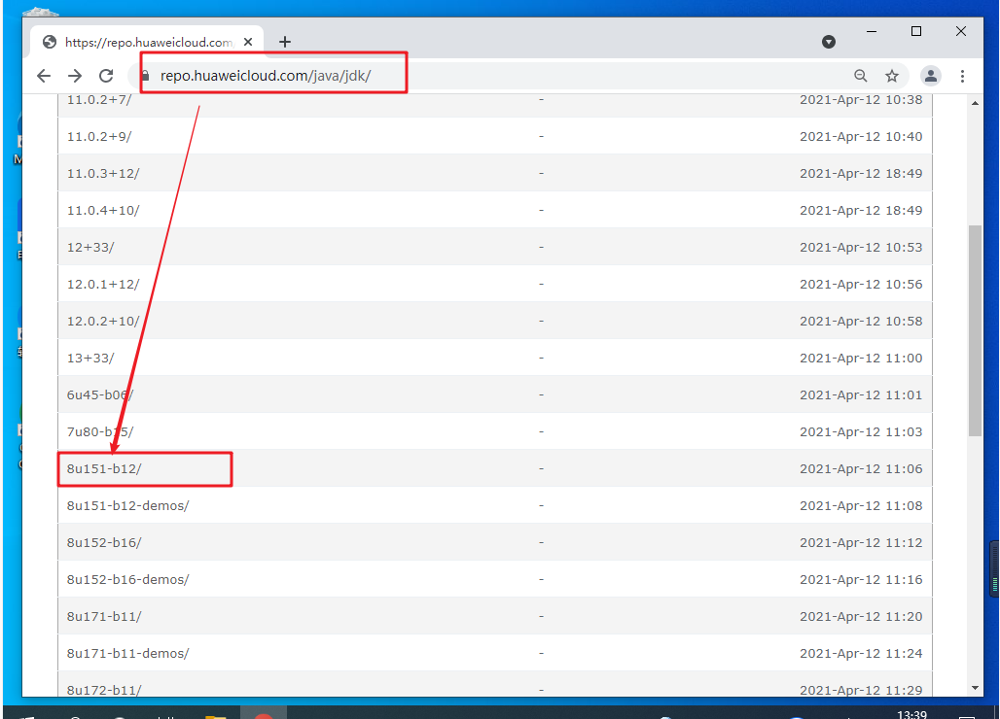
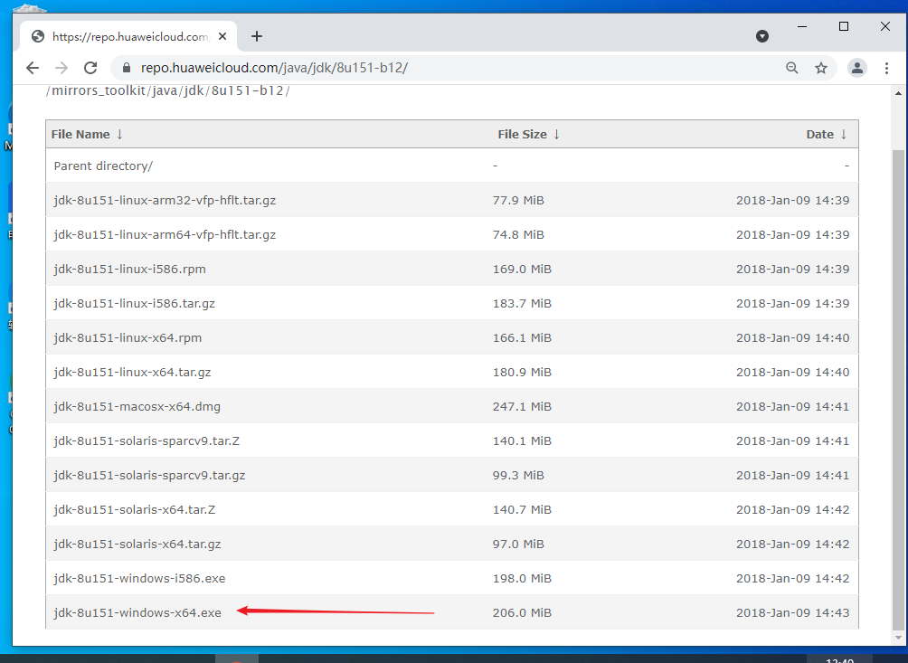
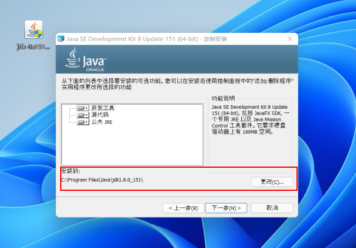
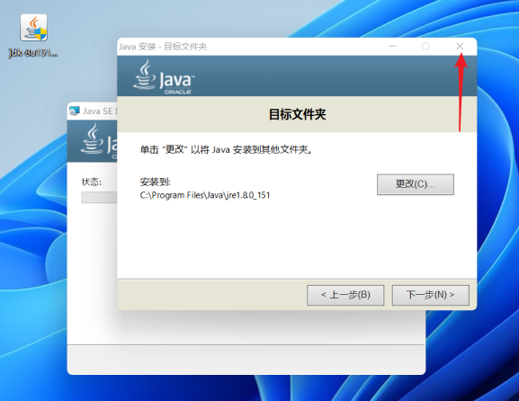
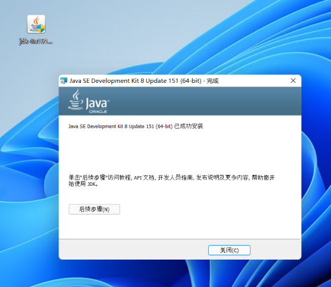
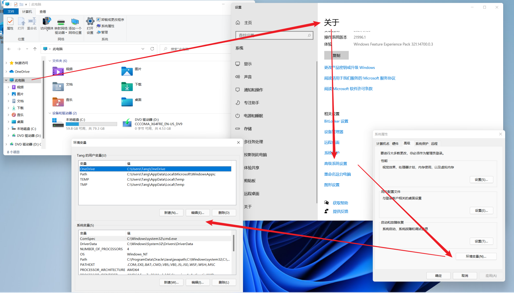
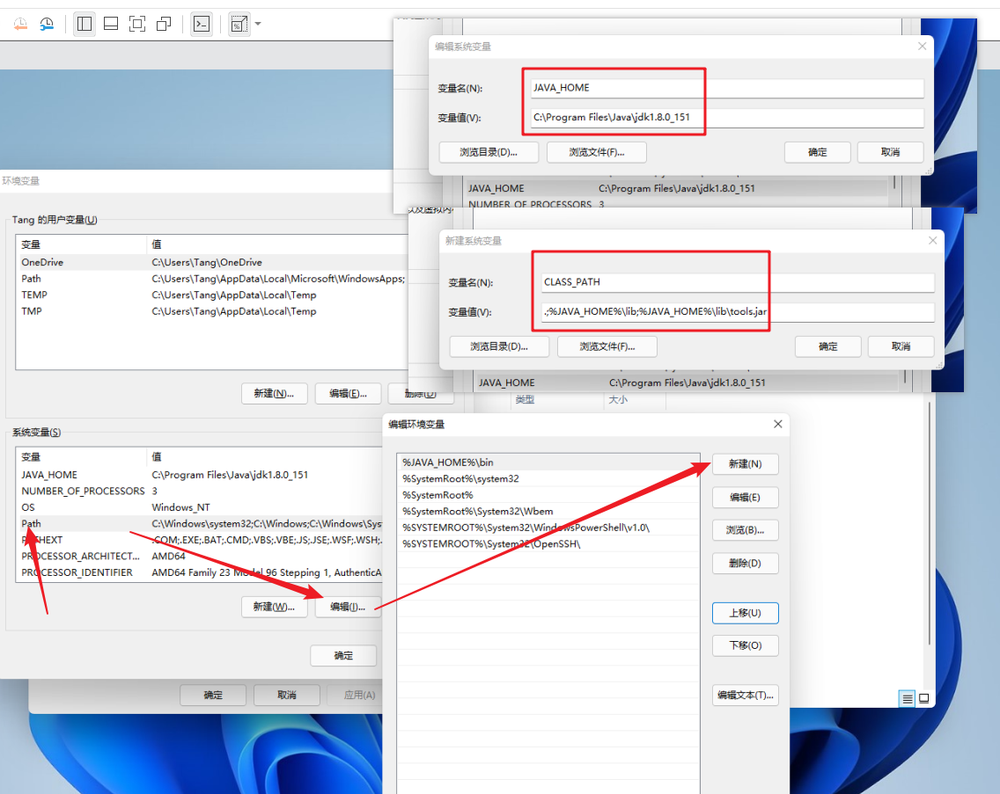
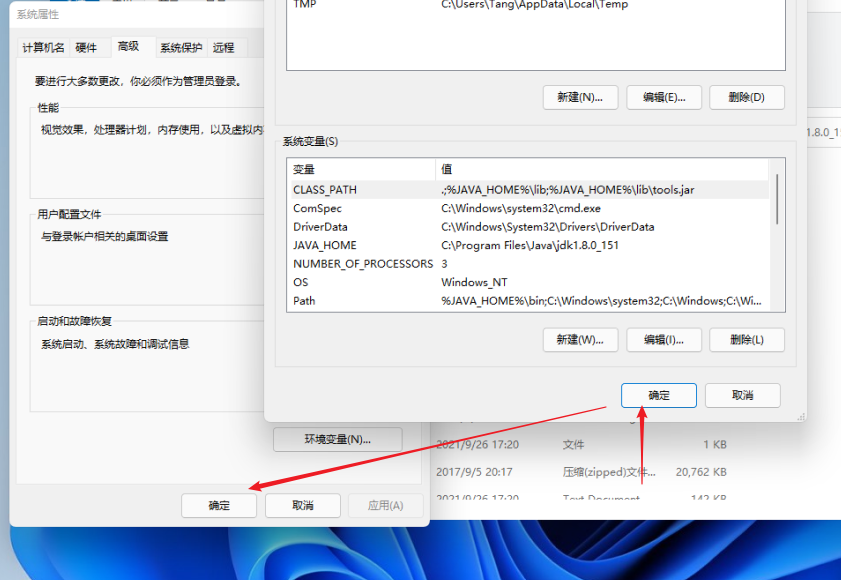
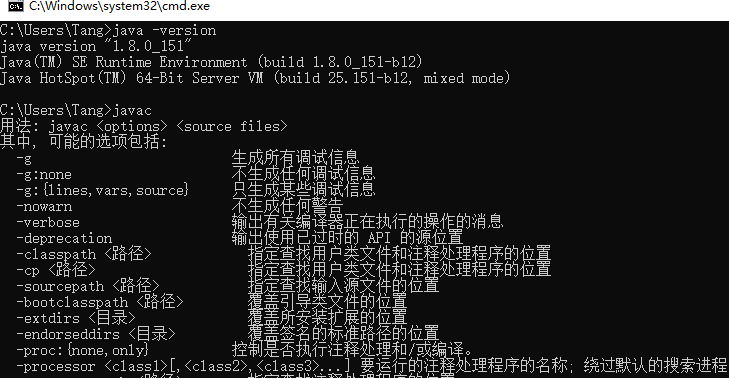

> 当前演示环境为虚拟机中的Windows系统，Mac及Linux、Ubuntu等请自行寻找安装教程

## JDK下载

> oracle官方下载地址需要登录，所以这里选择去华为镜像仓库去下载，版本更具个人喜好选择下载，我这下载JDK8
>
> 地址：[https://repo.huaweicloud.com/java/jdk/](https://repo.huaweicloud.com/java/jdk/)

> 根据自身系统版本下载对应的安装程序

## 执行安装

> 一直下一步就可以，中间的安装位置可以自定义但要记录下，后面配置系统环境变量要用到

> JDK8还会有个弹窗是安装JRE的，非JDK8忽略这一步。这里不需要安装，应为JDK中集成有JRE

> 安装完成

## 配置环境变量

> 现在虽然已经安装完了，但是没有配置全局变量，Java命令还是不能用

> 打开资源管理器 => 单击此电脑 => 右键选属性 => 关于中找到高级系统设置 => 点击环境变量

> 系统环境变量中新增 **JAVA_HOME** 、**CLASSP_PATH** ，**PATH** 中追加一条记录并置顶

>新增 *JAVA_HOME* ：**填刚才的安装路径**
>
>新增 *CLASS_PATH* ：`.;%JAVA_HOME%\lib;%JAVA_HOME%\lib\tools.jar`
>
>编辑 *PATH* 追加：`%JAVA_HOME%\bin`

> 确定保存

> 打开CMD命令行，执行 `java -version` 与 `javac`

