## 基本数据类型

| 类型        | 字节数 | 默认值         | 包装类型  |
| ----------- | ------ | -------------- | --------- |
| **byte**    | 1      | 0              | Byte      |
| **char**    | 2      | '/uoooo'(null) | Character |
| **short**   | 2      | 0              | Short     |
| **int**     | 4      | 0              | Integer   |
| **long**    | 8      | 0L             | Long      |
| **float**   | 4      | 0.0F           | Float     |
| **double**  | 8      | 0.0D           | Double    |
| **boolean** | 1      | false          | Boolean   |

### 数值类型的取值范围

> 整数的取值范围计算，N：字节数


### 数值类型转换


> 强制转换精度会丢失，如float转int：由于float的变量的存储空间大于int，float在被强转为int时因为int类型存储空间不足，float变量的数据会被截断去掉高位保存低位从而导致数值发生变化，请酌情使用强制转换，Java中boolean类型不能参与数值类型的转换

### 拆箱与装箱

> 基本数据类型赋值给包装类型时为 **装箱**

> 包装类型赋值给基础数据类型时为 **拆箱**

> 注意点1：基本数据类型与包装类型==比较时，包装类型会拆箱成基础数据类型，此时比较的其实为数值大小而非地址
>
> 注意点2：Java中整数 `-128` ~ `127` 被存在常量池中，意味着多个Integer无论被赋值其中的某个值其实地址都是一样的，new关键字创建的会重新开辟空间，所以不在该范围中，
> 而大于127或小于-128的值被赋给多个Integer时由于常量池中不存在，也就意味着多个Integer对象会独立存储数值，此时比较地址值时不一样的

## 实参传递的值与引用

> 方法调用时实参分为值传递和引用传递

> **值传递：** 值传递多发生于数值类型参数的传递，以及String类型，修改值传递的变量对其原有的变量不会做成变动
>
> **引用传递：** 数组、非基本数据类型为引用传递，修改引用中的数据会对原变量的数据进行改动

## 权限修饰符

| 修饰符        | 本类中 | 同一包中的其他类（包括子类） | 其他包中的子类 | 其他包中的其他类 |
| ------------- | :------: | :----------------------------: | :--------------: | :----------------: |
| **public**    | √      | √                            | √              | √                |
| **default**   | √      | √                            |                |                  |
| **protected** | √      | √                            | √              |                  |
| **private**   | √      |                              |                |                  |

## final关键字的作用

> final修饰的类：不可被继承

> final修饰的方法：不可被重写

> final修饰的变量：只能进行一次赋值，赋值后不可以修改指向（内存地址），即基本数据类型不可修改值，引用类型不能改变引用地址，但可以修改引用地址内的值

## String类

> final修饰的类，不可被继承

### String与StringBuffer、StringBuilder的区别

> String的值是不可变的，每次对String的操作都会生成新的String对象

> StringBuffer是可变类，和线程安全的字符串操作类，任何对它指向的字符串的操作都不会产生新的对象。每个StringBuffer对象都有一定的缓冲区容量，当字符串大小没有超过容量时，不会分配新的容量，当字符串大小超过容量时，会自动增加容量

> StringBuilder相较于StringBuffer有速度优势，所以多数情况下建议使用StringBuilder类。然而在应用程序要求线程安全的情况下，则必须使用StringBuffer类

## static关键字的特点

> static修饰的类只能时内部类，且静态内部类只能访问外部类的静态变量及静态方法

> static修饰的方法，可以直接通过类名调用，不需要实例化对象调用，且不能方法实例成员变量

> static修饰的变量，全局只有一个

## 重载与重写

- **重载：** 一个类中存在多个方法名称相同，而参数列表不同的方法，这种行为叫重载

  ```java
  void add(int i,int n){}
  //void add(int m,int n){} 不构成重载，参数不同体现在类型、顺序、个数上的不同而不是参数名
  void add(float f,float x){}
  void add(int i,float f){}
  ```

- **重写：** 一个类对父类的定义的方法进行重新实现，这种行为重写/覆盖

  ```java
  class Person{
      void eat(){
          System.out.println("该吃饭了");
      }
  }
  class Man extends Person{ 
      @Override
      void eat(){ //重新实现了父类的方法
          System.out.println("我爱吃肉");
      }
  }
  ```

## this与super的指向

- **this：** this指对象本身，this.xx指向对象的成员变量，this.xx()指向对象的成员方法，this()指向本类的空参/含参构造器

- **super：** super指向父类空间，super.xx指向父类变量，super.xx()指向父类方法，super()指向父类的空参/含参构造器

> 子类构造器中会默认调用super()

## 类初始化顺序

```
父类静态变量-->父类静态代码块-->子类静态变量-->子类静态代码块-->父类普通变量
-->父类普通代码块-->父类构造函数-->子类普通变量-->子类普通代码块-->子类构造函数
```

## Error与Exception

- **Error：** Error 类是指 java 运行时系统的内部错误和资源耗尽错误。应用程序不会抛出该类对象。如果出现了这样的错误，除了告知用户，剩下的就是尽力使程序安全的终止。

- **Exception：** 又有两个分支，一个是运行时异常RuntimeException ，一个是检查异常CheckedException
    - **RuntimeException：** RuntimeException是那些可能在 Java 虚拟机正常运行期间抛出的异常的超类
    - **CheckedException：** 一般是外部错误，这种异常都发生在编译阶段，Java 编译器会强制程序去捕获此类异常，即会出现要求你把这段可能出现异常的程序进行 try catch

## throw与throws的区别

- **throw：** 在函数体内使用，可以抛出指定类型的异常，执行带throw会终止其功能将问题抛给调用者
- **throws：** 在函数声明上，可以指定多个可能会发生的异常，并不一定发生该异常

## try-catch-finally

> try-catch只能捕获Exception不嫩捕获Error
>
> try-catch的catch异常应从子类异常开始捕获，再是父类异常
>
> try-catch-finally中无论是否发生异常都会执行到finally代码块中的代码

## 类加载器

- **Bootstrap classLoader：** 主要负责加载核心的类库(java.lang.*等)，构造ExtClassLoader和APPClassLoader
- **ExtClassLoader：** 主要负责加载jre/lib/ext目录下的一些扩展的jar。
- **AppClassLoader：** 主要负责加载应用程序的主函数类

### 双亲委派机制

> 防止重复加载同一个.class。通过委托去向上面问一问，加载过了，就不用再加载一遍。保证数据安全。

> 保证核心class对象不能被篡改。保证了Class执行安全。

 

