## List集合

### ArrayList

> **原理：** 内部由数组实现，允许对元素进行快速的随机访问，但存储空间必须连续。

> **动态扩容：** 当数组大小不满足使用需求时需要重新分配空间，将已有的数组的数据复制到新的存储空间中。

> **初始大小：** 10

> **扩容倍数：** 1.5

> **数据变动：** 当从ArrayList的中间位置插入或者删除元素时，需要对数组进行复制、移动、代价比较高。

> **总结：** 适合随机查找和遍历，不适合插入和删除

### Vector

> **原理：** 与ArrayList原理相似，但Vector在方法上使用了synchronized实现同步方法，所以Vecotr是线程安全的

> **初始大小：** 10

> **扩容倍数：** 2

> **总结：** 线程安全，但访问慢

### LinkList

> **原理：** 用链表结构存储数据的，很适合数据的动态插入和删除

> **数据变动：** 插入或删除时只需要对当前元素的前后一个元素的头信息进行修改即可，其他元素不会发生任何变化

> **总结：** 适合数据的动态插入和删除,需要顺序读取不适合随机查找

## Set集合

### HashSet

> 哈希表边存放的是哈希值。HashSet存储元素的顺序并不是按照存入时的顺序（和List显然不同）而是按照哈希值来存的所以取数据也是按照哈希值取得。元素的哈希值是通过元素的hashcode方法来获取的, HashSet首先判断两个元素的哈希值，如果哈希值一样，接着会比较equals方法如果equls结果为true，HashSet就视为同一个元素。如果equals为false就不是同一个元素。

### TreeSet

> TreeSet()是使用二叉树的原理对新add()的对象按照指定的顺序排序（升序、降序），每增加一个对象都会进行排序，将对象插入的二叉树指定的位置。

> Integer和String对象都可以进行默认的TreeSet排序，而自定义类的对象是不可以的，自己定义的类必须实现Comparable接口，并且覆写相应的compareTo()函数，才可以正常使用。

> 在覆写compare()函数时，要返回相应的值才能使TreeSet按照一定的规则来排序

> 比较此对象与指定对象的顺序。如果该对象小于、等于或大于指定对象，则分别返回负整数、零或正整数。

### LinkHashSet

> 对于LinkedHashSet而言，它继承与HashSet、又基于LinkedHashMap来实现的。LinkedHashSet底层使用LinkedHashMap来保存所有元素，它继承与HashSet，其所有的方法操作上又与HashSet相同，因此LinkedHashSet的实现上非常简单，只提供了四个构造方法，并通过传递一个标识参数，调用父类的构造器，底层构造一个LinkedHashMap来实现，在相关操作上与父类HashSet的操作相同，直接调用父类HashSet的方法即可。

## Map集合

### HashMap

> HashMap根据键的hashCode值存储数据，大多数情况下可以直接定位到它的值，因而具有很快的访问速度，但遍历顺序却是不确定的。HashMap最多只允许一条记录的键为null，允许多条记录的值为null。HashMap非线程安全，即任一时刻可以有多个线程同时写HashMap，可能会导致数据的不一致。如果需要满足线程安全，可以用Collections的synchronizedMap方法使HashMap具有线程安全的能力，或者使用ConcurrentHashMap。

#### Java7 HashMap



> 大方向上，HashMap 里面是一个数组，然后数组中每个元素是一个单向链表。上图中，每个绿色的实体是嵌套类Entry 的实例，Entry 包含四个属性：key, value, hash 值和用于单向链表的next。
>
> - capacity：当前数组容量，始终保持2^n，可以扩容，扩容后数组大小为当前的2 倍。
> - loadFactor：负载因子，默认为0.75。
> - threshold：扩容的阈值，等于capacity * loadFactor
> - 默认容量：1<<<4即16

> 插入时会先判断是否需要扩容，再插入

#### Java8 HashMap

> Java8 对HashMap 进行了一些修改，最大的不同就是利用了红黑树，所以其由数组+链表+[红黑树](/数据结构/红黑树图解.md)组成。

> 根据Java7 HashMap 的介绍，我们知道，查找的时候，根据hash 值我们能够快速定位到数组的具体下标，但是之后的话，需要顺着链表一个个比较下去才能找到我们需要的，时间复杂度取决于链表的长度，为 O(n)。为了降低这部分的开销，在 Java8 中，当链表中的元素超过了 8 个以后，会将链表转换为红黑树，在这些位置进行查找的时候可以降低时间复杂度为 O(logN)。



> 插入时先进行插入，插入完成再判断是否需要扩容

#### Java7中HashMap头插法的危害

> map扩容时，头插法会使链表发生反转，多线程环境下会产生环；
>
> 个人理解可能存在错误观点


### ConcurrentHashMap

#### Java7中的ConcurrentHashMap

> Java7中ConcurrentHashMap采用与HashMap相同的**存储格式：数据+链表**，但引入了Segment分段锁的概念，转变成了两层结构，第一次Hash确定所在Segment，第二次Hash确定具体的节点位置

 

#### Java8中的ConcurrentHashMap

> Java8中ConcurrentHashMap抛弃了Segment分段锁，采用了粒度更细的加锁方式，使用Synchronized锁数组中的根节点使之支持更高的并发量



### HashTable

> HashTable中hash数组默认大小是11，扩容的方式是 old*2+1，继承自Dictionary类，HashTable采用了锁全表的方式来保证线程安全，在性能上比不上ConcurrentHashMap，所以不推荐使用

### TreeMap

> TreeMap实现SortedMap接口，能够把它保存的记录根据键排序，默认是按键值的升序排序，也可以指定排序的比较器，当用Iterator遍历TreeMap时，得到的记录是排过序的。

> 在使用TreeMap时，key必须实现Comparable接口或者在构造TreeMap传入自定义的Comparator，否则会在运行时抛出 java.lang.ClassCastException 类型的异常。

> 方式一：key实现Comparable 接口，例：按优先级升序排序

```java
public class Test02 implements Comparable<Test02> {
    private final Integer level;

    public Test02(Integer level) {
        this.level = level;
    }

    @Override
    public String toString() {
        return "Test02{" +
                "level=" + level +
                '}';
    }

    public static void main(String[] args) {
        TreeMap<Test02, Object> resultMap = new TreeMap<>();

        resultMap.put(new Test02(3), 3);
        resultMap.put(new Test02(1), 1);
        resultMap.put(new Test02(4), 4);
        resultMap.put(new Test02(5), 5);
        resultMap.put(new Test02(2), 2);

        resultMap.forEach((k, v) -> {
            System.out.printf("Key：'%S'，Value：'%s'\n", k, v);
        });
    }

    @Override
    public int compareTo(Test02 o) {
        return Integer.compare(this.level, o.level);
    }
}
// 输出
// Key：'TEST02{LEVEL=1}'，Value：'1'
// Key：'TEST02{LEVEL=2}'，Value：'2'
// Key：'TEST02{LEVEL=3}'，Value：'3'
// Key：'TEST02{LEVEL=4}'，Value：'4'
// Key：'TEST02{LEVEL=5}'，Value：'5'
```

> 方式二：传入自定义Comparator实现类，例：按字符串长度升序排序

```java
public class Test02 {
    public static void main(String[] args) {
        TreeMap<String, Object> resultMap = new TreeMap<>(new Comparator<String>() {
            @Override
            public int compare(String o1, String o2) {
                return Integer.compare(o1.length(), o2.length());
            }
        });

        resultMap.put("123456", 123456);
        resultMap.put("123", 123);
        resultMap.put("12345678", 12345678);
        resultMap.put("1234", 1234);
        resultMap.put("123456789", 123456789);

        resultMap.forEach((k, v) -> {
            System.out.printf("Key：'%S'，Value：'%s'\n", k, v);
        });
    }
}
// 输出：
// Key：'123'，Value：'123'
// Key：'1234'，Value：'1234'
// Key：'123456'，Value：'123456'
// Key：'12345678'，Value：'12345678'
// Key：'123456789'，Value：'123456789'

```

### LinkedHashMap

> LinkedHashMap是HashMap的一个子类，通过HashMap+双向链表的方式，保存了记录的插入顺序，在用Iterator遍历LinkedHashMap时，先得到的记录肯定是先插入的，也可以在构造时带参数，按照访问次序排序。

### HashTable

> HashTable是线程安全的类，但由于在增改删时会对全表加锁，所以其性能很低，在项目中遇到需要用到线程安全的Key-Value结构存储，一般都会采用ConcureentHashMap

## Java1.8版本Map.put()的过程源码分析

- **`V put(K key, V value)`**

  ```java
  /**
   * 将指定值与此映射中的指定键相关联.
   * 如果映射先前包含键的映射，则旧的值被替换
   *
   * @param key 与指定值相关联的键
   * @param value 要与指定键关联的值
   * @return 与 key 关联的先前值，如果没有 key 的映射，则为 null。
   *         （空返回也可以指示映射先前将空与键关联。）
   */
  public V put(K key, V value) {
      return putVal(hash(key), key, value, false, true);
  }
  ```

- **`int hash(Object key)`**

  ```java
  /**
   * 计算 key.hashCode() 并将散列的较高位（异或）传播到较低位。
   * 由于该表使用二次幂掩码，因此仅在当前掩码上方位变化的散列集将始终发生冲突。 
   * （众所周知的例子是在小表中保存连续整数的浮点键集。）
   * 所以我们应用一种变换来向下传播较高位的影响。位扩展的速度、效用和质量之间存在权衡。
   * 因为许多常见的散列集已经合理分布（因此不会从传播中受益），并且因为我们使用树来处理 bin 中的大量冲突，
   * 所以我们只是以最便宜的方式对一些移位的位进行异或以减少系统损失，
   * 以及合并最高位的影响，否则由于表边界而永远不会在索引计算中使用。
   */
  static final int hash(Object key) {
      int h;
      return (key == null) ? 0 : (h = key.hashCode()) ^ (h >>> 16);
  }
  ```

- **`V putVal(int hash, K key, V value, boolean onlyIfAbsent,boolean evict)`**

  ```java
  /**
   * 实现 Map.put 和相关方法
   *
   * @param hash key的散列
   * @param key key
   * @param value 要put的值
   * @param onlyIfAbsent 如果是true，则不覆盖当前的值
   * @param evict 如果为 false，则表处于创建模式
   * @return 以前的值，如果没有，则为 null
   */
  final V putVal(int hash, K key, V value, boolean onlyIfAbsent,boolean evict) {
      Node<K,V>[] tab;
      Node<K,V> p;
      int n, i;
      // table来自于成员变量 Node<K,V>[] table，即Map中的数组结构
      if ((tab = table) == null || (n = tab.length) == 0)
          // table为空时扩容
          n = (tab = resize()).length;
      if ((p = tab[i = (n - 1) & hash]) == null)
          // 判断如果定位到的数组位为null时创建一个新的普通节点
          tab[i] = newNode(hash, key, value, null);
      else {
          // 数组位存在数据时的处理
          Node<K,V> e;
          K k;
          if (p.hash == hash && ((k = p.key) == key || (key != null && key.equals(k))))
                // 将key与数组元素进行比较。key的hash一致，内存地址一致，或key不为空equals比较也一致，说明此时是更新数据
              e = p;
          else if (p instanceof TreeNode)
                // 如果是树形节点调用putTreeVal()，新键插入会返回null
              e = ((TreeNode<K,V>)p). putTreeVal(this, tab, hash, key, value);
          else {
              // 既不是数组位头元素又不是树形结构，那就执行链表的逻辑
              for (int binCount = 0; ; ++binCount) {  
                  if ((e = p.next) == null) {
                      // 下一个链表节点元素如果是空就新增节点
                      p.next = newNode(hash, key, value, null);
                      // TREEIFY_THRESHOLD 树形化的阈值 8
                      if (binCount >= TREEIFY_THRESHOLD - 1) // -1 是加上了数组中的根节点元素
                          // 这里判断链长度达到了8的阈值，将链表转化为红黑树并跳出循环
                          treeifyBin(tab, hash);
                      break;
                  }  
                  if (e.hash == hash &&((k = e.key) == key || (key != null && key.equals(k))))
                      // 节点的hash与链表节点元素hash一致，或键的内存地址一致与键equals比较也一致，说明此时是更新数据
                      break;
                  // 遍历下一个节点
                  p = e;
              }
          }
          if (e != null) { 
              // 键的旧值
              V oldValue = e.value; 
              if (!onlyIfAbsent || oldValue == null)
                  // 可以覆盖或旧值为空，赋值新值
                  e.value = value;
              afterNodeAccess(e); // 将更新过的节点移到链表的最后
              return oldValue;
          }
      }
      // 只有发生了新增操作时才会执行到这里  
      ++modCount; // 这里记录了map元素变动的次数，用于遍历时比较，判断是否存在了并发操作，比较时不一致会抛出并发异常
      if (++size > threshold) 
            // 集合当前元素数量大于阈值触发扩容  
          resize();
      afterNodeInsertion(evict);// 插入节点后的操作，方法实现了LRU淘汰机制，但默认不会生效
      return null;
  }
  ```
  
- **`TreeNode<K,V> putTreeVal(HashMap<K,V> map, Node<K,V>[] tab, int h, K k, V v)`**
  > 作用就是获取对应要修改的节点，如果找不到就新增，大体步骤如下：
  >
  > 1. 获取到树形节点的根节点
  > 2. 从根节点开始遍历，比较节点hash值
  > 3. 为0且equals比较为true则是说明key是单当前遍历的节点，返回节点给方法调用者
  > 4. 遍历的节点keyhuah与插入节点key的hash比较如果为-1，则遍历节点的右子树
  > 5. 如果为1，则遍历节点的左子树
  > 6. 遍历过程重复3、4、5布
  > 7. 如果在遍历的过程中发现下一个子树节点为NULL时，说明遍历红黑树未找到改key，此时创建一个新的子树节点，赋值至当前为空的这个子树节点

- **`Node<K,V>[] resize()`** 

  > 作用就是为了扩容，大体的步骤如下：
  >
  > - 计算新的容量、阈值
  > - 创建一个新的Node数组
  > - 遍历旧的数组结构
  > - 获取元素指向，清除旧map中的地址指向
  > - 通过key的huah值&（扩容前容量-1）的按位与计算结果判断是否要调整位置
  > - 插入节点
  > - 最终完成扩容

- **`Node<K,V> newNode(int hash, K key, V value, Node<K,V> next)`** 

  > 创建一个新的普通节点，非树形节点

- **`void treeifyBin(Node<K,V>[] tab, int hash)`**

  > 将链表树形化，但需要注意的是，当容量小于64是，该方法会去掉resize，而非继续扩容

- **`void afterNodeAccess(Node<K,V> p)`**

  > 将修改的节点移动到链表的最后

- **`void afterNodeRemoval(Node<K,V> p)`**

  > 这个方法其实可以忽视，因为方法体中的实现逻辑，在正常情况下是不会执行的

> 大致流程

 