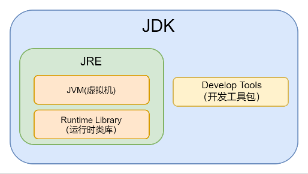

<h1 style="color: cornflowerblue">Java</h1>

> 这里对Java基础语法不做过多的介绍，主要以面试和工作中需要用到或注意的地方做记录和讲解，对基础感兴趣的可以去自行查找学习

## 介绍

> 百度百科：Java是一门面向对象编程语言，不仅吸收了C++语言的各种优点，还摒弃了C++里难以理解的多继承、指针等概念，因此Java语言具有功能强大和简单易用两个特征。Java语言作为静态面向对象编程语言的代表，极好地实现了面向对象理论，允许程序员以优雅的思维方式进行复杂的编程

> Java介于编译型语言和解释型语言之间。Java是将代码编译成一种字"节码"，它类似于抽象的CPU指令，然后，针对不同平台编写虚拟机(JVM)，不同平台的虚拟机负责加载字节码并执行，这样就实现了"一次编写，到处运行"的效果。当然，这是针对Java开发者而言。对于虚拟机，需要为每个平台分别开发。为了保证不同平台、不同公司开发的虚拟机都能正确执行Java字节码

## Java版本发布时间

| 时间   | 版本      |
| :----- | :-------- |
| 1995   | 1.0       |
| 1998   | 1.2       |
| 2000   | 1.3       |
| 2002   | 1.4       |
| 2004   | 1.5 / 5.0 |
| 2005   | 1.6 / 6.0 |
| 2011   | 1.7 / 7.0 |
| 2014   | 1.8 / 8.0 |
| 2017/9 | 1.9 / 9.0 |
| 2018/3 | 10        |
| 2018/9 | 11        |
| ...    | ...       |

## Java发展重大事件

| 时间          | 事件                                                         |
| ------------- | ------------------------------------------------------------ |
| 1990年        | Sun公司中James Gosling带领小组Green Team开发出新的程序，命名Oak，后改名Java |
| 1996年1月23日 | Sun Microsystems发布JDK1.0                                   |
| 1998年        | JDK1.2发布。同时Sun发布了JSP/Servlet、EJB规范，Java 也分为3个版本分别为 J2EE、J2SE、J2ME，表明Java开始向企业、桌面应用和移动设备应用三大领域 |
| 2000年        | JDK1.3发布，**Java HotSpot Virtual Machine正式发布，成为Java默认虚拟机** |
| 2002年        | JDK1.4发布，古老的Classic虚拟机退出历史舞台                  |
| 2004年        | JDK1.5发布，同时**JDK1.5 改名为JavaSE5.0**，此次更新加入大量新特性 |
| 2006年        | JDK6发布。**Java开源并建立了OpenJDK，HotSpot虚拟机同样做为OpenJDK的默认虚拟机** |
| 2008年        | Oracle收购BEA ，得到JRockit虚拟机                            |
| 2010年        | Oracle公司收购Sun公司                                        |
| 2011年        | JDK7发布，**在JDK1.7u4中正式启动G1垃圾回收器**               |
| 2014年        | JDK8发布                                                     |
| 2017年        | JDK9发布，**将G1设置成默认GC，替代CMS（并发垃圾回收器）**    |
| 2018年        | JDK11发布，LTS版本JDK，**发布革命性ZGC，调整JDK授权许可**    |
| 2019年        | JDK12发布，加入RedHat开发的Shenandoah GC                     |

## JDK、JRE、JVM

> **JDK：**Java Development Kit (Java 开发工具包)
>
> **JRE：**Java Runtime Environment (Java运行时环境)
>
> **JVM：**Java Virtual Machine (Java虚拟机)

