##  Spring核心组件

 

## Spring核心

> IOC容器和AOP模块。通过IOC容器管理POJO对象以及他们之间的耦合关系；通过AOP以动态非侵入的方式增强服务。IOC让相互协作的组件保持松散的耦合，而AOP编程允许你把遍布于应用各层的功能分离出来形成可重用的功能组件。

## SpringIOC原理

### IOC简介

> Spring通过一个配置文件描述Bean及Bean之间的依赖关系，利用 Java 语言的反射功能实例化Bean并建立Bean之间的依赖关系。 Spring的IOC容器在完成这些底层工作的基础上，还提供了Bean实例缓存、生命周期管理、 Bean实例代理、事件发布、资源装载等高级服务。

### Spring 容器高层视图

> Spring启动时读取应用程序提供的Bean配置信息，并在Spring 容器中生成一份相应的Bean配置注册表，然后根据这张注册表实例化Bean，装配好Bean之间的依赖关系，为上层应用提供准备就绪的运行环境。其中Bean缓存池为HashMap实现

 

### IOC容器实现

> Spring IOC容器的设计主要是基于BeanFactory和ApplicationContext两个接口，其中ApplicationContext是BeanFactory的子接口之一。换句话说BeanFactory是Spring IOC容器所定义的最底层接口，而ApplicationContext是其高级接口之一，并且对BeanFactory功能做了许多有用的扩展，所以在绝大部分的工作场景下，都会使用ApplicationContext作为Spring IOC容器

| 容器                              | 描述                                                         |
| --------------------------------- | ------------------------------------------------------------ |
| **Spring BeanFactory容器**        | 最简单的容器，给DI提供了基本支持，它用 org.springframework.beans.factory.BeanFactory 接口来定义。BeanFactory 或者相关的接口，如 BeanFactoryAware，InitializingBean，DisposableBean，在 Spring 中仍然存在具有大量的与 Spring 整合的第三方框架的反向兼容性的目的 |
| **Spring ApplicationContext容器** | 该容器添加了更多的企业特定的功能，例如从一个属性文件中解析文本信息的能力，发布应用程序事件给感兴趣的事件监听器的能力。该容器是由 org.springframework.context.ApplicationContext 接口定义 |

### BeanFactory

>  BeanFactory是Spring框架的基础设施，面向Spring本身。ApplicationContext面向使用Spring 框架的开发者，几乎所有的应用场合我们都直接使用ApplicationContext而非底层的BeanFactory

 

#### BeanDefinitionRegistry注册表

