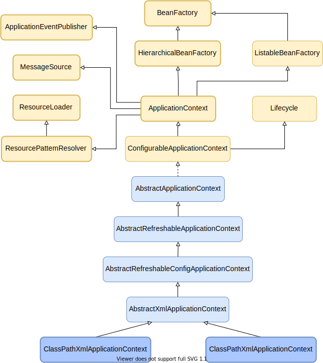

## Spring核心组件

## Spring核心

> IOC容器和AOP模块。通过IOC容器管理POJO对象以及他们之间的耦合关系；通过AOP以动态非侵入的方式增强服务。IOC让相互协作的组件保持松散的耦合，而AOP编程允许你把遍布于应用各层的功能分离出来形成可重用的功能组件。

## SpringIOC原理

### IOC简介

> Spring通过一个配置文件描述Bean及Bean之间的依赖关系，利用 Java 语言的反射功能实例化Bean并建立Bean之间的依赖关系。 Spring的IOC容器在完成这些底层工作的基础上，还提供了Bean实例缓存、生命周期管理、 Bean实例代理、事件发布、资源装载等高级服务。

### Spring 容器高层视图

> Spring启动时读取应用程序提供的Bean配置信息，并在Spring 容器中生成一份相应的Bean配置注册表，然后根据这张注册表实例化Bean，装配好Bean之间的依赖关系，为上层应用提供准备就绪的运行环境。其中Bean缓存池为HashMap实现

### IOC容器实现

> Spring IOC容器的设计主要是基于BeanFactory和ApplicationContext两个接口，其中ApplicationContext是BeanFactory的子接口之一。换句话说BeanFactory是Spring IOC容器所定义的最底层接口，而ApplicationContext是其高级接口之一，并且对BeanFactory功能做了许多有用的扩展，所以在绝大部分的工作场景下，都会使用ApplicationContext作为Spring IOC容器

| 容器                              | 描述                                                         |
| --------------------------------- | ------------------------------------------------------------ |
| **Spring
BeanFactory容器**        | 最简单的容器，给DI提供了基本支持，它用 org.springframework.beans.factory.BeanFactory 接口来定义。BeanFactory 或者相关的接口，如 BeanFactoryAware，InitializingBean，DisposableBean，在 Spring 中仍然存在具有大量的与 Spring 整合的第三方框架的反向兼容性的目的 |
| **Spring
ApplicationContext容器** | 该容器添加了更多的企业特定的功能，例如从一个属性文件中解析文本信息的能力，发布应用程序事件给感兴趣的事件监听器的能力。该容器是由 org.springframework.context.ApplicationContext 接口定义 |

### BeanFactory

> BeanFactory是Spring框架的基础设施，面向Spring本身。ApplicationContext面向使用Spring 框架的开发者，几乎所有的应用场合我们都直接使用ApplicationContext而非底层的BeanFactory

#### BeanDefinitionRegistry注册表

> Spring配置文件中每一个节点元素在Spring容器里都通过一个BeanDefinition对象表示，它描述了Bean的配置信息。而BeanDefinitionRegistry接口提供了向容器手工注册BeanDefinition对象的方法

#### BeanFactory顶层接口

> 位于类结构树的顶端 ，它最主要的方法就是getBean(String beanName)，该方法从容器中返回特定名称的Bean，BeanFactory的功能通过其他的接口得到不断扩展

#### ListableBeanFactory

> 该接口定义了访问容器中Bean基本信息的若干方法，如查看Bean的个数、获取某一类型Bean的配置名、查看容器中是否包括某一Bean等方法

#### HierarchicalBeanFactory父子级联

> 父子级联IOC容器的接口，子容器可以通过接口方法访问父容器； 通过HierarchicalBeanFactory接口， Spring的IOC容器可以建立父子层级关联的容器体系，子容器可以访问父容器中的Bean，但父容器不能访问子容器的Bean。Spring使用父子容器实现了很多功能，比如在SpringMVC中，展现层Bean位于一个子容器中，而业务层和持久层的Bean位于父容器中。这样，展现层Bean就可以引用业务层和持久层的Bean，而业务层和持久层的Bean则看不到展现层的Bean

#### ConfigurableBeanFactory

> 是一个重要的接口，增强了IOC容器的可定制性，它定义了设置类装载器、属性编辑器、容器初始化后置处理器等方法

#### AutowireCapableBeanFactory自动装配

> 定义了将容器中的Bean按某种规则（如按名字匹配、按类型匹配等）进行自动装配的方法

#### SingletonBeanRegistry运行期间注册单例Bean

> 定义了允许在运行期间向容器注册单实例Bean的方法；对于单实例（ singleton）的Bean来说，BeanFactory会缓存Bean实例，所以第二次使用getBean()获取Bean时将直接从IOC容器的缓存中获取Bean实例。Spring在DefaultSingletonBeanRegistry类中提供了一个用于缓存单实例 Bean 的缓存器，它是一个用HashMap实现的缓存器，单实例的Bean以beanName为键保存在这个HashMap中

#### 依赖日志框框

> 在初始化BeanFactory时，必须为其提供一种日志框架，比如使用Log4J， 即在类路径下提供Log4J配置文件，这样启动Spring容器才不会报错

### ApplicationContext

> ApplicationContext由BeanFactory派 生 而 来 ， 提供了更多面向实际应用的功能 。ApplicationContext继承了HierarchicalBeanFactory和ListableBeanFactory接口，在此基础上，还通过多个其他的接口扩展了BeanFactory的功能：

- **ClassPathXmlApplicationContext：** 默认从类路径加载配置文件
- **FileSystemXmlApplicationContext：** 默认从文件系统中装载配置文件
- **ApplicationEventPublisher：** 让容器拥有发布应用上下文事件的功能，包括容器启动事件、关闭事件等。
- **MessageSource：** 为应用提供i18n国际化消息访问的功能
- **ResourcePatternResolver ：**
  所有ApplicationContext实现类都实现了类似于PathMatchingResourcePatternResolver的功能，可以通过带前缀的Ant风格的资源文件路径装载Spring的配置文件。
- **LifeCycle：** 该接口是Spring2.0加入的，该接口提供了start()和stop()
  两个方法，主要用于控制异步处理过程。在具体使用时，该接口同时被ApplicationContext实现及具体Bean实现，ApplicationContext会将start/stop的信息传递给容器中所有实现了该接口的Bean，以达到管理和控制
  JMX、任务调度等目的
- **ConfigurableApplicationContext：** 扩展于 ApplicationContext，它新增加了两个主要的方法：refresh()和close()
  ，让ApplicationContext具有启动、刷新和关闭应用上下文的能力。在应用上下文关闭的情况下调用refresh()即可启动应用上下文，在已经启动的状态下，调用refresh()则清除缓存并重新装载配置信息，而调用close()
  则可关闭应用上下文

### WebApplication

> WebApplicationContext是专门为Web应用准备的，它允许从相对于Web根目录的路径中装载配置文件完成初始化工作。从WebApplicationContext中可以获得ServletContext的引用，整个Web应用上下文对象将作为属性放置到ServletContext中，以便Web应用环境可以访问Spring应用上下文。

