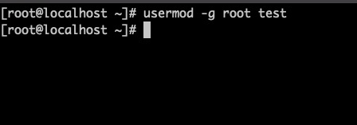
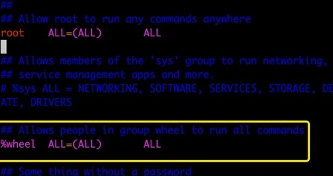
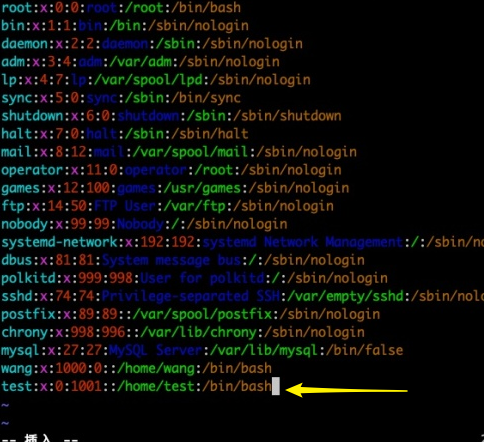

> CSDN上的某篇文章

## 1、添加用户并设置密码：

- **添加一个普通用户**

  ```shell
  # adduser <username>
  adduser test
  ```

  > 此方法创建用户对密码强度存在要求

- **添加密码**

  ```shell
  # passwd <username>
  passwd test
  ```

## 2、将用户加入到Root组

```shell
# usermod -g <groupname> <username>
usermod -g root test
```



## 3、赋予Root权限

> 编辑文件，找到下面内容，并把注释#去掉

```shell
vi /etc/sudoers
```



## 4、修改passwd文件

> 修改/etc/passwd文件，添加的用户，并把用户ID修改为0（用户ID为x后面的那个数字）

```shell
vi /etc/passwd
```



> 每行代表一个用户，可以看到我们的系统里有很多用户，绝大多数是系统或服务正常运行必须的用户，这些用户称为系统用户，这些用户是不可登录的，同时不能被删除。一旦删除，依赖它们的服务或程序将会出问题
>
> 1、第一个字段，保存的是用户名
>
> 2、第二个字段 “X”，代表有密码。这个字段称为密码标识
>
> 3、第三个字段，用户ID(UID)，系统是通过 UID 来识别不同的用户和分配用户权限的。这些 UID 是有使用限制和要求的：
>
> - 0：如果用户 UID 为 0，则代表这个账号是管理员账号。在 Linux 中如何把普通用户升级成管理员呢？只需把其他用户的 UID 修改为 0 就可以了
>
> - 1-499：系统用户（伪用户）UID。这些 UID 是系统保留给系统用户的 UID，也就是说 UID 是 1~499 范围内的用户是不能登录系统的，而是用来运行系统或服务的。其中，1~99 是系统保留的账号，系统自动创建；100~499 是预留给用户创建账号的。
>
> - 500-65535：普通用户UID。建立的普通用户的UID从500开始，最大到65535