> 翻译自mermaid官网文档
>
> 官网：https://mermaid-js.github.io/mermaid/#/

## 流程图

> 所有流程图都由**节点**、几何形状和**边缘**、箭头或线条组成。mermaid代码定义了这些**节点**和**边**的生成和交互方式。

> 它还可以容纳不同的箭头类型、多向箭头以及与子图的链接。

> **重要说明**：请勿将“end”一词输入为流程图节点。将所有或任何一个字母大写以防止流程图中断，即“End”或“END”。

### 节点（默认）

```
graph LR
    id
```

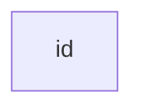

### 带有文本的节点·

```
graph LR
    id1[This is the text in the box]
```


### 图表

> 该语句声明了流程图的方向。
>
> 这声明图形是从上到下定向的（`TD`或`TB`）。

```
graph TD
    Start --> Stop
```

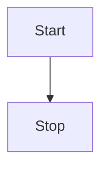

> 这声明了图形从左向右 ( `LR`)定向。

```
graph LR
    Start --> Stop
```

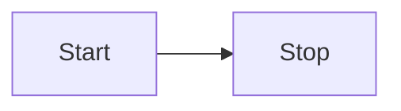

### 流程图方向

> 可能的流程图方向是：
>
> - **TB** —— 从上到下
> - **TD** —— 自上而下/与自上而下相同
> - **BT** —— 自下而上
> - **RL** —— 从右到左
> - **LR** —— 从左到右

### 节点形状

#### 具有圆角的节点

```
graph LR
    id1(This is the text in the box)
```

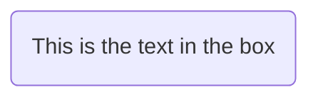

#### 具有圆边的节点

```
graph LR
    id1([This is the text in the box])
```


#### 子程序形状的节点

```
graph LR
    id1[[This is the text in the box]]
```

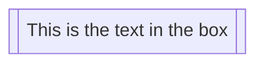

#### 圆柱形状的节点

```
graph LR
    id1[(Database)]
```

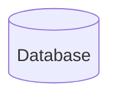

#### 圆形的节点

```
graph LR
    id1((This is the text in the circle))
```

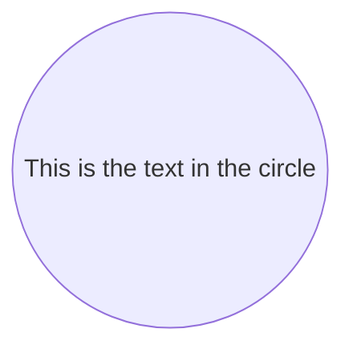

#### 不对称形状的节点

```
graph LR
    id1>This is the text in the box]
```

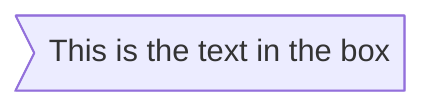

> 目前只有上面的形状是可能的 其他暂不支持

#### 菱形节点

```
graph LR
    id1{This is the text in the box}
```

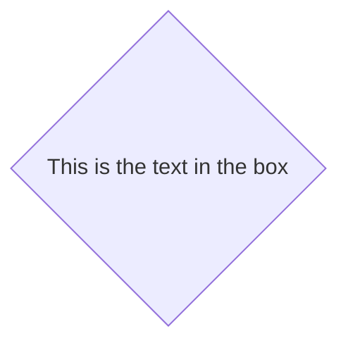

#### 六边形节点

```
graph LR
    id1{{This is the text in the box}}
```


#### 平行四边形

```
graph TD
    id1[/This is the text in the box/]
```

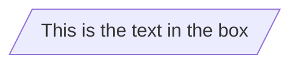

#### 平行四边形 alt

```
graph TD
    id1[\This is the text in the box\]
```

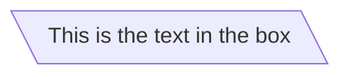

#### 梯形

```
graph TD
    A[/Christmas\]
```

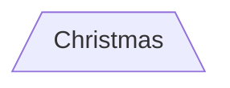

#### 梯形alt

```
graph TD
    B[\Go shopping/]
```

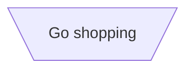

### 节点之间的链接

> 节点可以通过链接/边连接。可以有不同类型的链接或将文本字符串附加到链接。

#### 带箭头的链接

```
graph LR
    A-->B
```

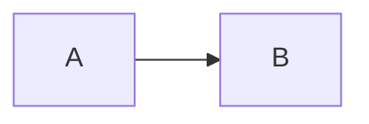

#### 开放链接

```
graph LR
    A --- B
```

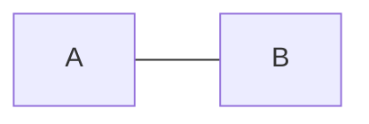

#### 链接上的文字

```
graph LR
    A-- This is the text! ---B
```

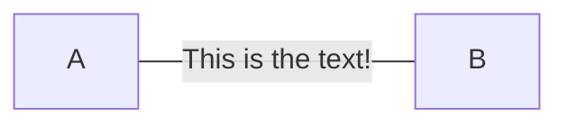

> 或

```
graph LR
    A---|This is the text|B
```

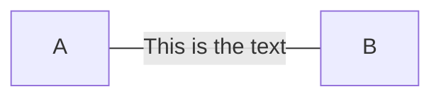

#### 带有箭头和文本的链接

```
graph LR
    A-->|text|B
```

```mermaid
graph LR
    A-->|text|B
```

> 或

```
graph LR
    A-- text -->B
```

```mermaid
graph LR
    A-- text -->B
```

#### 虚线链接

```
graph LR;
   A-.->B;
```

```mermaid
graph LR;
   A-.->B;
```

#### 带文字的虚线链接

```
graph LR
   A-. text .-> B
```

```mermaid
graph LR
   A-. text .-> B
```

#### 粗链接

```
graph LR
   A ==> B
```

```mermaid
graph LR
   A ==> B
```

#### 带有文本的粗链接

```
graph LR
   A == text ==> B
```

```mermaid
graph LR
   A == text ==> B
```

#### 多路链接

> 可以在同一行中声明多个链接，如下所示：

```
graph LR
   A -- text --> B -- text2 --> C
```

```mermaid
graph LR
   A -- text --> B -- text2 --> C
```

> 也可以在同一行中声明多个节点链接，如下所示：

```
graph LR
   a --> b & c--> d
```

```mermaid
graph LR
   a --> b & c--> d
```

> 然后，还可以以非常有表现力的方式描述依赖项。像下面的单行：

```
graph TB
    A & B--> C & D
```

```mermaid
graph TB
    A & B--> C & D
```

> 如果使用基本语法描述相同的图表，它将需要四行。

```
graph TB
    A --> C
    A --> D
    B --> C
    B --> D
```

```mermaid
graph TB
    A --> C
    A --> D
    B --> C
    B --> D
```

#### 测试版：新的箭头类型

> 当使用流程图而不是图形时，支持新类型的箭头，如下所示：

```
flowchart LR
    A --o B
    B --x C
```

```mermaid
flowchart LR
    A --o B
    B --x C
```

#### 测试版：多向箭头

> 当使用流程图而不是图形时，可以使用多向箭头。

```
flowchart LR
    A o--o B
    B <--> C
    C x--x D
```

```mermaid
flowchart LR
    A o--o B
    B <--> C
    C x--x D
```

#### 链接的最小长度

> 流程图中的每个节点最终都被分配到渲染图中的一个等级，即垂直或水平级别（取决于流程图的方向），基于它所链接的节点。默认情况下，链接可以跨越任意数量的等级，但可以通过在链接定义中添加额外的破折号来要求任何链接比其他链接更长。

> 在以下示例中，在从节点*B* 到节点*E*的链接中添加了两个额外的破折号，因此它比常规链接多跨越两个等级：

```
graph TD
    A[Start] --> B{Is it?};
    B -->|Yes| C[OK];
    C --> D[Rethink];
    D --> B;
    B ---->|No| E[End];
```

```mermaid
graph TD
    A[Start] --> B{Is it?};
    B -->|Yes| C[OK];
    C --> D[Rethink];
    D --> B;
    B ---->|No| E[End];
```

> **注意 **：链接的长度可能仍然超过渲染引擎请求的等级数以适应其他请求。

> 当链接标签写在链接中间时，必须在链接的右侧添加额外的破折号。以下示例等效于前一个示例：

```
graph TD
    A[Start] --> B{Is it?};
    B -- Yes --> C[OK];
    C --> D[Rethink];
    D --> B;
    B -- No ----> E[End];
```

```mermaid
graph TD
    A[Start] --> B{Is it?};
    B -- Yes --> C[OK];
    C --> D[Rethink];
    D --> B;
    B -- No ----> E[End];
```

> 对于虚线或粗链接，要添加的字符是等号或点，总结如下表：

| 长度       | 1      | 2       | 3        |
| ---------- | ------ | ------- | -------- |
| 正常       | `---`  | `----`  | `-----`  |
| 正常带箭头 | `-->`  | `--->`  | `---->`  |
| 厚         | `===`  | `====`  | `=====`  |
| 粗有箭头   | `==>`  | `===>`  | `====>`  |
| 虚线       | `-.-`  | `-..-`  | `-...-`  |
| 用箭头点缀 | `-.->` | `-..->` | `-...->` |

#### 破坏语法的特殊字符

> 可以将文本放在引号内以呈现更麻烦的字符。如下例所示：

```
graph LR
    id1["This is the (text) in the box"]
```

```mermaid
graph LR
    id1["This is the (text) in the box"]
```

### 转义字符的实体代码

> 可以使用此处举例说明的语法对字符进行转义。

```
    graph LR
        A["A double quote:#quot;"] -->B["A dec char:#9829;"]
```

```mermaid
    graph LR
        A["A double quote:#quot;"] -->B["A dec char:#9829;"]
```

### 子图

```
subgraph title
    graph definition
end
```

> 下面是一个例子：

```
graph TB
    c1-->a2
    subgraph one
    a1-->a2
    end
    subgraph two
    b1-->b2
    end
    subgraph three
    c1-->c2
    end
```

```mermaid
graph TB
    c1-->a2
    subgraph one
    a1-->a2
    end
    subgraph two
    b1-->b2
    end
    subgraph three
    c1-->c2
    end
```

> 还可以为子图设置显式 ID。

```
graph TB
    c1-->a2
    subgraph ide1 [one]
    a1-->a2
    end
```

```mermaid
graph TB
    c1-->a2
    subgraph ide1 [one]
    a1-->a2
    end
```

### 测试版：流程图

> 使用图类型流程图，还可以设置与子图之间的边，如下图所示。

```
flowchart TB
    c1-->a2
    subgraph one
    a1-->a2
    end
    subgraph two
    b1-->b2
    end
    subgraph three
    c1-->c2
    end
    one --> two
    three --> two
    two --> c2
```

```mermaid
flowchart TB
    c1-->a2
    subgraph one
    a1-->a2
    end
    subgraph two
    b1-->b2
    end
    subgraph three
    c1-->c2
    end
    one --> two
    three --> two
    two --> c2
```

### 注释

```
graph LR
%% this is a comment A -- text --> B{node}
   A -- text --> B -- text2 --> C
```

```mermaid
graph LR
%% this is a comment A -- text --> B{node}
   A -- text --> B -- text2 --> C
```

### 样式和类

#### 样式链接

> 可以对链接进行样式设置。例如，可能想要为在流程中倒退的链接设置样式。由于链接没有与节点相同的 id，因此需要一些其他方式来决定链接应该附加到什么样式。使用在图中定义链接时的顺序号而不是 id。在下面的示例中，linkStyle 语句中定义的样式将属于图中的第四个链接：

```
linkStyle 3 stroke:#ff3,stroke-width:4px,color:red;
```

#### 设置节点样式

> 可以对节点应用特定样式，例如较粗的边框或不同的背景颜色。

```
graph LR
    id1(Start)-->id2(Stop)
    style id1 fill:#f9f,stroke:#333,stroke-width:4px
    style id2 fill:#bbf,stroke:#f66,stroke-width:2px,color:#fff,stroke-dasharray: 5 5
```

```mermaid
graph LR
    id1(Start)-->id2(Stop)
    style id1 fill:#f9f,stroke:#333,stroke-width:4px
    style id2 fill:#bbf,stroke:#f66,stroke-width:2px,color:#fff,stroke-dasharray: 5 5
```

#### 类

> 比每次都定义样式更方便的是定义一个样式类并将这个类附加到应该具有不同外观的节点上。

> 类定义类似于以下示例：

    classDef className fill:#f9f,stroke:#333,stroke-width:4px;

> 将类附加到节点的操作如下：

    class nodeId1 className;

> 也可以在一个语句中将类附加到节点列表：

    class nodeId1,nodeId2 className;

> 添加类的一种更简短的形式是使用:::运算符将类名附加到节点，如下所示：

```
graph LR
    A:::someclass --> B
    classDef someclass fill:#f96;
```

```mermaid
graph LR
    A:::someclass --> B
    classDef someclass fill:#f96;
```

## 序列图

> 序列图是一种交互图，它显示了进程如何相互操作以及以何种顺序运行。

### 语法

```
sequenceDiagram
    Alice->>John: Hello John, how are you?
    John-->>Alice: Great!
    Alice-->>John: See you later!
```

```mermaid
sequenceDiagram
    Alice->>John: Hello John, how are you?
    John-->>Alice: Great!
    Alice-->>John: See you later!
```

#### 别名

> 可以有一个方便的标识符和一个描述性标签。

```
sequenceDiagram
    participant A as Alice
    participant J as John
    A->>J: Hello John, how are you?
    J->>A: Great!
```

```mermaid
sequenceDiagram
    participant A as Alice
    participant J as John
    A->>J: Hello John, how are you?
    J->>A: Great!
```

#### 信息

> 消息可以是两条，以实线或虚线显示。
> [行动者\]\[箭头][行动者]：消息文本
> 当前支持六种类型的箭头：(<8.8只支持前四个)

| 类型 | 说明                           |
| ---- | ------------------------------ |
| ->   | 没有箭头的实线                 |
| -->  | 没有箭头的虚线                 |
| ->>  | 带箭头的实线                   |
| -->> | 带箭头的虚线                   |
| -x   | 实线末尾有一个十字             |
| --x  | 末端带有十字的虚线。           |
| -)   | 实线末尾有一个开放箭头（异步） |
| --)  | 末尾带有开放箭头的虚线（异步） |

### 激活

> 可以激活和停用行动者。(de)activation 可以是专用声明：

```
sequenceDiagram
    Alice->>John: Hello John, how are you?
    activate John
    John-->>Alice: Great!
    deactivate John
```

```mermaid
sequenceDiagram
    Alice->>John: Hello John, how are you?
    activate John
    John-->>Alice: Great!
    deactivate John
```

> 通过在消息箭头后附加`+`/`-`后缀，还有一个快捷表示法：

```
sequenceDiagram
    Alice->>+John: Hello John, how are you?
    John-->>-Alice: Great!
```

```mermaid
sequenceDiagram
    Alice->>+John: Hello John, how are you?
    John-->>-Alice: Great!
```

可以为同一行动者堆叠激活：

```
sequenceDiagram
    Alice->>+John: Hello John, how are you?
    Alice->>+John: John, can you hear me?
    John-->>-Alice: Hi Alice, I can hear you!
    John-->>-Alice: I feel great!
```

```mermaid
sequenceDiagram
    Alice->>+John: Hello John, how are you?
    Alice->>+John: John, can you hear me?
    John-->>-Alice: Hi Alice, I can hear you!
    John-->>-Alice: I feel great!
```

### 笔记

> 可以向序列图中添加注释。这是通过符号 Note [ right of | 左边 | over ] [Actor]：笔记内容中的文字

```
sequenceDiagram
    participant John
    Note right of John: Text in note
```

```mermaid
sequenceDiagram
    participant John
    Note right of John: Text in note
```

> 还可以创建跨越两个参与者的笔记：

```
sequenceDiagram
    Alice->John: Hello John, how are you?
    Note over Alice,John: A typical interaction
```

```mermaid
sequenceDiagram
    Alice->John: Hello John, how are you?
    Note over Alice,John: A typical interaction
```

### 循环

> 可以在序列图中表达循环。这是由符号完成的

```
loop Loop text
... statements ...
end
```

```
sequenceDiagram
    Alice->John: Hello John, how are you?
    loop Every minute
        John-->Alice: Great!
    end
```

```mermaid
sequenceDiagram
    Alice->John: Hello John, how are you?
    loop Every minute
        John-->Alice: Great!
    end
```

### 替代

> 可以在序列图中表达替代路径。这是由符号完成的

```
alt Describing text
... statements ...
else
... statements ...
end
```

> 或者如果有可选的序列（如果没有其他）。

```
opt Describing text
... statements ...
end
```

```
sequenceDiagram
    Alice->>Bob: Hello Bob, how are you?
    alt is sick
        Bob->>Alice: Not so good :(
    else is well
        Bob->>Alice: Feeling fresh like a daisy
    end
    opt Extra response
        Bob->>Alice: Thanks for asking
    end
```

```mermaid
sequenceDiagram
    Alice->>Bob: Hello Bob, how are you?
    alt is sick
        Bob->>Alice: Not so good :(
    else is well
        Bob->>Alice: Feeling fresh like a daisy
    end
    opt Extra response
        Bob->>Alice: Thanks for asking
    end
```

### 并行

> 可以显示并行发生的操作。这是由符号完成的

```
par [Action 1]
... statements ...
and [Action 2]
... statements ...
and [Action N]
... statements ...
end
```

```
sequenceDiagram
    par Alice to Bob
    	Alice->>Bob: Hello guys!
    and Alice to John
    	Alice->>John: Hello guys!
    end
    Bob-->>Alice: Hi Alice!
    John-->>Alice: Hi Alice!
```

```mermaid
sequenceDiagram
    par Alice to Bob
    	Alice->>Bob: Hello guys!
    and Alice to John
    	Alice->>John: Hello guys!
    end
    Bob-->>Alice: Hi Alice!
    John-->>Alice: Hi Alice!
```

> 也可以嵌套并行块。

```
sequenceDiagram
    par Alice to Bob
		Alice->>Bob: Go help John
    and Alice to John
		Alice->>John: I want this done today
        par John to Charlie
        	John->>Charlie: Can we do this today?
        and John to Diana
        	John->>Diana: Can you help us today?
        end
    end
```

```mermaid
sequenceDiagram
    par Alice to Bob
		Alice->>Bob: Go help John
    and Alice to John
		Alice->>John: I want this done today
        par John to Charlie
        	John->>Charlie: Can we do this today?
        and John to Diana
        	John->>Diana: Can you help us today?
        end
    end
```

### 背景高亮

> 可以通过提供彩色背景矩形来突出显示流。这是由符号完成的颜色使用 rgb 和 rgba 语法定义。

```
rect rgb(0, 255, 0)
... content ...
end
```

```
rect rgba(0, 0, 255, .1)
... content ...
end
```

```
sequenceDiagram
	Note right of Alice: Alice calls John.
	rect rgb(191, 223, 255)
        Alice->>+John: Hello John, how are you?
        rect rgba(200, 150, 255)
            Alice->>+John: John, can you hear me?
            John-->>-Alice: Hi Alice, I can hear you!
        end
        John-->>-Alice: I feel great!
    end
	Alice->>+John: Did you want to go to the game tonight?
    John-->>-Alice: Yeah! See you there!
```

```mermaid
sequenceDiagram
	Note right of Alice: Alice calls John.
	rect rgb(191, 223, 255)
        Alice->>+John: Hello John, how are you?
        rect rgba(200, 150, 255)
            Alice->>+John: John, can you hear me?
            John-->>-Alice: Hi Alice, I can hear you!
        end
        John-->>-Alice: I feel great!
    end
	Alice->>+John: Did you want to go to the game tonight?
    John-->>-Alice: Yeah! See you there!
```

### 注释

```
sequenceDiagram
    Alice->>John: Hello John, how are you?
    %% this is a comment
    John-->>Alice: Great!
```

```mermaid
sequenceDiagram
    Alice->>John: Hello John, how are you?
    %% this is a comment
    John-->>Alice: Great!
```

#### 转义字符的实体代码

> 可以使用此处举例说明的语法对字符进行转义。

```
sequenceDiagram
    A->>B: I #9829; you!
    B->>A: I #9829; you #infin; times more!
```

```mermaid
sequenceDiagram
    A->>B: I #9829; you!
    B->>A: I #9829; you #infin; times more!
```

### 序列号

> `autonumber`

```
sequenceDiagram
    autonumber
    Alice->>John: Hello John, how are you?
    loop Healthcheck
        John->>John: Fight against hypochondria
    end
    Note right of John: Rational thoughts!
    John-->>Alice: Great!
    John->>Bob: How about you?
    Bob-->>John: Jolly good!
```
```mermaid
sequenceDiagram
    autonumber
    Alice->>John: Hello John, how are you?
    loop Healthcheck
        John->>John: Fight against hypochondria
    end
    Note right of John: Rational thoughts!
    John-->>Alice: Great!
    John->>Bob: How about you?
    Bob-->>John: Jolly good!
```

## 类图

> **`classDiagram-v2`**为**`classDiagram`**二倍图

> 类图是面向对象建模的主要构建块。它用于应用程序结构的一般概念建模，以及将模型转换为编程代码的详细建模。类图也可用于数据建模。类图中的类代表主要元素、应用程序中的交互以及要编程的类。

```
classDiagram-v2
      Animal <|-- Duck
      Animal <|-- Fish
      Animal <|-- Zebra
      Animal : +int age
      Animal : +String gender
      Animal: +isMammal()
      Animal: +mate()
      class Duck{
          +String beakColor
          +swim()
          +quack()
      }
      class Fish{
          -int sizeInFeet
          -canEat()
      }
      class Zebra{
          +bool is_wild
          +run()
      }
```

```mermaid
classDiagram-v2
      Animal <|-- Duck
      Animal <|-- Fish
      Animal <|-- Zebra
      Animal : +int age
      Animal : +String gender
      Animal: +isMammal()
      Animal: +mate()
      class Duck{
          +String beakColor
          +swim()
          +quack()
      }
      class Fish{
          -int sizeInFeet
          -canEat()
      }
      class Zebra{
          +bool is_wild
          +run()
      }
```

### 语法

> UML 提供了表示类成员的机制，例如属性和方法，以及关于它们的附加信息。图中一个类的单个实例包含三个隔间：
>
> - 顶部隔间包含类的名称。它以粗体居中打印，第一个字母大写。它还可能包含描述类性质的可选注释文本。
> - 中间隔间包含类的属性。它们是左对齐的，第一个字母是小写的。底部隔间包含类可以执行的操作。它们也是左对齐的，第一个字母是小写的。

```
classDiagram-v2
    class BankAccount
    BankAccount : +String owner
    BankAccount : +Bigdecimal balance
    BankAccount : +deposit(amount)
    BankAccount : +withdrawl(amount)
```

```mermaid
classDiagram-v2
    class BankAccount
    BankAccount : +String owner
    BankAccount : +Bigdecimal balance
    BankAccount : +deposit(amount)
    BankAccount : +withdrawl(amount)
```

### 定义一个类

> 定义类有两种方式：
>
> - 使用关键字class显式定义一个类，例如class Animal。这定义了 Animal 类
> - 通过它们之间的关系定义两个类Vehicle <|-- Car。这定义了两个类 Vehicle 和 Car 以及它们的关系。

```
classDiagram-v2
    class Animal
    Vehicle <|-- Car
Animal
Vehicle
Car
```

```mermaid
classDiagram-v2
    class Animal
    Vehicle <|-- Car
Animal
Vehicle
Car
```

> 命名约定：类名应由字母数字（允许使用 unicode）和下划线字符组成。

### 定义类的成员

> UML 提供了表示类成员的机制，例如属性和方法，以及关于它们的附加信息。

> Mermaid 根据**括号** `()`是否存在来区分属性和函数/方法。那些`()`被视为函数/方法，而其他被视为属性。

> 有两种方法可以定义类的成员，无论使用哪种语法来定义成员，输出都将相同。这两种不同的方式是：
>
> - 使用**:（**冒号）后跟成员名称来关联类的成员，这对于一次定义一个成员很有用。例如：

```
classDiagram-v2
 class BankAccount
 BankAccount : +String owner
 BankAccount : +BigDecimal balance
 BankAccount : +deposit(amount)
 BankAccount : +withdrawal(amount)
```

```mermaid
classDiagram-v2
 class BankAccount
 BankAccount : +String owner
 BankAccount : +BigDecimal balance
 BankAccount : +deposit(amount)
 BankAccount : +withdrawal(amount)
```

> - 使用**{}**括号关联类的成员，其中成员在大括号内分组。适用于一次定义多个成员。例如：

```
classDiagram-v2
class BankAccount{
    +String owner
    +BigDecimal balance
    +deposit(amount)
    +withdrawl(amount)
}
```

```mermaid
classDiagram-v2
class BankAccount{
    +String owner
    +BigDecimal balance
    +deposit(amount)
    +withdrawl(amount)
}
```

#### 返回类型

或者，可以使用将返回的数据类型结束方法/函数定义（注意：`)`方法定义的最后部分和返回类型示例之间必须有一个空格：

```
classDiagram-v2
class BankAccount{
    +String owner
    +BigDecimal balance
    +deposit(amount) bool
    +withdrawl(amount) int
}
```

```mermaid
classDiagram-v2
class BankAccount{
    +String owner
    +BigDecimal balance
    +deposit(amount) bool
    +withdrawl(amount) int
}
```

#### 通用类型

> 可以使用泛型类型定义成员，例如`List<int>`，通过将类型包含在`~`(**波浪号**) 中来定义字段、参数和返回类型。注意：当前不支持**嵌套**类型声明（例如`List<List<int>>`）

> 这可以作为任一类定义方法的一部分来完成：

```
classDiagram-v2
class Square~Shape~{
    int id
    List~int~ position
    setPoints(List~int~ points)
    getPoints() List~int~
}

Square : -List~string~ messages
Square : +setMessages(List~string~ messages)
Square : +getMessages() List~string~
```

```mermaid
classDiagram-v2
class Square~Shape~{
    int id
    List~int~ position
    setPoints(List~int~ points)
    getPoints() List~int~
}

Square : -List~string~ messages
Square : +setMessages(List~string~ messages)
Square : +getMessages() List~string~
```

#### 返回类型

> 可以选择使用将返回的数据类型结束方法/函数定义

#### 能见度

> 要指定类成员（即任何属性或方法）的可见性，可以将这些符号放在成员名称之前，但它是可选的：
>
> - `+` 公众号
> - `-` 私人
> - `#` 受保护
> - `~` 包装/内部

> *请注意，*还可以通过在方法的末尾添加以下符号来将其他*分类器*包含到方法定义中，即：在 之后`()`：

> - `*` 摘要例如： `someAbstractMethod()*`
> - `$` 静态例如： `someStaticMethod()$`

### 定义关系

> 关系是一个通用术语，涵盖了在类和对象图中发现的特定类型的逻辑连接。

```
[classA][Arrow][ClassB]:LabelText
```

> 目前支持的 UML 下的类定义了不同类型的关系：

| 类型  | 说明         |
| ----- | ------------ |
| <\|-- | 继承         |
| *--   | 组成         |
| 哦--  | 聚合         |
| -->   | 协会         |
| ——    | 链接（实心） |
| ..>   | 依赖         |
| ..\|> | 实现         |
| ..    | 链接（虚线） |

```
classDiagram-v2
classA <|-- classB
classC *-- classD
classE o-- classF
classG <-- classH
classI -- classJ
classK <.. classL
classM <|.. classN
classO .. classP
```

```mermaid
classDiagram-v2
classA <|-- classB
classC *-- classD
classE o-- classF
classG <-- classH
classI -- classJ
classK <.. classL
classM <|.. classN
classO .. classP
```

> 我们可以使用标签来描述两个类之间关系的性质。此外，箭头也可以用于相反的方向：

```
classDiagram-v2
classA --|> classB : Inheritance
classC --* classD : Composition
classE --o classF : Aggregation
classG --> classH : Association
classI -- classJ : Link(Solid)
classK ..> classL : Dependency
classM ..|> classN : Realization
classO .. classP : Link(Dashed)
```

```mermaid
classDiagram-v2
classA --|> classB : Inheritance
classC --* classD : Composition
classE --o classF : Aggregation
classG --> classH : Association
classI -- classJ : Link(Solid)
classK ..> classL : Dependency
classM ..|> classN : Realization
classO .. classP : Link(Dashed)
```

### 关系标签

> 可以向关系添加标签文本：

```
[classA][Arrow][ClassB]:LabelText
```

```
classDiagram-v2
classA <|-- classB : implements
classC *-- classD : composition
classE o-- classF : association
```

```mermaid
classDiagram-v2
classA <|-- classB : implements
classC *-- classD : composition
classE o-- classF : association
```

### 基数/关系的多重性

> 类图中的多重性或基数表示一个类的实例链接到另一类的一个实例的数量。例如，一家公司将有一名或多名员工，但每位员工只为一家公司工作。

> 多重符号放置在关联的末端附近。

> 不同的基数选项是：
>
> - `1` 只有 1 个
> - `0..1` 零或一
> - `1..*` 一个或多个
> - `*` 许多
> - `n` n {其中 n>1}
> - `0..n` 零到 n {其中 n>1}
> - `1..n` 一到 n {其中 n>1}

> 通过在"给定箭头之前（可选）和之后（可选）的引号内放置基数文本，可以轻松定义基数。

```
[classA] "cardinality1" [Arrow] "cardinality2" [ClassB]:LabelText
```

```
classDiagram-v2
    Customer "1" --> "*" Ticket
    Student "1" --> "1..*" Course
    Galaxy --> "many" Star : Contains
```

```mermaid
classDiagram-v2
    Customer "1" --> "*" Ticket
    Student "1" --> "1..*" Course
    Galaxy --> "many" Star : Contains
```

### 类的注释

> 可以使用特定的标记文本来注释类，就像类的元数据一样，清楚地表明其性质。一些常见的注释示例可能是：
>
> - `<<Interface>>` 表示接口类
> - `<<abstract>>` 表示抽象类
> - `<<Service>>` 表示服务类
> - `<<enumeration>>` 代表一个枚举

> 注释在开头`<<`和结尾中定义`>>`。有两种方法可以向类添加注释，无论使用何种语法，输出都将相同。这两种方式是：
>
> - 在定义类之后的***单独行中\***。例如：

```
classDiagram-v2
class Shape
<<interface>> Shape
```

```mermaid
classDiagram-v2
class Shape
<<interface>> Shape
```

> - 在带有类定义的***嵌套结构中\***。例如：

```
classDiagram-v2
class Shape{
    <<interface>>
    noOfVertices
    draw()
}
class Color{
    <<enumeration>>
    RED
    BLUE
    GREEN
    WHITE
    BLACK
}
```

```mermaid
classDiagram-v2
class Shape{
    <<interface>>
    noOfVertices
    draw()
}
class Color{
    <<enumeration>>
    RED
    BLUE
    GREEN
    WHITE
    BLACK
}
```

### 注释

> 同上

## 状态图

> **`stateDiagram-v2`**为**`stateDiagram`**二倍图

> “状态图是一种用于计算机科学和相关领域的图，用于描述系统的行为。状态图要求所描述的系统由有限数量的状态组成；有时情况确实如此，而在其他情况下有时这是一个合理的抽象。” 维基百科

> Mermaid 可以渲染状态图。语法尝试与plantUml 中使用的语法保持一致，因为这将使用户更容易在mermaid 和plantUml 之间共享图表。

```
stateDiagram-v2
    [*] --> Still
    Still --> [*]

    Still --> Moving
    Moving --> Still
    Moving --> Crash
    Crash --> [*]
```

```mermaid
stateDiagram-v2
    [*] --> Still
    Still --> [*]

    Still --> Moving
    Moving --> Still
    Moving --> Crash
    Crash --> [*]
```

### 州

> 可以通过多种方式声明状态。最简单的方法是定义一个状态 ID 作为描述。

```
stateDiagram-v2
    s1
```

```mermaid
stateDiagram-v2
    s1
```

> 另一种方法是使用 state 关键字和如下描述：

```
stateDiagram-v2
    state "This is a state description" as s2
```

```mermaid
stateDiagram-v2
    state "This is a state description" as s2
```

> 用描述定义状态的另一种方法是定义状态 id 后跟一个冒号和描述：

```mermaid
stateDiagram-v2
    s2 : This is a state description
```

### 过渡

> 转换是一种状态进入另一种状态时的路径/边缘。这使用文本箭头“-->”表示。

> 当您定义两个状态之间的转换并且状态尚未定义时，未定义的状态将使用转换中的 id 进行定义。您可以稍后向以这种方式定义的状态添加描述。

```
stateDiagram-v2
    s1 --> s2
```

```mermaid
stateDiagram-v2
    s1 --> s2
```

> 可以向过渡添加文本。来形容它代表什么。

```
stateDiagram-v2
    s1 --> s2: A transition
```

```mermaid
stateDiagram-v2
    s1 --> s2: A transition
```

### 开始和结束

> 有两种特殊状态指示图表的开始和停止。这些是用 [*] 语法编写的，转换的方向将其定义为开始或停止状态。

```
stateDiagram-v2
    [*] --> s1
    s1 --> [*]
```

```mermaid
stateDiagram-v2
    [*] --> s1
    s1 --> [*]
```

### 复合状态

> 在实际使用状态图时，您经常会得到多维的图，因为一个状态可以有多个内部状态。这些在本术语中称为复合状态。

> 为了定义复合状态，您需要使用 state 关键字，后跟一个 id 和 {} 之间复合状态的主体。请参阅下面的示例：

```
stateDiagram-v2
    [*] --> First
    state First {
        [*] --> second
        second --> [*]
    }
```

```mermaid
stateDiagram-v2
    [*] --> First
    state First {
        [*] --> second
        second --> [*]
    }
```

> 您可以在多个层中执行此操作：

```
stateDiagram-v2
    [*] --> First

    state First {
        [*] --> Second

        state Second {
            [*] --> second
            second --> Third

            state Third {
                [*] --> third
                third --> [*]
            }
        }
    }
```

```mermaid
stateDiagram-v2
    [*] --> First

    state First {
        [*] --> Second

        state Second {
            [*] --> second
            second --> Third

            state Third {
                [*] --> third
                third --> [*]
            }
        }
    }
```

> 您还可以定义复合状态之间的转换：

```
stateDiagram-v2
    [*] --> First
    First --> Second
    First --> Third

    state First {
        [*] --> fir
        fir --> [*]
    }
    state Second {
        [*] --> sec
        sec --> [*]
    }
    state Third {
        [*] --> thi
        thi --> [*]
    }
```

```mermaid
stateDiagram-v2
    [*] --> First
    First --> Second
    First --> Third

    state First {
        [*] --> fir
        fir --> [*]
    }
    state Second {
        [*] --> sec
        sec --> [*]
    }
    state Third {
        [*] --> thi
        thi --> [*]
    }
```

> 您不能定义属于不同复合状态的内部状态之间的转换

### 选择

> 有时您需要对两个或多个路径之间的选择进行建模，您可以使用 **<\<choice>>** 来实现。

```
stateDiagram-v2
    state if_state <<choice>>
    [*] --> IsPositive
    IsPositive --> if_state
    if_state --> False: if n < 0
    if_state --> True : if n >= 0
```

```mermaid
stateDiagram-v2
    state if_state <<choice>>
    [*] --> IsPositive
    IsPositive --> if_state
    if_state --> False: if n < 0
    if_state --> True : if n >= 0
```

### 分支

> 可以使用 **<\<fork>> <\<join>>** 在图中指定一个分支。

```
   stateDiagram-v2
    state fork_state <<fork>>
      [*] --> fork_state
      fork_state --> State2
      fork_state --> State3

      state join_state <<join>>
      State2 --> join_state
      State3 --> join_state
      join_state --> State4
      State4 --> [*]
```

```mermaid
   stateDiagram-v2
    state fork_state <<fork>>
      [*] --> fork_state
      fork_state --> State2
      fork_state --> State3

      state join_state <<join>>
      State2 --> join_state
      State3 --> join_state
      join_state --> State4
      State4 --> [*]
```

### 笔记

> 有时，没有什么比便利贴更能说明问题了。在状态图中也是如此。

> 在这里您可以选择将注释放在节点的*右侧*或*左侧*。

```
stateDiagram-v2
    State1: The state with a note
    note right of State1
        Important information! You can write
        notes.
    end note
    State1 --> State2
    note left of State2 : This is the note to the left.
```

```mermaid
stateDiagram-v2
    State1: The state with a note
    note right of State1
        Important information! You can write
        notes.
    end note
    State1 --> State2
    note left of State2 : This is the note to the left.
```

### 并发

> 与在 plantUml 中一样，您可以使用 -- 符号指定并发性。

```
stateDiagram-v2
    [*] --> Active

    state Active {
        [*] --> NumLockOff
        NumLockOff --> NumLockOn : EvNumLockPressed
        NumLockOn --> NumLockOff : EvNumLockPressed
        --
        [*] --> CapsLockOff
        CapsLockOff --> CapsLockOn : EvCapsLockPressed
        CapsLockOn --> CapsLockOff : EvCapsLockPressed
        --
        [*] --> ScrollLockOff
        ScrollLockOff --> ScrollLockOn : EvScrollLockPressed
        ScrollLockOn --> ScrollLockOff : EvScrollLockPressed
    }
```

```mermaid
stateDiagram-v2
    [*] --> Active

    state Active {
        [*] --> NumLockOff
        NumLockOff --> NumLockOn : EvNumLockPressed
        NumLockOn --> NumLockOff : EvNumLockPressed
        --
        [*] --> CapsLockOff
        CapsLockOff --> CapsLockOn : EvCapsLockPressed
        CapsLockOn --> CapsLockOff : EvCapsLockPressed
        --
        [*] --> ScrollLockOff
        ScrollLockOff --> ScrollLockOn : EvScrollLockPressed
        ScrollLockOn --> ScrollLockOff : EvScrollLockPressed
    }
```

## 实体关系图

> 实体-关系模型（或 ER 模型）描述了特定知识领域中的相关事物。基本 ER 模型由实体类型（对感兴趣的事物进行分类）组成，并指定实体（这些实体类型的实例）之间可以存在的关系。维基百科。

> 请注意，ER 建模的从业者几乎总是将*实体类型*简称为*实体*。例如，`CUSTOMER`实体*类型*将简称为`CUSTOMER`实体。这太常见了，不建议做任何其他事情，但从技术上讲，实体是实体类型的抽象*实例*，这就是 ER 图显示的 - 抽象实例，以及它们之间的关系。这就是为什么实体总是使用单数名词命名的原因。

```
erDiagram
    CUSTOMER ||--o{ ORDER : places
    ORDER ||--|{ LINE-ITEM : contains
    CUSTOMER }|..|{ DELIVERY-ADDRESS : uses
```

```mermaid
erDiagram
    CUSTOMER ||--o{ ORDER : places
    ORDER ||--|{ LINE-ITEM : contains
    CUSTOMER }|..|{ DELIVERY-ADDRESS : uses
```

> 实体之间的关系由带有表示基数的结束标记的线表示。美人鱼使用最流行的鱼尾纹符号。鱼尾纹直观地传达了它所连接的实体的许多实例的可能性。

> ER 图可用于各种目的，从没有任何实现细节的抽象逻辑模型到关系数据库表的物理模型。在 ER 图上包含属性定义以帮助理解实体的目的和含义是很有用的。这些不一定是详尽无遗的；通常一小部分属性就足够了。Mermaid 允许根据它们的*类型*和*名称*进行定义。

```
erDiagram
    CUSTOMER ||--o{ ORDER : places
    CUSTOMER {
        string name
        string custNumber
        string sector
    }
    ORDER ||--|{ LINE-ITEM : contains
    ORDER {
        int orderNumber
        string deliveryAddress
    }
    LINE-ITEM {
        string productCode
        int quantity
        float pricePerUnit
    }
```

```mermaid
erDiagram
    CUSTOMER ||--o{ ORDER : places
    CUSTOMER {
        string name
        string custNumber
        string sector
    }
    ORDER ||--|{ LINE-ITEM : contains
    ORDER {
        int orderNumber
        string deliveryAddress
    }
    LINE-ITEM {
        string productCode
        int quantity
        float pricePerUnit
    }
```

> 在 ER 图上包含属性时，您必须决定是否将外键作为属性包含在内。这可能取决于您尝试表示关系表结构的紧密程度。如果你的图表是*合乎逻辑的*模型并不意味着关系实现，那么最好将它们排除在外，因为关联关系已经传达了实体关联的方式。例如，JSON 数据结构可以使用数组实现一对多关系，而无需外键属性。类似地，面向对象的编程语言可以使用指向集合的指针或引用。即使对于旨在用于关系实现的模型，您也可能决定包含外键属性会复制关系已经描述的信息，并且不会为实体增加意义。最终，这是你的选择。

### 语法

#### 实体和关系

> ER 图的 Mermaid 语法与 PlantUML 兼容，并带有用于标记关系的扩展。每个语句由以下部分组成：

```markdown
    <first-entity> [<relationship> <second-entity> : <relationship-label>]
```

> 哪里：
>
> - `first-entity`是实体的名称。名称必须以字母字符开头，还可以包含数字、连字符和下划线。
> - `relationship`描述两个实体相互关联的方式。见下文。
> - `second-entity` 是另一个实体的名称。
> - `relationship-label` 从第一个实体的角度描述关系。

    >  例如：

```markdown
    PROPERTY ||--|{ ROOM : contains
```

> 此语句可以理解为*一个属性包含一个或多个房间，并且一个房间是一个且仅一个属性的一部分*。可以看到这里的标签是从第一个实体的角度来看的：一个属性包含一个房间，但一个房间不包含一个属性。当从第二个实体的角度考虑时，等效标签通常很容易推断。（一些 ER 图从两个角度标记关系，但这里不支持，通常是多余的）。

> 只有`first-entity`声明的一部分是强制性的。这使得显示没有关系的实体成为可能，这在图表的迭代构建过程中非常有用。如果指定了语句的任何其他部分，则所有部分都是强制性的。

#### 关系语法

> `relationship`每个语句的部分可以分解为三个子组件：
>
> - 第一个实体相对于第二个实体的基数，
> - 该关系是否赋予“子”实体身份
> - 第二个实体相对于第一个实体的基数

> 基数是描述另一个实体的多少元素可以与所讨论的实体相关的属性。在上面的例子中， a`PROPERTY`可以有一个或多个`ROOM`与之相关联的实例，而 a`ROOM`只能与一个相关联`PROPERTY`。在每个基数标记中有两个字符。最外面的字符代表最大值，最里面的字符代表最小值。下表总结了可能的基数。

| 值（左） | 价值（右） | 意义                 |
| -------- | ---------- | -------------------- |
| `|o`     | `o|`       | 零或一               |
| `||`     | `||`       | 正好一个             |
| `}o`     | `o{`       | 零个或多个（无上限） |
| `}|`     | `|{`       | 一项或多项（无上限） |

#### 识别

> 关系可以被分类为**识别**或**不可识别**，并且这些与任一实线或虚线分别呈现。当所讨论的实体之一在没有另一个实体的情况下不能独立存在时，这是相关的。例如，一家为人们驾驶汽车提供保险的公司可能需要将数据存储在`NAMED-DRIVER`s 上。在对此进行建模时，我们可能首先观察到 a`CAR`可以由许多`PERSON`实例驱动，并且 a`PERSON`可以驱动许多`CAR`s - 两个实体可以没有另一个实体存在，所以这是一个非识别关系，我们可以在 Mermaid 中将其指定为：`PERSON }|..|{ CAR : "driver"`. 请注意关系中间的两个点，这将导致在两个实体之间绘制一条虚线。但是，当这种多对多关系分解为两个一对多关系时，我们观察到 a`NAMED-DRIVER`不能同时存在 a`PERSON`和 a `CAR`- 关系变得具有识别性并且将使用连字符指定，连字符转换为实线：

```
    CAR ||--o{ NAMED-DRIVER : allows
    PERSON ||--o{ NAMED-DRIVER : is
```

#### 属性

> 可以通过指定实体名称后跟包含多个`type name`对的块来为实体定义属性，其中块由开头`{`和结尾分隔`}`。例如：

```
erDiagram
    CAR ||--o{ NAMED-DRIVER : allows
    CAR {
        string registrationNumber
        string make
        string model
    }
    PERSON ||--o{ NAMED-DRIVER : is
    PERSON {
        string firstName
        string lastName
        int age
    }
```

```mermaid
erDiagram
    CAR ||--o{ NAMED-DRIVER : allows
    CAR {
        string registrationNumber
        string make
        string model
    }
    PERSON ||--o{ NAMED-DRIVER : is
    PERSON {
        string firstName
        string lastName
        int age
    }
```

> 属性呈现在实体框内：

```
erDiagram
    CAR ||--o{ NAMED-DRIVER : allows
    CAR {
        string registrationNumber
        string make
        string model
    }
    PERSON ||--o{ NAMED-DRIVER : is
    PERSON {
        string firstName
        string lastName
        int age
    }
```

```mermaid
erDiagram
    CAR ||--o{ NAMED-DRIVER : allows
    CAR {
        string registrationNumber
        string make
        string model
    }
    PERSON ||--o{ NAMED-DRIVER : is
    PERSON {
        string firstName
        string lastName
        int age
    }
```

> 该`type`和`name`值必须以字母开头，可以包含数字，连字符或下划线。除此之外，没有任何限制，也没有隐式的有效数据类型集。

## 用户旅程图

> 用户旅程高度详细地描述了不同用户在系统、应用程序或网站中完成特定任务所采取的具体步骤。此技术显示当前（原样）用户工作流程，并揭示未来工作流程的改进领域。（维基百科）

```
journey
    title My working day
    section Go to work
      Make tea: 5: Me
      Go upstairs: 3: Me
      Do work: 1: Me, Cat
    section Go home
      Go downstairs: 5: Me
      Sit down: 5: Me
```

```mermaid
journey
    title My working day
    section Go to work
      Make tea: 5: Me
      Go upstairs: 3: Me
      Do work: 1: Me, Cat
    section Go home
      Go downstairs: 5: Me
      Sit down: 5: Me
```

> 每个用户旅程都分为多个部分，这些部分描述了用户尝试完成的任务的一部分。

> 任务语法是 `Task name: <score>: <comma separated list of actors>`

## 甘特图

> 甘特图是一种条形图，由 Karol Adamiecki 于 1896 年首次开发，1910 年代由 Henry Gantt 独立开发，用于说明项目进度和完成任何项目所需的时间。甘特图说明项目的终端元素和摘要元素的开始日期和完成日期之间的天数。

```
gantt
    title A Gantt Diagram
    dateFormat  YYYY-MM-DD
    section Section
    A task           :a1, 2014-01-01, 30d
    Another task     :after a1  , 20d
    section Another
    Task in sec      :2014-01-12  , 12d
    another task      : 24d
```

```mermaid
gantt
    title A Gantt Diagram
    dateFormat  YYYY-MM-DD
    section Section
    A task           :a1, 2014-01-01, 30d
    Another task     :after a1  , 20d
    section Another
    Task in sec      :2014-01-12  , 12d
    another task      : 24d
```

### 语法

```
gantt
    dateFormat  YYYY-MM-DD
    title       Adding GANTT diagram functionality to mermaid
    excludes    weekends
    %% (`excludes` accepts specific dates in YYYY-MM-DD format, days of the week ("sunday") or "weekends", but not the word "weekdays".)

    section A section
    Completed task            :done,    des1, 2014-01-06,2014-01-08
    Active task               :active,  des2, 2014-01-09, 3d
    Future task               :         des3, after des2, 5d
    Future task2              :         des4, after des3, 5d

    section Critical tasks
    Completed task in the critical line :crit, done, 2014-01-06,24h
    Implement parser and jison          :crit, done, after des1, 2d
    Create tests for parser             :crit, active, 3d
    Future task in critical line        :crit, 5d
    Create tests for renderer           :2d
    Add to mermaid                      :1d

    section Documentation
    Describe gantt syntax               :active, a1, after des1, 3d
    Add gantt diagram to demo page      :after a1  , 20h
    Add another diagram to demo page    :doc1, after a1  , 48h

    section Last section
    Describe gantt syntax               :after doc1, 3d
    Add gantt diagram to demo page      :20h
    Add another diagram to demo page    :48h
```

```mermaid
gantt
    dateFormat  YYYY-MM-DD
    title       Adding GANTT diagram functionality to mermaid
    excludes    weekends
    %% (`excludes` accepts specific dates in YYYY-MM-DD format, days of the week ("sunday") or "weekends", but not the word "weekdays".)

    section A section
    Completed task            :done,    des1, 2014-01-06,2014-01-08
    Active task               :active,  des2, 2014-01-09, 3d
    Future task               :         des3, after des2, 5d
    Future task2              :         des4, after des3, 5d

    section Critical tasks
    Completed task in the critical line :crit, done, 2014-01-06,24h
    Implement parser and jison          :crit, done, after des1, 2d
    Create tests for parser             :crit, active, 3d
    Future task in critical line        :crit, 5d
    Create tests for renderer           :2d
    Add to mermaid                      :1d

    section Documentation
    Describe gantt syntax               :active, a1, after des1, 3d
    Add gantt diagram to demo page      :after a1  , 20h
    Add another diagram to demo page    :doc1, after a1  , 48h

    section Last section
    Describe gantt syntax               :after doc1, 3d
    Add gantt diagram to demo page      :20h
    Add another diagram to demo page    :48h
```

> 可以设置多个由空格分隔的依赖项：

```
gantt
	apple :a, 2017-07-20, 1w
	banana :crit, b, 2017-07-23, 1d
	cherry :active, c, after b a, 1d
```

```mermaid
gantt
	apple :a, 2017-07-20, 1w
	banana :crit, b, 2017-07-23, 1d
	cherry :active, c, after b a, 1d
```

#### 标题

> `title`是显示在甘特图顶部的可选字符串，用于描述整个图表。

#### 章节说明

> 您可以将图表分成不同的部分，例如将项目的不同部分（如开发和文档）分开。

> 为此，请以`section`关键字开始一行并为其命名。（请注意，与整个图表的标题不同，此名称是**必需**的。

### 设置日期

> `dateFormat`定义甘特图元素的日期**输入**格式。这些日期在呈现的图表**输出**中的表示方式由 定义`axisFormat`。

#### 输入日期格式

> 默认输入日期格式为`YYYY-MM-DD`. 您可以定义您的自定义`dateFormat`.

```
dateFormat YYYY-MM-DD
```

> 支持以下格式化选项：

```
输入         示例                说明:
YYYY        2014                4位数年份
YY          14                  2位数年份
Q           1..4                一年的季度。将月份设置为季度的第一个月。
M MM        1..12               月数
MMM MMMM    January..Dec        由 moment.locale() 设置的语言环境中的月份名称
D DD        1..31               每月的第几天
Do          1st..31st           带序数的月份中的第几天
DDD DDDD    1..365              一年中的一天
X           1410715640.579      Unix 时间戳
x           1410715640579       Unix 毫秒时间戳
H HH        0..23               24 小时制
h hh        1..12               与 A 一起使用的 12 小时时间。
a A         am pm               中午之后或之前
m mm        0..59               分钟
s ss        0..59               秒
S           0..9                十分之一秒
SS          0..99               几百秒
SSS         0..999              千分之一秒
Z ZZ        +12:00              从 UTC 偏移为 +-HH:mm、+-HHmm 或 
```

> 更多信息：[http](http://momentjs.com/docs/#/parsing/string-format/) : [//momentjs.com/docs/#/parsing/string-format/](http://momentjs.com/docs/#/parsing/string-format/)

#### 在轴上输出日期格式

> 默认输出日期格式为 YYYY-MM-DD。您可以定义您的自定义`axisFormat`，例如`2020-Q1`2020 年第一季度。

```
axisFormat  %Y-%m-%d
```

> 支持以下格式化字符串：

```
%a - 缩写的工作日名称。
%A - 完整的工作日名称。
%b - 缩写的月份名称。
%B - 完整的月份名称。
%c - 日期和时间，如“%a %b %e %H:%M:%S %Y”。
%d - 十进制数 [01,31] 的月份补零日。
%e - 十进制数 [1,31] 的月份中以空格填充的日期；相当于 %_d。
%H - 小时（24 小时制）作为十进制数 [00,23]。
%I - 小时（12 小时制）作为十进制数 [01,12]。
%j - 以十进制数表示的一年中的第几天 [001,366]。
%m - 月份为十进制数 [01,12]。
%M - 分钟作为十进制数 [00,59]。
%L - 毫秒作为十进制数 [000, 999]。
%p - 上午或下午[AM,PM]
%S - 秒作为十进制数 [00,61]
%U - 一年中的周数（星期日作为一周的第一天）作为十进制数 [00,53]。
%w - 工作日为十进制数 [0(星期日),6]。
%W - 一年中的周数（星期一作为一周的第一天）作为十进制数 [00,53]。
%x - 日期, 如 "%m/%d/%Y".
%X - 时间, 如 "%H:%M:%S".
%y - 没有世纪的年份作为十进制数 [00,99]。
%Y - 年，世纪为十进制数。
%Z - 时区偏移量，例如“-0700”。
%% - 文字“%”字符
```

## 饼图

> 饼图（或圆图）是一种圆形统计图形，它被分成多个切片来说明数字比例。在饼图中，每个切片的弧长（及其中心角和面积）与其代表的数量成正比。虽然它因其类似于切片的馅饼而得名，但它的呈现方式有多种变化。已知最早的饼图通常归功于威廉·普莱费尔 (William Playfair) 的 1801 年统计简报 - 维基百科

```
pie title Pets adopted by volunteers
    "Dogs" : 386
    "Cats" : 85
    "Rats" : 15
```

```mermaid
pie title Pets adopted by volunteers
    "Dogs" : 386
    "Cats" : 85
    "Rats" : 15
```

### 语法

在美人鱼中绘制饼图非常简单。

- 以`pie`关键字开头以开始图表
- 后跟`title`关键字及其字符串值，为饼图提供标题。这是***可选的\***
- 其次是数据集
    - `label`对于饼图中`" "`引号内的部分。
    - 后跟`:`冒号作为分隔符
    - 后跟`positive numeric value`（最多支持两位小数）

```
[pie]
	[title] [titlevalue]
    (↓可选) 
    "[datakey1]" : [dataValue1] 
    "[datakey2]" : [dataValue2] 
    "[datakey3]" : [dataValue3] 
```

### 示例

```
pie
    title Key elements in Product X
    "Calcium" : 42.96
    "Potassium" : 50.05
    "Magnesium" : 10.01
    "Iron" :  5
```

```mermaid
pie
    title Key elements in Product X
    "Calcium" : 42.96
    "Potassium" : 50.05
    "Magnesium" : 10.01
    "Iron" :  5
```