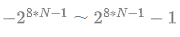

## 基本类型有哪些？

> byte、boolean、char、sort、int、long、float、double

## 基本类型对应的封装类叫什么？

> Byte、Boolean、Character、Sort Integer、Long、Float、Double

## 基本类型的默认值及数值类型取值范围?

| 类型        | 字节数 | 默认值         | 包装类型  |
| ----------- | ------ | -------------- | --------- |
| **byte**    | 1      | 0              | Byte      |
| **char**    | 2      | '/uoooo'(null) | Character |
| **short**   | 2      | 0              | Short     |
| **int**     | 4      | 0              | Integer   |
| **long**    | 8      | 0L             | Long      |
| **float**   | 4      | 0.0F           | Float     |
| **double**  | 8      | 0.0D           | Double    |
| **boolean** | 1      | false          | Boolean   |

> 数值取值范围 N为字节数

## String对象是可变的吗？

> 不可变，String内部成员由final修饰、所以值是不可变的，所以String对象操作会重新分配指向

## String类被final修饰有什么用
> 被final修饰的类不能被继承、方法不能被重写

## 重写与重载的区别
> 重载是在一个类中由多个名称相同但参数列表不同的方法（参数列表不同体现在顺序、类型、个数与返回值无关）；
> 重写发生在父子类之间，子类重新实现父类方法视为重写、覆盖

## 